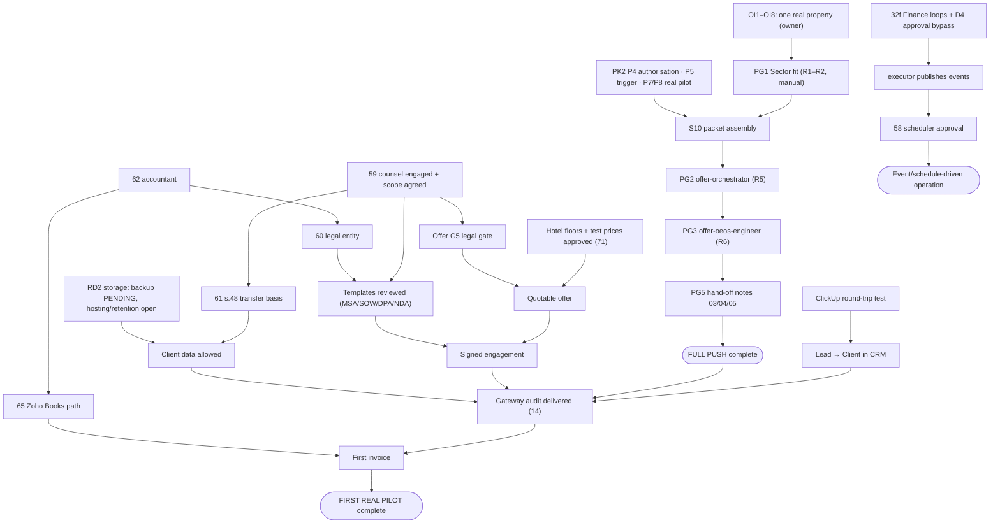

# Readiness Assessment — Mechanism vs Real-Pilot

**Measured:** 2026-10-02 (repository state at commit `990f1fb`, working tree clean)
**Owner:** Agency Governance (00)
**Status:** Measurement · **read-only** · nothing was run to produce it — no agent, skill, runtime, test suite, connector or external API. Every "test run" cited below is a **recorded** result found in the repository, not one re-run for this report.
**Standard applied:** [`AEIT_11_RUNTIME_TRUTH_STANDARD.md`](AEIT_11_RUNTIME_TRUTH_STANDARD.md) — a state is claimed only with its named test (R1), never inherited (R2), and `CONNECTED`/`LIVE` decay after 30 days (R3).

> **Bottom line.** The machinery is far ahead of the reality it is meant to run on. **Agency-wide weighted readiness: mechanism 53.0 %, real-pilot 16.5 %.** The Full Push path's mechanism is **86.5 %** ready, but its real-pilot readiness is **20 %**. Required gates passed: **0 of 5** (PG0 only partly). The first real pilot is at **15 %**. What stops it is no longer code. It is one real property (OI1–OI8), one engaged lawyer, and one legal entity.

---

## 1. Scoring formula — reproducible

**Per item, per dimension:**

```
score = Σ (weight_c × credit_c) / Σ (weight_c for every criterion c that applies)
weights: G governance/decision 15 · S schemas/data contracts 20 · I implementation/runtime 20
         D integrations/delivery 15 · T tests/verification 20 · L legal/privacy/security 10
credit:  V VERIFIED = 1 · P PARTIAL = 0.5 · B BLOCKED/ABSENT = 0 · N NOT APPLICABLE = weight removed
```

Ratings are written as a six-letter string in the order **G S I D T L**. For example, `VVPPVP` = 15 + 20 + 10 + 7.5 + 20 + 5 = **77.5 / 100**. Every table shows the string and the arithmetic.

**Caps, applied after the formula (never rounded up):**

| Cap | Applies when | Test used here |
|---|---|---|
| Mechanism ≤ **39 %** | No verified execution path | No dated execution record (`runtime.jsonl`, `skill_runs.jsonl`, sandbox streams, provisioning audit) **and** no recorded live execution of its code path |
| Mechanism ≤ **49 %** | Plugin never executed | No recorded execution against its real target (mocked tests do not count) |
| Real-pilot ≤ **49 %** | Unresolved hard legal/security stop | Item's real-pilot path touches client data, contracts, published claims, payments or personal data while counsel is unengaged (item 59), the entity is unresolved (60) and s.48 transfers are undocumented (61) |
| Fixture success ≠ real execution | Always | `TEST_FIXTURE`-classified runs earn mechanism credit only |

**What each criterion means in each dimension:**

| | Mechanism (does the machinery work?) | Real-pilot (can it run for a real property, today?) |
|---|---|---|
| **G** | Gates and decision records **in force and enforced in code** | Owner inputs supplied and the run **authorised** |
| **S** | Schemas/contracts **machine-checked** (gate, test or live store matches spec) | **Real data** present in the real store |
| **I** | Executable artifact with a **dated execution record** (V) or built only (P) | **Non-fixture** execution on real inputs |
| **D** | Internal edges `CONNECTED` and tested; no edge is `LIVE` anywhere (`executor.ts` never publishes), so V needs a verified hand-off | Live external integration and a **real delivery** to the next owner |
| **T** | **Recorded** test/gate runs with results | Verification of a real-data run |
| **L** | Isolation, secrets handling, fixture lanes, offline guard | Counsel review, entity, DPA/s.48, licensing, claims |

**Weights for the agency-wide figure:** the spine departments (01, 02, 03, 04, 05, 07, 08, 09) and Governance (00) carry weight 2, and the other 12 carry weight 1. The denominator is 30. Cross-Domain Synthesis (18) is a reference archive and is excluded.

---

## 2. Headline figures

| Measure | Mechanism | Real-pilot | Arithmetic |
|---|---|---|---|
| **Agency-wide, weighted** (21 departments incl. 00) | **53.0 %** | **16.5 %** | Σ(score × weight) / 30 — §3 |
| Agency-wide, unweighted | 50.9 % | 16.5 % | mean of 21 |
| **115 agents**, mean | 42.3 % | 13.0 % | §7; **9 of 115** have a dated execution record |
| **Full Push** (Sector → Offer, one real property, public data, manual) | **86.5 %** | **20.0 %** | Mechanism is the mean of the 11 items the push uses (§2.1). Real-pilot rated `PBBPBP` = 7.5+0+0+7.5+0+5 |
| Full Push, gate view | — | **0 of 5 required gates passed** | PG0 ◐ (public-only prep only) · PG1 ❌ · PG2 ❌ · PG3 ❌ · PG5 ❌ · PG4 N/A (skipped by RD5, **not passed**) |
| **First real pilot** (`PILOT-H-001` as a client: audit, client data, contract, invoice) | **71.5 %** | **15.0 %** | Mechanism is the mean of 20 items (§2.1). Real-pilot rated `PBBPBB` = 7.5+0+0+7.5+0+0 |

### 2.1 Which items each path uses

- **Full Push (11 items):** 00 Governance 77.5 · 01 Sector 82.5 · 02 Offer 92.5 · arika-runtime 87.5 · Hospitality plugin 77.5 · S10 92.5 · `offer-orchestrator` 92.5 · `offer-oeos-engineer` 92.5 · Anthropic API 93.75 · Google Drive 67.5 · Notion 95. Sum 951.25 ÷ 11 = **86.5 %**.
- **First real pilot (20 items):** the 11 above, plus 05 Sales 60 · 07 Client Success 39 · 08 Operations 39 · 09 Finance 52.5 · 10 Legal 39 · 14 Audits 39 · ClickUp 77.5 · Zoho Books 62.5 · finos-plugin 70. Sum 1 429.75 ÷ 20 = **71.5 %**.

**Full Push real-pilot rating `PBBPBP`, criterion by criterion:**
- **G = P:** RD1 and RD3–RD7 are decided and RD2's location half is decided, but OI1–OI9 are unsupplied and PG1 is unmet.
- **S = B:** there is no property record, and S10 packet assembly is BLOCKED by PK2 P4 (authorisation), P5 (trigger) and P7/P8 (real pilot).
- **I = B:** every Offer run so far is `TEST_FIXTURE`.
- **D = P:** the Sector → Offer text-reference route works, the receiver is verified on a fixture only, and the downstream hand-offs are notes carried by hand.
- **T = B:** the run log in packet §11 is empty.
- **L = P:** the data is public only and OI7/OI8 default to the safe side, but OTA terms and screenshot handling have not been assessed.

**First-real-pilot real rating `PBBPBB`:** the same as above, except that S is B because there is no client data or ratified intake (item 73), and L is B because there is no engaged counsel, entity or DPA. The 49 % legal cap does not bind because the score is already 15 %.

---

## 3. Departments

| # | Department | Mech. rating | Mech. arithmetic | **Mechanism** | Real rating | Real arithmetic | **Real-pilot** | Wt | First pilot |
|---|---|---|---|---|---|---|---|---|---|
| 00 | Governance + shared infra | `VVPPVP` | 77.5/100=77.5% | **77.5 %** | `PPBPBB` | 25/100=25.0% | **25.0 %** | 2 | Needed (PG0 gates, intake, offline guard) |
| 01 | Sector | `VVPPVV` | 82.5/100=82.5% | **82.5 %** | `PPPPBP` | 40/100=40.0% | **40.0 %** | 2 | Needed (R2 fit, R3 S10 packet) |
| 02 | Offer | `VVVPVV` | 92.5/100=92.5% | **92.5 %** | `PPBBBB` | 17.5/100=17.5% | **17.5 %** | 2 | Needed (R5–R6) |
| 03 | Marketing | `PPPPPP` | 50/100=50.0% → cap 39 | **39.0 %** | `BBBPBB` | 7.5/100=7.5% | **7.5 %** | 2 | Defer (RD6: notes only) |
| 04 | Content | `PVPPPP` | 60/100=60.0% → cap 39 | **39.0 %** | `BPBPBB` | 17.5/100=17.5% | **17.5 %** | 2 | Defer (RD6: notes only) |
| 05 | Sales | `PVPPPP` | 60/100=60.0% | **60.0 %** | `BPBPBB` | 17.5/100=17.5% | **17.5 %** | 2 | Defer for Full Push; needed for first real pilot (CRM) |
| 06 | ClientPartner Acquisition | `PVPPPP` | 60/100=60.0% → cap 39 | **39.0 %** | `BPBPBB` | 17.5/100=17.5% | **17.5 %** | 1 | Defer |
| 07 | Client Success | `PPPPPP` | 50/100=50.0% → cap 39 | **39.0 %** | `BBBPBB` | 7.5/100=7.5% | **7.5 %** | 2 | Defer for Full Push; onboarding needed for first real pilot |
| 08 | Operations | `PPPPPP` | 50/100=50.0% → cap 39 | **39.0 %** | `PBBPBB` | 15/100=15.0% | **15.0 %** | 2 | Defer for Full Push; delivery needed for first real pilot |
| 09 | Finance | `PVPBPP` | 52.5/100=52.5% | **52.5 %** | `BBBBBB` | 0/100=0.0% | **0.0 %** | 2 | Defer for Full Push; invoicing needed for first real pilot |
| 10 | Legal | `VPPPPP` | 57.5/100=57.5% → cap 39 | **39.0 %** | `PBBBBB` | 7.5/100=7.5% | **7.5 %** | 1 | Needed for first real pilot (hard stop) |
| 11 | HR / People Ops | `PPPPPP` | 50/100=50.0% → cap 39 | **39.0 %** | `PBBNBB` | 7.5/85=8.8% | **8.8 %** | 1 | Defer (solo + AI, provisional capacity) |
| 12 | Branding | `VVVPPP` | 77.5/100=77.5% | **77.5 %** | `PPPPPP` | 50/100=50.0% | **50.0 %** | 1 | Defer |
| 13 | Tech Stack | `VPPPPP` | 57.5/100=57.5% | **57.5 %** | `PPPPPB` | 45/100=45.0% | **45.0 %** | 1 | Needed (verify integrations) |
| 14 | Audits & Diagnostics | `PPPPPP` | 50/100=50.0% → cap 39 | **39.0 %** | `BBBBBB` | 0/100=0.0% | **0.0 %** | 1 | Needed for first real pilot (gateway audit) |
| 15 | Consulting & Advisory | `PPPPPP` | 50/100=50.0% → cap 39 | **39.0 %** | `BBBBBB` | 0/100=0.0% | **0.0 %** | 1 | Defer |
| 16 | Automation | `PPPPPP` | 50/100=50.0% | **50.0 %** | `BBBPBB` | 7.5/100=7.5% | **7.5 %** | 1 | Defer (manual only; scheduler not approved) |
| 17 | AI Enablement | `PPPPPP` | 50/100=50.0% → cap 39 | **39.0 %** | `BBBBBB` | 0/100=0.0% | **0.0 %** | 1 | Defer |
| 19 | Design | `PPPPPP` | 50/100=50.0% | **50.0 %** | `BBPBBB` | 10/100=10.0% | **10.0 %** | 1 | Defer |
| 20 | Experience Engineering | `PPPPPP` | 50/100=50.0% → cap 39 | **39.0 %** | `PPPPPB` | 45/100=45.0% | **45.0 %** | 1 | Defer |
| 21 | Presence | `PPPBPP` | 42.5/100=42.5% → cap 39 | **39.0 %** | `BBBPBB` | 7.5/100=7.5% | **7.5 %** | 1 | Defer |
| | **Agency, weighted** | | Σ(score×wt)/30 | **53.0 %** | | | **16.5 %** | 30 | |
| 18 | Cross-Domain Synthesis | N/A — reference archive, excluded | | | | | | 0 | — |

### 3.1 Evidence per department

**00 Governance + shared infrastructure**
- **Evidence:**
  - Constitution, RACI, KPI dictionary and approval matrix are in force.
  - The CRM schema is implemented in ClickUp, live-verified 2026-07-15. The Lead fields were provisioned under CRM-PROV-1, with an audit record dated `2026-09-29T045210Z` and `verified_after`.
  - `estate_event_gate.py` passed (exit 0) on 2026-09-14 and was falsified 2026-08-28.
  - `intake_gate.py`, `offline_guard` (Python + Node preload) and `skill_run_gate.py` exist.
  - The dashboard spine is not started. Handoff standards are designed (AEIT_09) but not built. The memory protocol is partial.
- **Tests actually run (recorded):** offline guard 46/46 (31 Python + 15 Node); estate gate PASS 2026-09-14; skill_run_gate falsified 2026-09-12.
- **Fixture-only:** the offline guard's protection of fixture runs.
- **Hard blockers:**
  - Counsel not engaged (59), entity unresolved (60), s.48 transfers undocumented (61).
  - Client Intake Profile unratified (73).
  - Scheduler governance undecided (58).
  - Runtime approval bypass, P10 finding #6 / D4 (see the runtime row in §4).
- **Smallest action:** ratify the Client Intake Profile (item 73).
- **First pilot:** needed.

**01 Sector**
- **Evidence:**
  - 16 Notion databases; 311 of 311 fields owned (AEIT_11 §3).
  - S01–S10 have dated runs (15 records); live writes were made 2026-10-02 (DB6 OD1/OD2, the DB9 `Evidence` field).
  - Hospitality reached Offer-Ready (S10, Gate G).
  - The Sector → Offer receiver was implemented and verified 2026-10-02: one fixture acknowledgement, with hashes recorded.
  - Weak spots:
    - 5 agents have never run.
    - S11 and S12 exist only as contracts.
    - `sector-icp-fit` cannot fit a hotel (B2B SaaS only).
    - Marketing and Operations have no route from Sector (31k).
    - 8 of the 14 original skill records carry fabricated timestamps; they are grandfathered and fenced by `skill_run_gate.py`.
- **Tests actually run (recorded):**
  - `sector_truth_gate.py` went red on 28 lines, then green.
  - `skill_run_gate.py` was falsified with 2 failures and exit 1.
  - **No recorded result was found** for `test_db9_provenance.py` (141 test functions), `test_skill_fixture.py` (44) or `test_offer_inbox_receiver.py` (72). They exist; a pass is not claimed.
- **Fixture-only:** S10 runs SF1 and SF2; the P10 delivery (one empty-payload control reference); the whole A001 sandbox (D20: mechanism evidence only).
- **Hard blockers:** OI1–OI8 unsupplied (PG1). S10 assembly is blocked by PK2 P4/P5/P7/P8. P8 sources are all `candidate`.
- **Smallest action:** the owner supplies OI1–OI8 for one property. That unblocks R1–R2 and the manual fit check.
- **First pilot:** needed (R2 fit, R3 S10 packet).

**02 Offer**
- **Evidence:**
  - 3 agents with 8 dated runs: 5 on 2026-09-13 in the control test (test-fixture values), plus sandbox runs F1/D21 (09-21), F2 (09-22) and F3 (09-29).
  - Fixture lanes are single-use, and the gate fires before any model call.
  - The rejected-brief emit fix and the self-loop break are in place.
  - The capacity worksheet's gates G1, G3, G4 and G6 are passed for the MVP only.
- **Tests actually run (recorded):** runtime suite 54/54 (2026-09-22). Earlier: 40/40, 36/36, 28/28.
- **Fixture-only:** every Offer agent result, including the `needs_more_seed_data`, `reject` and `insufficient_data` outcomes.
- **Hard blockers:** no real seed brief (PG2). Not Quotable. No hotel price floors and no H-band support in the pricing agent. G5 (legal) narrowed, not passed. G2 blocked by legal.
- **Smallest action:** none inside Offer. It waits on Sector R3 and owner review.
- **First pilot:** needed (R5, R6). The pricing agent is skipped (RD5).

**03 Marketing**
- **Evidence:** 9 agents `BUILT`, none run. No route from Sector (31k). No accounts; Postiz is running but no platform is connected.
- **Tests actually run:** only the runtime registry test, which validates all 115 specs.
- **Fixture-only:** none.
- **Hard blockers:** no social accounts (44). Claims substantiation has no reviewer. RD6 allows notes only.
- **Smallest action:** decide 31k, i.e. who produces Marketing's inbound route.
- **First pilot:** defer. It gets a hand-off note only.

**04 Content**
- **Evidence:** the Notion brief database is built to schema (verified 2026-07-03) and **empty**. The 5 intelligence sources are wired to real emitters. 6 agents have never run. The Design routine was last verified 2026-07-15, which is past R3's 30-day limit.
- **Tests actually run:** registry only.
- **Fixture-only:** none.
- **Hard blockers:** no social accounts; launch date not set (14); PG5 not passed.
- **Smallest action:** one fixture brief through `content-brief-builder`. That needs an owner authorisation and lifts the mechanism cap.
- **First pilot:** defer (hand-off note only).

**05 Sales**
- **Evidence:**
  - The most complete specs in the repo; 10 agents.
  - 2 agents have 3 **schedule-triggered** runs (2026-08-24 and 08-27), all with `input: null`, so they reported having no data.
  - The ClickUp Lead list is live with provisioned fields and **zero rows**.
  - `DISCOVERY_COMPLETED` has no assigned producer.
- **Tests actually run:** registry only. The runs were not output-checked.
- **Fixture-only:** none.
- **Hard blockers:** no lead (go-live item 12). The CRM route is `HANDOFF_FAILURE` until a round-trip test passes. Outreach claims and personal data are blocked by legal (59, 61).
- **Smallest action:** a fixture-lead CRM round-trip test (create, read back, delete).
- **First pilot:** defer for the Full Push. The CRM is needed for the first real pilot.

**06 ClientPartner Acquisition**
- **Evidence:** 7 agents never run. Partner list live with zero rows.
- **Tests actually run:** registry only.
- **Fixture-only:** none.
- **Hard blockers:** no partners (20). The trust governor is Class 3 and partner agreements are unreviewed.
- **Smallest action:** none needed before the pilot.
- **First pilot:** defer.

**07 Client Success**
- **Evidence:** 6 agents never run. `HEALTH_SCORE_DROPPED` is a loop open at both ends (32c), and `CONTRACT_ENDING` has no producer. No BI or dashboard.
- **Tests actually run:** registry only.
- **Fixture-only:** none.
- **Hard blockers:** no client. The health-score producer is unassigned.
- **Smallest action:** assign the `HEALTH_SCORE_DROPPED` producer (an ownership decision, R7).
- **First pilot:** onboarding is needed for the first real pilot, not for the Full Push.

**08 Operations**
- **Evidence:** 8 agents never run. The calendar subscription is "specified, not wired". There is no capacity model, only a provisional MVP decision of one client at a time. No route from Sector (31k).
- **Tests actually run:** registry only.
- **Fixture-only:** none.
- **Hard blockers:** no capacity model; delivery would run under an unsigned SOW.
- **Smallest action:** record the provisional capacity in Operations rather than only in Offer.
- **First pilot:** needed for the first real pilot.

**09 Finance**
- **Evidence:**
  - finos-plugin executed live once, on 2026-07-01: a `REVENUE_RECEIVED` event produced 5 recommendations and the audit chain stayed intact.
  - The Zoho connector `health()` was live on 2026-07-07.
  - **No dated runtime record exists** (`09_Finance/_memory/` does not exist), and the run is older than 30 days.
  - 🔴 **3 non-terminating self-loops** (`finance-cfo-agent`, `finance-cashflow-agent`, `finance-treasury-agent`) plus 4 shared-topic re-entries.
  - The Zoho trial has expired (65).
- **Tests actually run (recorded):** 8 pass (2026-07-07; 2 engine-smoke + 6 connector in the current files).
- **Fixture-only:** none. The July run was live, but it used a synthetic event.
- **Hard blockers:** the 3 loops (32f); Zoho expired (65); no accountant (62); entity (60).
- **Smallest action:** break the 3 loops, or add cycle detection to the event bus. This can be done offline.
- **First pilot:** invoicing is needed for the first real pilot.

**10 Legal**
- **Evidence:** 7 templates exist, all unreviewed. Counsel is named but not engaged, with two letters unsigned. The owner's scope decision was recorded and the scope request was sent on 2026-09-16. Both agents have never run.
- **Tests actually run:** registry only.
- **Fixture-only:** none.
- **Hard blockers:** 59, 60 and 61. This is the agency's hard legal stop.
- **Smallest action:** chase counsel's reply to the 2026-09-16 scope request and agree scope.
- **First pilot:** **needed**. It blocks every client-facing step.

**11 HR / People Ops**
- **Evidence:** 4 agents never run. No employment or contractor contract, no payroll, no capacity model.
- **Tests actually run:** registry only.
- **Fixture-only:** none.
- **Hard blockers:** no accountant (62).
- **Smallest action:** none needed before the pilot (solo + AI is approved provisionally).
- **First pilot:** defer.

**12 Branding**
- **Evidence:**
  - BOIS ran 7 times (2026-07-14 to 07-19) on Arika's own real brand. 4 audit runs failed before one synthesized.
  - In that run governance passed, with mean confidence **0.31** and **74 evidence gaps**.
  - `anthropic` *is* importable today, so item 70 ("not installed") is **stale**.
  - The governance validator agent has never run.
- **Tests actually run:** `smoke_test.py` is a script with no assertions and no recorded result.
- **Fixture-only:** none.
- **Hard blockers:** Canva unauthenticated (64).
- **Smallest action:** close item 70 as resolved, with today's import check as its test.
- **First pilot:** defer.

**13 Tech Stack**
- **Evidence:** the live audit on 2026-07-15 found 4 false rows. Drive was live-checked on 2026-09-20/21. `techstack-cost-guardian` ran twice (2026-08-23 and 08-30). The connection verifier has never run. Most rows are past R3's 30-day limit.
- **Tests actually run:** the 2026-07-15 audit; the 2026-09-21 Drive check.
- **Fixture-only:** none.
- **Hard blockers:** the s.48 sub-processor documentation (61). The inventory *is* the sub-processor list.
- **Smallest action:** one read-only `techstack-connection-verifier` sweep. That needs owner authorisation, and it re-dates every row.
- **First pilot:** needed (the integrations must be true).

**14 Audits & Diagnostics**
- **Evidence:** 6 agents never run, and the chain has never delivered an audit. The counting barrier was deliberately not built. `AUDIT_ENGAGEMENT_SIGNED` is a manual entry. The join-gate *mechanism* is generically tested in the runtime.
- **Tests actually run:** runtime join-gate tests, which are not specific to Audits.
- **Fixture-only:** none.
- **Hard blockers:** no client; data access needs a DPA; no benchmarks.
- **Smallest action:** one fixture run of `audits-scoping` on a synthetic unit.
- **First pilot:** **needed** for the first real pilot (diagnostic-first, audit-gated MVP).

**15 Consulting & Advisory**
- **Evidence:** 3 agents never run. The VIP day has a price but no process (67).
- **Tests actually run:** registry only.
- **Fixture-only:** none.
- **Hard blockers:** 67 and 68.
- **Smallest action:** none.
- **First pilot:** defer.

**16 Automation**
- **Evidence:** one cloud routine. It fired, died, and was restored on 2026-07-15, and has not been verified since, so it decays under R3. Schedule triggers: 30; approval-matrix rows: 1 (58). The CRM-PROV-1 row says "not yet run", but its audit record shows it **ran 2026-09-29**, so that row is stale. 4 agents have never run.
- **Tests actually run:** forced routine run 2026-07-15.
- **Fixture-only:** none.
- **Hard blockers:** scheduler not approved (58); approval bypass (D4).
- **Smallest action:** run `automation-reliability-monitor` once, which re-dates the routine.
- **First pilot:** defer (manual only).

**17 AI Enablement**
- **Evidence:** 4 agents never run. The governance gate is BLOCKED by design because there is no legal reviewer.
- **Tests actually run:** registry only.
- **Fixture-only:** none.
- **Hard blockers:** 59.
- **Smallest action:** none.
- **First pilot:** defer.

**19 Design**
- **Evidence:** 1 storyboard run (2026-07-19). design-plugin (KIE) tests pass against a **mocked** API. Canva, OpenArt and Relume are unauthenticated, and OpenArt has 0 credits. The asset library and inspiration folders are empty.
- **Tests actually run (recorded):** 13 pass (2026-07-07). The file now has 15 tests, so the recorded result is stale.
- **Fixture-only:** all plugin tests (mocked).
- **Hard blockers:** 64. Item 66: OpenArt imagery is live on the site with commercial rights unchecked.
- **Smallest action:** re-authenticate Canva (owner).
- **First pilot:** defer.

**20 Experience Engineering**
- **Evidence:** 11 agents and 4 skills, none run. The website is deployed on Vercel (14 pages returned HTTP 200 on 2026-07-07, past the 30-day limit). The domain is only partly connected, and there is no form or analytics. `EXPERIENCE_PROJECT_SCOPED` has no producer (32d).
- **Tests actually run:** the 2026-07-07 HTTP check.
- **Fixture-only:** none.
- **Hard blockers:** item 66 (image rights on the live site).
- **Smallest action:** check OpenArt's commercial terms (66).
- **First pilot:** defer.

**21 Presence**
- **Evidence:** 8 agents never run. 5 of the estate's 9 unassigned producers are here (32a). Zero accounts.
- **Tests actually run:** registry only.
- **Fixture-only:** none.
- **Hard blockers:** 44 and 32a.
- **Smallest action:** decide 32a in one ruling (mark the edges `INTENDED`).
- **First pilot:** defer.

---

## 4. Plugins

| Plugin | Mech. rating | Mech. arithmetic | **Mechanism** | Real rating | Real arithmetic | **Real-pilot** | First pilot |
|---|---|---|---|---|---|---|---|
| arika-runtime (shared runtime) | `VVVPVP` | 87.5/100=87.5% | **87.5 %** | `PPPBPP` | 42.5/100=42.5% | **42.5 %** | Needed |
| finos-plugin (Finance 09) | `PVVPPP` | 70/100=70.0% | **70.0 %** | `BBBBBB` | 0/100=0.0% | **0.0 %** | Defer for Full Push |
| bois (Branding 12) | `VVVPPP` | 77.5/100=77.5% | **77.5 %** | `PPPPPP` | 50/100=50.0% | **50.0 %** | Defer |
| design-plugin / KIE (Design 19) | `PPPPPP` | 50/100=50.0% → cap 49 | **49.0 %** | `BBBPBB` | 7.5/100=7.5% | **7.5 %** | Defer |
| Hospitality sector plugin #001 (01) | `VVPPVP` | 77.5/100=77.5% | **77.5 %** | `PPPPBP` | 40/100=40.0% | **40.0 %** | Needed |

### 4.1 Plugin evidence

- **arika-runtime:**
  - **Evidence:** builds clean (`dist/` rebuilt 2026-10-02). Fixture lanes are single-use, and the gate fires before any model call. `executor.ts` never publishes, so no edge is `LIVE`. The event bus has no cycle detection. 🔴 `humanGate` is computed after the agent answers and **no code acts on it** (P10 finding #6 / D4) — "the most serious latent risk in the estate".
  - **Tests (recorded):** 54/54 on 2026-09-22. `fixture-f3.test.mjs` (14 tests, added 09-29) has **no recorded result**; the suite now has 68 tests.
  - **Smallest action:** make dispatch refuse when `humanGate` is true, with a test. This can be done offline.
  - **First pilot:** needed (`arika run` only).
- **finos-plugin:**
  - **Evidence:** one live in-plugin execution (2026-07-01) and a live Zoho `health()` (2026-07-07). Never run through the runtime with a dated record. Zoho trial expired.
  - **Tests (recorded):** 8 pass (2026-07-07).
  - **Smallest action:** break the loops (32f).
  - **First pilot:** defer for the Full Push.
- **bois:**
  - **Evidence:** 7 dated runs; the contract bug was fixed 2026-07-15; Python `anthropic` is installed.
  - **Tests:** smoke script only, no recorded result.
  - **Smallest action:** run the governance validator once.
  - **First pilot:** defer.
- **design-plugin (KIE):**
  - **Evidence:** **never executed against the real API** (tests are mocked), so the 49 % cap applies. The account balance was read live (44 credits) on 2026-07-15, past the 30-day limit.
  - **Tests (recorded):** 13 pass, mocked. The file now has 15.
  - **Smallest action:** none needed before the pilot.
  - **First pilot:** defer.
- **Hospitality sector plugin #001:**
  - **Evidence:**
    - 12 of 14 slots are authored; P3 and P12 are partial.
    - `plugin.config.json` is a ratified compiled sidecar (31c).
    - 3 Destination Profiles: Nairobi, Maasai Mara, Diani. Mombasa is unprofiled.
    - All P8 sources are still `candidate`.
  - **Tests:** `p2_coverage_gate.py` and `sector_truth_gate.py` (gates).
  - **First pilot:** needed.

---


## 5. Integrations

| Integration | Mech. rating | Mech. arithmetic | **Mechanism** | Real rating | Real arithmetic | **Real-pilot** | First pilot |
|---|---|---|---|---|---|---|---|
| Notion | `VVVVVP` | 95/100=95.0% | **95.0 %** | `PPPVPB` | 52.5/100=52.5% → cap 49 | **49.0 %** | Needed (Sector DBs) |
| ClickUp CRM | `VVVPPP` | 77.5/100=77.5% | **77.5 %** | `PBBPBB` | 15/100=15.0% | **15.0 %** | Needed for first real pilot |
| Google Drive (My Drive) | `VPVPPP` | 67.5/100=67.5% | **67.5 %** | `PBPPBB` | 25/100=25.0% | **25.0 %** | Needed (client folder) |
| Anthropic API | `VNVVVP` | 75/80=93.8% | **93.8 %** | `PNPVBB` | 32.5/80=40.6% | **40.6 %** | Needed |
| Zoho Books | `PVVBPP` | 62.5/100=62.5% | **62.5 %** | `BBBBBB` | 0/100=0.0% | **0.0 %** | Needed for first real pilot (invoice) |
| Claude cloud routine (Notion→Design) | `VPVPPP` | 67.5/100=67.5% | **67.5 %** | `PBBPBN` | 15/90=16.7% | **16.7 %** | Defer |
| Self-hosted VPS + Coolify + Postiz | `VNVPPP` | 57.5/80=71.9% | **71.9 %** | `BNBBBB` | 0/80=0.0% | **0.0 %** | Defer |
| Vercel (arika-website) | `VNVPPP` | 57.5/80=71.9% | **71.9 %** | `PNPPBB` | 25/80=31.2% | **31.2 %** | Defer |
| KIE.ai (Nano Banana Pro, Seedance) | `VPPPPP` | 57.5/100=57.5% | **57.5 %** | `BBBPBB` | 7.5/100=7.5% | **7.5 %** | Defer |
| Canva | `VPBBBP` | 30/100=30.0% | **30.0 %** | `PBBBBB` | 7.5/100=7.5% | **7.5 %** | Defer |
| OpenArt | `VNBBBB` | 15/80=18.8% | **18.8 %** | `BNBBBB` | 0/80=0.0% | **0.0 %** | Defer |
| Relume | `PNBBBP` | 12.5/80=15.6% | **15.6 %** | `BNBBBB` | 0/80=0.0% | **0.0 %** | Defer |
| Named-only (Whimsical, Formspree, Sanity, Plausible/GA, GSC, Google Calendar, ManyChat, Remotion, motion libs) | `BBBBBB` | 0/100=0.0% | **0.0 %** | `BBBBBB` | 0/100=0.0% | **0.0 %** | Defer |

### 5.1 Integration evidence (R3: anything last verified before 2026-09-02 is past the 30-day limit)

| Integration | Last live verification | Note |
|---|---|---|
| Notion | 2026-10-02 (DB6 and DB9 live writes) | Content brief database empty; s.48 for client data |
| ClickUp | 2026-09-29 (CRM-PROV-1 `verified_after`) | Field existence only; CRM route is `HANDOFF_FAILURE` until a round-trip test |
| Google Drive | 2026-09-21 (folders + owner UI check) | **Not approved for client data**; backup PENDING |
| Anthropic API | 2026-09-29 (F3 run) | Rotation owner-attested; inputs land in git-tracked, auto-synced logs (RD1 mitigates) |
| Zoho Books | 2026-07-15 | `is_trial_expired: true` (65) |
| Claude cloud routine | 2026-07-15 | Past the 30-day limit; nothing has re-verified it since |
| VPS + Coolify + Postiz | 2026-08-07 | No platform account connected |
| Vercel | 2026-07-07 | Domain partly connected; no form or analytics |
| KIE.ai | 2026-07-15 | Mocked tests only |
| Canva, OpenArt, Relume | — | **Unauthenticated now** (this session's environment reports all three as needing auth) |
| Named-only tools | never | No account, no connection |

---


## 6. Skills (14 under `.claude/skills/`)

| Skill | Mech. rating | Mech. arithmetic | **Mechanism** | Real rating | Real arithmetic | **Real-pilot** | First pilot |
|---|---|---|---|---|---|---|---|
| S01 sector-finding-writer | `VVVPVV` | 92.5/100=92.5% | **92.5 %** | `PPPPBP` | 40/100=40.0% | **40.0 %** | Defer |
| S02 sector-audience-language-mapper | `VVVPVV` | 92.5/100=92.5% | **92.5 %** | `PPPPBP` | 40/100=40.0% | **40.0 %** | Defer |
| S03 sector-source-registrar | `VVVPVV` | 92.5/100=92.5% | **92.5 %** | `PPPPBP` | 40/100=40.0% | **40.0 %** | Defer (P8 verification later) |
| S04 sector-signal-writer | `VVVPVV` | 92.5/100=92.5% | **92.5 %** | `PPPPBP` | 40/100=40.0% | **40.0 %** | Defer |
| S05 sector-place-profiler | `VVVPVV` | 92.5/100=92.5% | **92.5 %** | `PPPPBP` | 40/100=40.0% | **40.0 %** | Needed only if OI4 is unprofiled |
| S06 sector-state-distiller | `VVVPVV` | 92.5/100=92.5% | **92.5 %** | `PPPPBP` | 40/100=40.0% | **40.0 %** | Defer |
| S07 sector-taxonomy-registrar | `VVVPPV` | 82.5/100=82.5% | **82.5 %** | `PPPPBP` | 40/100=40.0% | **40.0 %** | Defer |
| S08 sector-offer-router | `VVVPVV` | 92.5/100=92.5% | **92.5 %** | `PPPPBP` | 40/100=40.0% | **40.0 %** | Defer |
| S09 sector-calendar-resolver | `VVVPPV` | 82.5/100=82.5% | **82.5 %** | `PPPPBP` | 40/100=40.0% | **40.0 %** | Defer |
| S10 sector-handoff-packet | `VVVPVV` | 92.5/100=92.5% | **92.5 %** | `PPBBBP` | 22.5/100=22.5% | **22.5 %** | Needed (R3) |
| creative-direction (EE station 1) | `PPPPBN` | 35/90=38.9% | **38.9 %** | `BBBBBN` | 0/90=0.0% | **0.0 %** | Defer |
| sitemap-and-refs (EE stations 2–3) | `PPPPBN` | 35/90=38.9% | **38.9 %** | `BBBBBN` | 0/90=0.0% | **0.0 %** | Defer |
| design-tokens (EE station 5) | `PPPPBN` | 35/90=38.9% | **38.9 %** | `BBBBBN` | 0/90=0.0% | **0.0 %** | Defer |
| design-audit (EE station 6 gate) | `PPPPBN` | 35/90=38.9% | **38.9 %** | `BBBBBN` | 0/90=0.0% | **0.0 %** | Defer |

### 6.1 Skill notes

- **Sector S01–S10** are executed by Claude Code (`source: claude-code`) and gated by the write contract and `skill_run_gate.py`.
- **S07 and S09** get T = P because **every one of their records sits in the 8 grandfathered records with fabricated timestamps** (AEIT_11 §5.1). The run happened; its date is unproven.
- **S10:** its real Gate G run is grandfathered, but the fixture runs SF1 and SF2 (2026-09-22 and 09-29) are valid. Real-pilot I = B and D = B because packet assembly is BLOCKED by PK2 P4/P5/P7/P8.
- **S11 and S12** are contracts without a `SKILL.md`, so they are not scored as skills. S12 (hotel company fit) is the gap RD4 accepted for the first pilot.
- **EE skills (4):** never run, and the `design-audit` gate has never been exercised. Capped at 39 %.

---


## 7. Agents — all 115

**Agent rule:**
- **Mechanism:**
  - A dated execution record gives V for G, S and I; without one, each is P.
  - D is B for the 3 agents in a non-terminating loop and P for the rest (no edge is `LIVE`).
  - T is V only where agent-specific tests exist (`offer-orchestrator`, `offer-oeos-engineer`).
  - L is V only where the fixture lane has been exercised (the same two).
  - With no dated record, the 39 % cap applies.
- **Real-pilot:**
  - G, S, D and L are inherited from the department, because they describe its environment.
  - I and T are P only for agents with a **non-fixture** dated run; all others are B.
  - `offer-pricing-floor-analyst` gets G = B (skipped by RD5). The two Offer agents on the push path get G = P.
  - Where the department has a legal stop, the 49 % cap applies.

**Agents with a dated execution record: 9 of 115.** AEIT_11 §5's "6 of 115" is stale.
- Real runs: `branding-brand-audit`, `branding-brand-definition`, `sales-lead-qualification`, `sales-follow-up-recovery`, `techstack-cost-guardian`, `design-storyboard-generator`.
- `TEST_FIXTURE` runs: `offer-orchestrator`, `offer-oeos-engineer`, `offer-pricing-floor-analyst`.

The 7 Finance agents ran inside finos-plugin on 2026-07-01, but that run has **no dated execution record in any memory stream**, so under R1 they are not `LIVE`.

---


**Mean across 115 agents:** mechanism **42.3 %**, real-pilot **13.0 %**.

| Dept | Agent | Exec | Risk | Evidence | Mech. rating | Mech. arithmetic | **Mech.** | Real rating | Real arithmetic | **Real** | First pilot |
|---|---|---|---|---|---|---|---|---|---|---|---|
| 01 | `sector-icp-fit` | prompt | 1 | BUILT, never run | `PPPPPP` | 50/100=50.0% → cap 39 | **39.0 %** | `PPBPBP` | 30/100=30.0% | **30.0 %** | Defer |
| 01 | `sector-intelligence-mapper` | prompt | 1 | BUILT, never run | `PPPPPP` | 50/100=50.0% → cap 39 | **39.0 %** | `PPBPBP` | 30/100=30.0% | **30.0 %** | Defer |
| 01 | `sector-readiness-analyst` | prompt | 1 | BUILT, never run | `PPPPPP` | 50/100=50.0% → cap 39 | **39.0 %** | `PPBPBP` | 30/100=30.0% | **30.0 %** | Defer |
| 01 | `sector-signal-refresher` | prompt | 2 | BUILT, never run | `PPPPPP` | 50/100=50.0% → cap 39 | **39.0 %** | `PPBPBP` | 30/100=30.0% | **30.0 %** | Defer |
| 01 | `sector-signal-scorer` | prompt | 1 | BUILT, never run | `PPPPPP` | 50/100=50.0% → cap 39 | **39.0 %** | `PPBPBP` | 30/100=30.0% | **30.0 %** | Defer |
| 02 | `offer-oeos-engineer` | prompt | 1 | dated run (TEST_FIXTURE) | `VVVPVV` | 92.5/100=92.5% | **92.5 %** | `PPBBBB` | 17.5/100=17.5% | **17.5 %** | Needed (R6) |
| 02 | `offer-orchestrator` | prompt | 1 | dated run (TEST_FIXTURE) | `VVVPVV` | 92.5/100=92.5% | **92.5 %** | `PPBBBB` | 17.5/100=17.5% | **17.5 %** | Needed (R5) |
| 02 | `offer-pricing-floor-analyst` | prompt | 1 | dated run (TEST_FIXTURE) | `VVVPPP` | 77.5/100=77.5% | **77.5 %** | `BPBBBB` | 10/100=10.0% | **10.0 %** | Skipped (RD5) |
| 03 | `marketing-attribution-modeling` | prompt | 1 | BUILT, never run | `PPPPPP` | 50/100=50.0% → cap 39 | **39.0 %** | `BBBPBB` | 7.5/100=7.5% | **7.5 %** | Defer |
| 03 | `marketing-chief-strategist` | prompt | 1 | BUILT, never run | `PPPPPP` | 50/100=50.0% → cap 39 | **39.0 %** | `BBBPBB` | 7.5/100=7.5% | **7.5 %** | Defer |
| 03 | `marketing-demand-generation` | prompt | 2 | BUILT, never run | `PPPPPP` | 50/100=50.0% → cap 39 | **39.0 %** | `BBBPBB` | 7.5/100=7.5% | **7.5 %** | Defer |
| 03 | `marketing-funnel-architect` | prompt | 1 | BUILT, never run | `PPPPPP` | 50/100=50.0% → cap 39 | **39.0 %** | `BBBPBB` | 7.5/100=7.5% | **7.5 %** | Defer |
| 03 | `marketing-lifecycle` | prompt | 2 | BUILT, never run | `PPPPPP` | 50/100=50.0% → cap 39 | **39.0 %** | `BBBPBB` | 7.5/100=7.5% | **7.5 %** | Defer |
| 03 | `marketing-market-intelligence` | prompt | 1 | BUILT, never run | `PPPPPP` | 50/100=50.0% → cap 39 | **39.0 %** | `BBBPBB` | 7.5/100=7.5% | **7.5 %** | Defer |
| 03 | `marketing-ops-governor` | prompt | 1 | BUILT, never run | `PPPPPP` | 50/100=50.0% → cap 39 | **39.0 %** | `BBBPBB` | 7.5/100=7.5% | **7.5 %** | Defer |
| 03 | `marketing-orchestrator` | prompt | 1 | BUILT, never run | `PPPPPP` | 50/100=50.0% → cap 39 | **39.0 %** | `BBBPBB` | 7.5/100=7.5% | **7.5 %** | Defer |
| 03 | `marketing-seo-aeo-geo` | prompt | 1 | BUILT, never run | `PPPPPP` | 50/100=50.0% → cap 39 | **39.0 %** | `BBBPBB` | 7.5/100=7.5% | **7.5 %** | Defer |
| 04 | `content-brief-builder` | prompt | 2 | BUILT, never run | `PPPPPP` | 50/100=50.0% → cap 39 | **39.0 %** | `BPBPBB` | 17.5/100=17.5% | **17.5 %** | Defer |
| 04 | `content-intelligence-hub` | prompt | 1 | BUILT, never run | `PPPPPP` | 50/100=50.0% → cap 39 | **39.0 %** | `BPBPBB` | 17.5/100=17.5% | **17.5 %** | Defer |
| 04 | `content-multiplication-engine` | prompt | 1 | BUILT, never run | `PPPPPP` | 50/100=50.0% → cap 39 | **39.0 %** | `BPBPBB` | 17.5/100=17.5% | **17.5 %** | Defer |
| 04 | `content-narrative-architect` | prompt | 1 | BUILT, never run | `PPPPPP` | 50/100=50.0% → cap 39 | **39.0 %** | `BPBPBB` | 17.5/100=17.5% | **17.5 %** | Defer |
| 04 | `content-opportunity-mapper` | prompt | 1 | BUILT, never run | `PPPPPP` | 50/100=50.0% → cap 39 | **39.0 %** | `BPBPBB` | 17.5/100=17.5% | **17.5 %** | Defer |
| 04 | `content-publishing-gate` | prompt | 2 | BUILT, never run | `PPPPPP` | 50/100=50.0% → cap 39 | **39.0 %** | `BPBPBB` | 17.5/100=17.5% | **17.5 %** | Defer |
| 05 | `sales-customer-psychology` | prompt | 1 | BUILT, never run | `PPPPPP` | 50/100=50.0% → cap 39 | **39.0 %** | `BPBPBB` | 17.5/100=17.5% | **17.5 %** | Defer |
| 05 | `sales-enablement-playbooks` | prompt | 1 | BUILT, never run | `PPPPPP` | 50/100=50.0% → cap 39 | **39.0 %** | `BPBPBB` | 17.5/100=17.5% | **17.5 %** | Defer |
| 05 | `sales-execution-closing` | prompt | 2 | BUILT, never run | `PPPPPP` | 50/100=50.0% → cap 39 | **39.0 %** | `BPBPBB` | 17.5/100=17.5% | **17.5 %** | Defer |
| 05 | `sales-executive-intelligence` | prompt | 1 | BUILT, never run | `PPPPPP` | 50/100=50.0% → cap 39 | **39.0 %** | `BPBPBB` | 17.5/100=17.5% | **17.5 %** | Defer |
| 05 | `sales-follow-up-recovery` | prompt | 2 | dated run (real) | `VVVPPP` | 77.5/100=77.5% | **77.5 %** | `BPPPBB` | 27.5/100=27.5% | **27.5 %** | Defer |
| 05 | `sales-lead-qualification` | prompt | 1 | dated run (real) | `VVVPPP` | 77.5/100=77.5% | **77.5 %** | `BPPPBB` | 27.5/100=27.5% | **27.5 %** | Defer |
| 05 | `sales-reflection-quality` | prompt | 1 | BUILT, never run | `PPPPPP` | 50/100=50.0% → cap 39 | **39.0 %** | `BPBPBB` | 17.5/100=17.5% | **17.5 %** | Defer |
| 05 | `sales-revenue-operations` | prompt | 1 | BUILT, never run | `PPPPPP` | 50/100=50.0% → cap 39 | **39.0 %** | `BPBPBB` | 17.5/100=17.5% | **17.5 %** | Defer |
| 05 | `sales-revenue-strategy` | prompt | 2 | BUILT, never run | `PPPPPP` | 50/100=50.0% → cap 39 | **39.0 %** | `BPBPBB` | 17.5/100=17.5% | **17.5 %** | Defer |
| 05 | `sales-risk-trust-governance` | prompt | 2 | BUILT, never run | `PPPPPP` | 50/100=50.0% → cap 39 | **39.0 %** | `BPBPBB` | 17.5/100=17.5% | **17.5 %** | Defer |
| 06 | `clientpartner-acquisition-architect` | prompt | 2 | BUILT, never run | `PPPPPP` | 50/100=50.0% → cap 39 | **39.0 %** | `BPBPBB` | 17.5/100=17.5% | **17.5 %** | Defer |
| 06 | `clientpartner-acquisition-diagnostic` | prompt | 2 | BUILT, never run | `PPPPPP` | 50/100=50.0% → cap 39 | **39.0 %** | `BPBPBB` | 17.5/100=17.5% | **17.5 %** | Defer |
| 06 | `clientpartner-crm-architect` | prompt | 2 | BUILT, never run | `PPPPPP` | 50/100=50.0% → cap 39 | **39.0 %** | `BPBPBB` | 17.5/100=17.5% | **17.5 %** | Defer |
| 06 | `clientpartner-partner-ecosystem-architect` | prompt | 2 | BUILT, never run | `PPPPPP` | 50/100=50.0% → cap 39 | **39.0 %** | `BPBPBB` | 17.5/100=17.5% | **17.5 %** | Defer |
| 06 | `clientpartner-partner-enablement` | prompt | 2 | BUILT, never run | `PPPPPP` | 50/100=50.0% → cap 39 | **39.0 %** | `BPBPBB` | 17.5/100=17.5% | **17.5 %** | Defer |
| 06 | `clientpartner-partner-sourcing` | prompt | 1 | BUILT, never run | `PPPPPP` | 50/100=50.0% → cap 39 | **39.0 %** | `BPBPBB` | 17.5/100=17.5% | **17.5 %** | Defer |
| 06 | `clientpartner-trust-governor` | prompt | 3 | BUILT, never run | `PPPPPP` | 50/100=50.0% → cap 39 | **39.0 %** | `BPBPBB` | 17.5/100=17.5% | **17.5 %** | Defer |
| 07 | `client-success-advocacy` | prompt | 2 | BUILT, never run | `PPPPPP` | 50/100=50.0% → cap 39 | **39.0 %** | `BBBPBB` | 7.5/100=7.5% | **7.5 %** | Defer |
| 07 | `client-success-expansion` | prompt | 1 | BUILT, never run | `PPPPPP` | 50/100=50.0% → cap 39 | **39.0 %** | `BBBPBB` | 7.5/100=7.5% | **7.5 %** | Defer |
| 07 | `client-success-health-retention` | prompt | 2 | BUILT, never run | `PPPPPP` | 50/100=50.0% → cap 39 | **39.0 %** | `BBBPBB` | 7.5/100=7.5% | **7.5 %** | Defer |
| 07 | `client-success-offboarding` | prompt | 3 | BUILT, never run | `PPPPPP` | 50/100=50.0% → cap 39 | **39.0 %** | `BBBPBB` | 7.5/100=7.5% | **7.5 %** | Defer |
| 07 | `client-success-onboarding` | prompt | 2 | BUILT, never run | `PPPPPP` | 50/100=50.0% → cap 39 | **39.0 %** | `BBBPBB` | 7.5/100=7.5% | **7.5 %** | Defer |
| 07 | `client-success-segmentation` | prompt | 1 | BUILT, never run | `PPPPPP` | 50/100=50.0% → cap 39 | **39.0 %** | `BBBPBB` | 7.5/100=7.5% | **7.5 %** | Defer |
| 08 | `operations-calendar-orchestrator` | prompt | 1 | BUILT, never run | `PPPPPP` | 50/100=50.0% → cap 39 | **39.0 %** | `PBBPBB` | 15/100=15.0% | **15.0 %** | Defer |
| 08 | `operations-capacity-planner` | prompt | 1 | BUILT, never run | `PPPPPP` | 50/100=50.0% → cap 39 | **39.0 %** | `PBBPBB` | 15/100=15.0% | **15.0 %** | Defer |
| 08 | `operations-daily-command` | prompt | 1 | BUILT, never run | `PPPPPP` | 50/100=50.0% → cap 39 | **39.0 %** | `PBBPBB` | 15/100=15.0% | **15.0 %** | Defer |
| 08 | `operations-delivery-qa` | prompt | 2 | BUILT, never run | `PPPPPP` | 50/100=50.0% → cap 39 | **39.0 %** | `PBBPBB` | 15/100=15.0% | **15.0 %** | Defer |
| 08 | `operations-delivery-risk` | prompt | 2 | BUILT, never run | `PPPPPP` | 50/100=50.0% → cap 39 | **39.0 %** | `PBBPBB` | 15/100=15.0% | **15.0 %** | Defer |
| 08 | `operations-delivery-scheduler` | prompt | 2 | BUILT, never run | `PPPPPP` | 50/100=50.0% → cap 39 | **39.0 %** | `PBBPBB` | 15/100=15.0% | **15.0 %** | Defer |
| 08 | `operations-opportunity-filter` | prompt | 1 | BUILT, never run | `PPPPPP` | 50/100=50.0% → cap 39 | **39.0 %** | `PBBPBB` | 15/100=15.0% | **15.0 %** | Defer |
| 08 | `operations-state-monitor` | prompt | 1 | BUILT, never run | `PPPPPP` | 50/100=50.0% → cap 39 | **39.0 %** | `PBBPBB` | 15/100=15.0% | **15.0 %** | Defer |
| 09 | `finance-cashflow-agent` | finos-plugin | 3 | BUILT, never run; in non-terminating loop | `PPPBPP` | 42.5/100=42.5% → cap 39 | **39.0 %** | `BBBBBB` | 0/100=0.0% | **0.0 %** | Defer |
| 09 | `finance-cfo-agent` | finos-plugin | 3 | BUILT, never run; in non-terminating loop | `PPPBPP` | 42.5/100=42.5% → cap 39 | **39.0 %** | `BBBBBB` | 0/100=0.0% | **0.0 %** | Defer |
| 09 | `finance-compliance-agent` | finos-plugin | 4 | BUILT, never run | `PPPPPP` | 50/100=50.0% → cap 39 | **39.0 %** | `BBBBBB` | 0/100=0.0% | **0.0 %** | Defer |
| 09 | `finance-leakage-agent` | finos-plugin | 3 | BUILT, never run | `PPPPPP` | 50/100=50.0% → cap 39 | **39.0 %** | `BBBBBB` | 0/100=0.0% | **0.0 %** | Defer |
| 09 | `finance-profitability-agent` | finos-plugin | 3 | BUILT, never run | `PPPPPP` | 50/100=50.0% → cap 39 | **39.0 %** | `BBBBBB` | 0/100=0.0% | **0.0 %** | Defer |
| 09 | `finance-risk-agent` | finos-plugin | 3 | BUILT, never run | `PPPPPP` | 50/100=50.0% → cap 39 | **39.0 %** | `BBBBBB` | 0/100=0.0% | **0.0 %** | Defer |
| 09 | `finance-treasury-agent` | finos-plugin | 4 | BUILT, never run; in non-terminating loop | `PPPBPP` | 42.5/100=42.5% → cap 39 | **39.0 %** | `BBBBBB` | 0/100=0.0% | **0.0 %** | Defer |
| 10 | `legal-counsel-router` | prompt | 2 | BUILT, never run | `PPPPPP` | 50/100=50.0% → cap 39 | **39.0 %** | `PBBBBB` | 7.5/100=7.5% | **7.5 %** | Defer |
| 10 | `legal-exposure-register` | prompt | 1 | BUILT, never run | `PPPPPP` | 50/100=50.0% → cap 39 | **39.0 %** | `PBBBBB` | 7.5/100=7.5% | **7.5 %** | Defer |
| 11 | `hr-capacity-monitor` | prompt | 1 | BUILT, never run | `PPPPPP` | 50/100=50.0% → cap 39 | **39.0 %** | `PBBNBB` | 7.5/85=8.8% | **8.8 %** | Defer |
| 11 | `hr-engagement-classifier` | prompt | 2 | BUILT, never run | `PPPPPP` | 50/100=50.0% → cap 39 | **39.0 %** | `PBBNBB` | 7.5/85=8.8% | **8.8 %** | Defer |
| 11 | `hr-owner-sustainability` | prompt | 2 | BUILT, never run | `PPPPPP` | 50/100=50.0% → cap 39 | **39.0 %** | `PBBNBB` | 7.5/85=8.8% | **8.8 %** | Defer |
| 11 | `hr-role-architect` | prompt | 2 | BUILT, never run | `PPPPPP` | 50/100=50.0% → cap 39 | **39.0 %** | `PBBNBB` | 7.5/85=8.8% | **8.8 %** | Defer |
| 12 | `branding-brand-audit` | bois | 2 | dated run (real) | `VVVPPP` | 77.5/100=77.5% | **77.5 %** | `PPPPPP` | 50/100=50.0% | **50.0 %** | Defer |
| 12 | `branding-brand-definition` | bois | 2 | dated run (real) | `VVVPPP` | 77.5/100=77.5% | **77.5 %** | `PPPPPP` | 50/100=50.0% | **50.0 %** | Defer |
| 12 | `branding-governance-validator` | bois | 2 | BUILT, never run | `PPPPPP` | 50/100=50.0% → cap 39 | **39.0 %** | `PPBPBP` | 30/100=30.0% | **30.0 %** | Defer |
| 13 | `techstack-connection-verifier` | prompt | 1 | BUILT, never run | `PPPPPP` | 50/100=50.0% → cap 39 | **39.0 %** | `PPBPBB` | 25/100=25.0% | **25.0 %** | Defer |
| 13 | `techstack-cost-guardian` | prompt | 1 | dated run (real) | `VVVPPP` | 77.5/100=77.5% | **77.5 %** | `PPPPPB` | 45/100=45.0% | **45.0 %** | Defer |
| 13 | `techstack-inventory-registrar` | prompt | 2 | BUILT, never run | `PPPPPP` | 50/100=50.0% → cap 39 | **39.0 %** | `PPBPBB` | 25/100=25.0% | **25.0 %** | Defer |
| 14 | `audits-ascension-recommender` | prompt | 2 | BUILT, never run | `PPPPPP` | 50/100=50.0% → cap 39 | **39.0 %** | `BBBBBB` | 0/100=0.0% | **0.0 %** | Defer |
| 14 | `audits-data-access-gate` | prompt | 1 | BUILT, never run | `PPPPPP` | 50/100=50.0% → cap 39 | **39.0 %** | `BBBBBB` | 0/100=0.0% | **0.0 %** | Defer |
| 14 | `audits-quantification` | prompt | 2 | BUILT, never run | `PPPPPP` | 50/100=50.0% → cap 39 | **39.0 %** | `BBBBBB` | 0/100=0.0% | **0.0 %** | Defer |
| 14 | `audits-report-producer` | prompt | 3 | BUILT, never run | `PPPPPP` | 50/100=50.0% → cap 39 | **39.0 %** | `BBBBBB` | 0/100=0.0% | **0.0 %** | Defer |
| 14 | `audits-scoping` | prompt | 2 | BUILT, never run | `PPPPPP` | 50/100=50.0% → cap 39 | **39.0 %** | `BBBBBB` | 0/100=0.0% | **0.0 %** | Defer |
| 14 | `audits-subaudit-analyst` | prompt | 1 | BUILT, never run | `PPPPPP` | 50/100=50.0% → cap 39 | **39.0 %** | `BBBBBB` | 0/100=0.0% | **0.0 %** | Defer |
| 15 | `consulting-advisory-prep` | prompt | 1 | BUILT, never run | `PPPPPP` | 50/100=50.0% → cap 39 | **39.0 %** | `BBBBBB` | 0/100=0.0% | **0.0 %** | Defer |
| 15 | `consulting-decision-log` | prompt | 2 | BUILT, never run | `PPPPPP` | 50/100=50.0% → cap 39 | **39.0 %** | `BBBBBB` | 0/100=0.0% | **0.0 %** | Defer |
| 15 | `consulting-scope-guardian` | prompt | 2 | BUILT, never run | `PPPPPP` | 50/100=50.0% → cap 39 | **39.0 %** | `BBBBBB` | 0/100=0.0% | **0.0 %** | Defer |
| 16 | `automation-approval-gate` | prompt | 2 | BUILT, never run | `PPPPPP` | 50/100=50.0% → cap 39 | **39.0 %** | `BBBPBB` | 7.5/100=7.5% | **7.5 %** | Defer |
| 16 | `automation-process-architect` | prompt | 2 | BUILT, never run | `PPPPPP` | 50/100=50.0% → cap 39 | **39.0 %** | `BBBPBB` | 7.5/100=7.5% | **7.5 %** | Defer |
| 16 | `automation-reliability-monitor` | prompt | 1 | BUILT, never run | `PPPPPP` | 50/100=50.0% → cap 39 | **39.0 %** | `BBBPBB` | 7.5/100=7.5% | **7.5 %** | Defer |
| 16 | `automation-workflow-architect` | prompt | 2 | BUILT, never run | `PPPPPP` | 50/100=50.0% → cap 39 | **39.0 %** | `BBBPBB` | 7.5/100=7.5% | **7.5 %** | Defer |
| 17 | `ai-enablement-adoption-tracker` | prompt | 2 | BUILT, never run | `PPPPPP` | 50/100=50.0% → cap 39 | **39.0 %** | `BBBBBB` | 0/100=0.0% | **0.0 %** | Defer |
| 17 | `ai-enablement-governance-gate` | prompt | 3 | BUILT, never run | `PPPPPP` | 50/100=50.0% → cap 39 | **39.0 %** | `BBBBBB` | 0/100=0.0% | **0.0 %** | Defer |
| 17 | `ai-enablement-readiness-assessor` | prompt | 2 | BUILT, never run | `PPPPPP` | 50/100=50.0% → cap 39 | **39.0 %** | `BBBBBB` | 0/100=0.0% | **0.0 %** | Defer |
| 17 | `ai-enablement-roadmap-architect` | prompt | 2 | BUILT, never run | `PPPPPP` | 50/100=50.0% → cap 39 | **39.0 %** | `BBBBBB` | 0/100=0.0% | **0.0 %** | Defer |
| 19 | `design-asset-librarian` | prompt | 1 | BUILT, never run | `PPPPPP` | 50/100=50.0% → cap 39 | **39.0 %** | `BBBBBB` | 0/100=0.0% | **0.0 %** | Defer |
| 19 | `design-brand-environment-consistency-checker` | prompt | 2 | BUILT, never run | `PPPPPP` | 50/100=50.0% → cap 39 | **39.0 %** | `BBBBBB` | 0/100=0.0% | **0.0 %** | Defer |
| 19 | `design-canva-assembler` | prompt | 2 | BUILT, never run | `PPPPPP` | 50/100=50.0% → cap 39 | **39.0 %** | `BBBBBB` | 0/100=0.0% | **0.0 %** | Defer |
| 19 | `design-inspiration-curator` | prompt | 1 | BUILT, never run | `PPPPPP` | 50/100=50.0% → cap 39 | **39.0 %** | `BBBBBB` | 0/100=0.0% | **0.0 %** | Defer |
| 19 | `design-production-engine-coordinator` | prompt | 2 | BUILT, never run | `PPPPPP` | 50/100=50.0% → cap 39 | **39.0 %** | `BBBBBB` | 0/100=0.0% | **0.0 %** | Defer |
| 19 | `design-storyboard-generator` | prompt | 1 | dated run (real) | `VVVPPP` | 77.5/100=77.5% | **77.5 %** | `BBPBBB` | 10/100=10.0% | **10.0 %** | Defer |
| 20 | `experience-engineering-3d-director` | prompt | 1 | BUILT, never run | `PPPPPP` | 50/100=50.0% → cap 39 | **39.0 %** | `PPBPBB` | 25/100=25.0% | **25.0 %** | Defer |
| 20 | `experience-engineering-brand-strategist` | prompt | 1 | BUILT, never run | `PPPPPP` | 50/100=50.0% → cap 39 | **39.0 %** | `PPBPBB` | 25/100=25.0% | **25.0 %** | Defer |
| 20 | `experience-engineering-copywriter` | prompt | 1 | BUILT, never run | `PPPPPP` | 50/100=50.0% → cap 39 | **39.0 %** | `PPBPBB` | 25/100=25.0% | **25.0 %** | Defer |
| 20 | `experience-engineering-creative-director` | prompt | 2 | BUILT, never run | `PPPPPP` | 50/100=50.0% → cap 39 | **39.0 %** | `PPBPBB` | 25/100=25.0% | **25.0 %** | Defer |
| 20 | `experience-engineering-motion-director` | prompt | 1 | BUILT, never run | `PPPPPP` | 50/100=50.0% → cap 39 | **39.0 %** | `PPBPBB` | 25/100=25.0% | **25.0 %** | Defer |
| 20 | `experience-engineering-narrative-architect` | prompt | 1 | BUILT, never run | `PPPPPP` | 50/100=50.0% → cap 39 | **39.0 %** | `PPBPBB` | 25/100=25.0% | **25.0 %** | Defer |
| 20 | `experience-engineering-qa-performance-reviewer` | prompt | 2 | BUILT, never run | `PPPPPP` | 50/100=50.0% → cap 39 | **39.0 %** | `PPBPBB` | 25/100=25.0% | **25.0 %** | Defer |
| 20 | `experience-engineering-storyboard-artist` | prompt | 1 | BUILT, never run | `PPPPPP` | 50/100=50.0% → cap 39 | **39.0 %** | `PPBPBB` | 25/100=25.0% | **25.0 %** | Defer |
| 20 | `experience-engineering-technical-director` | prompt | 2 | BUILT, never run | `PPPPPP` | 50/100=50.0% → cap 39 | **39.0 %** | `PPBPBB` | 25/100=25.0% | **25.0 %** | Defer |
| 20 | `experience-engineering-ui-designer` | prompt | 1 | BUILT, never run | `PPPPPP` | 50/100=50.0% → cap 39 | **39.0 %** | `PPBPBB` | 25/100=25.0% | **25.0 %** | Defer |
| 20 | `experience-engineering-ux-strategist` | prompt | 1 | BUILT, never run | `PPPPPP` | 50/100=50.0% → cap 39 | **39.0 %** | `PPBPBB` | 25/100=25.0% | **25.0 %** | Defer |
| 21 | `presence-authority-pr` | prompt | 2 | BUILT, never run | `PPPPPP` | 50/100=50.0% → cap 39 | **39.0 %** | `BBBPBB` | 7.5/100=7.5% | **7.5 %** | Defer |
| 21 | `presence-developer-surface` | prompt | 2 | BUILT, never run | `PPPPPP` | 50/100=50.0% → cap 39 | **39.0 %** | `BBBPBB` | 7.5/100=7.5% | **7.5 %** | Defer |
| 21 | `presence-discovery-authority` | prompt | 2 | BUILT, never run | `PPPPPP` | 50/100=50.0% → cap 39 | **39.0 %** | `BBBPBB` | 7.5/100=7.5% | **7.5 %** | Defer |
| 21 | `presence-economics-gate` | prompt | 2 | BUILT, never run | `PPPPPP` | 50/100=50.0% → cap 39 | **39.0 %** | `BBBPBB` | 7.5/100=7.5% | **7.5 %** | Defer |
| 21 | `presence-engagement` | prompt | 2 | BUILT, never run | `PPPPPP` | 50/100=50.0% → cap 39 | **39.0 %** | `BBBPBB` | 7.5/100=7.5% | **7.5 %** | Defer |
| 21 | `presence-layer-registrar` | prompt | 2 | BUILT, never run | `PPPPPP` | 50/100=50.0% → cap 39 | **39.0 %** | `BBBPBB` | 7.5/100=7.5% | **7.5 %** | Defer |
| 21 | `presence-legal-liaison` | prompt | 2 | BUILT, never run | `PPPPPP` | 50/100=50.0% → cap 39 | **39.0 %** | `BBBPBB` | 7.5/100=7.5% | **7.5 %** | Defer |
| 21 | `presence-orchestrator` | prompt | 2 | BUILT, never run | `PPPPPP` | 50/100=50.0% → cap 39 | **39.0 %** | `BBBPBB` | 7.5/100=7.5% | **7.5 %** | Defer |

---

## 8. Blocker dependency graph



**Reading it:** the Full Push depends on **one owner input (OI1–OI8) and PK2**. The first real pilot also depends on the legal chain (59 → 60/61 → templates, data and G5), on pricing (71), and on the accountant (62 → 65). Event-driven operation is off the pilot path entirely; it is gated by 32f and D4 before 58.

---

## 9. The ten highest-leverage next actions, in order

| # | Action | Unblocks | Kind |
|---|---|---|---|
| 1 | **Supply OI1–OI8** for one real property (packet §4) | PG1 → the whole Full Push chain | Owner input |
| 2 | **Resolve PK2 P4 (authorisation) and P5 (trigger)** for S10 assembly; P7/P8 follow from #1 | S10 → PG2 | Owner decision + build |
| 3 | **Agree counsel's scope and sign the engagement** (59) | G5, template review, s.48, AI governance (17) | Owner + legal |
| 4 | **Decide the legal entity with the accountant** (60, 62) | Every template, invoicing, liability | Owner + professionals |
| 5 | **Document the s.48 cross-border basis** (61) | Client personal data in ClickUp, Notion, Drive or Anthropic | Legal |
| 6 | **Close D4: make dispatch refuse when `humanGate` is true**, with a test | Any future dispatcher; safe event wiring | Offline build |
| 7 | **Break the 3 Finance loops / add cycle detection** (32f) | `executor.ts` publishing; Finance events | Offline build |
| 8 | **ClickUp CRM round-trip test** on a fixture record | Sales' CRM route; first-pilot lead tracking | Simulation |
| 9 | **Decide the Zoho Books path** (65) | First invoice (go-live item 13) | Owner spend decision |
| 10 | **Re-verify the stale records**: item 70, CRM-PROV-1 row, AEIT_11 §5 count, routine, inventory rows (R3) | Truthful readiness numbers | Read-only checks + doc edits |

---

## 10. Which blockers simulation can and cannot remove

**Removable through simulation, fixtures or offline work** (each raises **mechanism** readiness only):
- D4 approval bypass: dispatch-time check plus a test.
- Finance's 3 non-terminating loops and 4 shared-topic re-entries: cycle detection or loop breaks, plus estate gate check 6.
- Producer assignments for `HEALTH_SCORE_DROPPED`, `CONTRACT_ENDING`, `DISCOVERY_COMPLETED`, `EXPERIENCE_PROJECT_SCOPED` and Presence's 5 orphaned waits. These are ownership *decisions*, then fixture tests.
- A ClickUp round-trip test on a fixture record.
- Audits' counting barrier (runtime membership from `AUDIT_SCOPED`): a fixture join test.
- A first fixture run for each never-run agent, through the single-use lane with an owner authorisation per run. This lifts the 39 % caps.
- Running the EE Spec System end to end on a synthetic brief to exercise the `design-audit` gate.
- Recording results for the three Sector test suites and `fixture-f3.test.mjs`.
- Labelling the 62 manual entry points (32e).
- Reconciling the stale records in §11.

**Cannot be removed by simulation** (each needs a real owner input, legal review, live data or a real prospect):
- A real property, OI1–OI9 (72). P7/P8 of PK2 by definition.
- Counsel engagement, template review, G5 (59). The legal entity (60). The s.48 basis (61).
- An accountant (62). The Zoho Books payment decision (65).
- Hotel price floors, test prices, H-band pricing support (71). A quotable offer.
- Ratification of the Client Intake Profile (73).
- Encrypted backup, hosting and retention for client data (RD2).
- Social media accounts (44).
- Re-authenticating Canva, OpenArt and Relume (64), and OpenArt's commercial terms (66).
- Verifying P8 sources against live publishers. Named decision-makers (P9 gated).
- A real lead, client, partner, invoice and KPI actuals (8, 9, 13, 20).
- Scheduler approval (58) — an owner decision, after D4 and 32f.
- The domain DNS record (go-live item 30).

---

## 11. Stale or contradictory records found (not edited — this assessment was read-only)

| Record | Says | Repository shows |
|---|---|---|
| `OWNER_INPUT_NEEDED.md` item 70 | BOIS' `anthropic` "Not installed" | `import anthropic` resolves today; Branding synthesized on 2026-07-19 |
| `AUTOMATION_APPROVAL_MATRIX.md` CRM-PROV-1 row | "specified 2026-09-23, not yet run — blocked on the owner supplying a token" | `crm_provisioning/_audit/2026-09-29T045210Z-CRM-PROV-1.json`: 4 fields created and verified |
| `AEIT_11_ESTATE_AUDIT.md` §1/§5 | "6 of 115" agents executed; "4 of 20" streams exist | 9 agents have dated records; Offer's stream plus 3 sandbox streams exist (already flagged stale in its own v0.2.2 note) |
| `GLOBAL_OS.md` §11 | Key "verified for Offer only"; "Rotate the key" | Rotation is owner-attested 2026-09-21 and the replacement key is verified by use (packet, TECHSTACK) |
| `AUTOMATION_APPROVAL_MATRIX.md` | Scheduler never booted | Sales and Tech Stack logged `trigger: schedule` runs on 2026-08-23 to 08-30, so the scheduler ran at some point. The matrix later says the triggers are "inert"; that is only true now |
| Previous chat estimate (2026-09-29) | "~30 orphan events" | Measured: 75 subscriber-only events = 4 external + 62 manual + **9 producer-unassigned** (AEIT_11 §3) |

Per `CLAUDE.md`, meaningful work should be logged in the owning department's Decision Log or Changelog. That was **not done**, because this assessment was explicitly read-only apart from this one report.

## 12. Limits of this measurement

- **No test, gate, agent, skill or connector was run.** Every "test run" is a recorded result found in the repository, and three suites have none.
- Each rating is a judgement against the cited evidence. The arithmetic is exact; the V/P/B calls are where a reviewer may disagree. To challenge one, change one letter in the rating string and recompute.
- "Real-pilot" means the first real Hospitality property. It does not mean the B2B SaaS ICP, which has no pilot in flight.
- Dates come from file contents, `date -r` file mtimes and `git log`; none was assumed (AEIT_11 R1 applies to dates).
