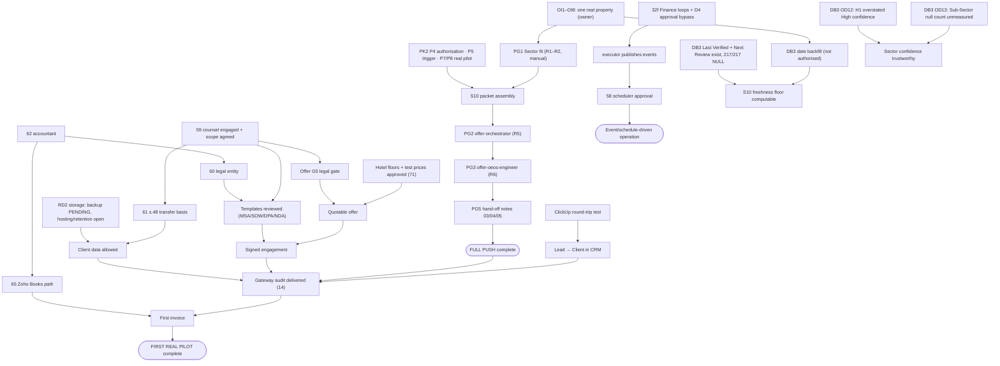

# Readiness Assessment — Mechanism vs Real-Pilot

**Refreshed:** 2026-10-03 — **four dimensions, and the offline suites were actually run this time.**
**Owner:** Agency Governance (00)
**Standard applied:** [`AEIT_11_RUNTIME_TRUTH_STANDARD.md`](AEIT_11_RUNTIME_TRUTH_STANDARD.md) — a state is claimed only with its named test (R1), never inherited (R2), and `CONNECTED`/`LIVE` decay after 30 days (R3). **R3 cutoff on this refresh: anything last verified before 2026-09-03 is past the limit.**

**Status of this refresh:** **offline measurement.** Every Python suite, Node suite, build and gate named in §2.2 **was executed on 2026-10-03** and its result is this document's own evidence. **No agent, skill, runtime boot, model call, browser, Notion, ClickUp or other connector call was made**, and none was authorised. Nothing was invented: where no evidence exists, the score is `B` and the gap is named.

> **Bottom line, 2026-10-03.** The machinery is far ahead of the reality it is meant to run on, and **the gap is now measured in four dimensions rather than two.** Agency-wide weighted: **mechanism 53.0 %** · **simulation 53.4 %** · **real-prospect pilot 16.5 %** · **client-facing 2.3 %**.
>
> 🔴 **The two new numbers are the useful ones.** **Simulation (53.4 %) has almost caught mechanism (53.0 %)** — meaning the estate can now rehearse nearly as much as it can build, and **further offline work has little headroom left at the agency level**. **Client-facing readiness is 2.3 %**, and it is low for one reason: items **59 (counsel)**, **60 (entity)** and **61 (s.48 transfers)** are all unresolved, so **no department may lawfully touch client data or sign anything**. That single chain holds **seventeen of twenty-one departments at exactly 0 %** on the fourth dimension.
>
> The Full Push path: mechanism **86.5 %**, simulation **89.2 %**, real-pilot **20 %**, client-facing **0 %**. The first real pilot: mechanism **72.0 %**, simulation **73.1 %**, real-pilot **15 %**, client-facing **0 %**. Required gates passed: **0 of 5** (PG0 only partly).
>
> **What stops the Full Push is still not code** — it is one real property (OI1–OI8) and two PK2 decisions (P4 authorisation, P5 trigger). **What stops a client is a lawyer and an entity.** The one thing that *is* code is Finance's three non-terminating loops and the runtime's `humanGate` bypass (D4), and both are removable offline today.

<details>
<summary><strong>SUPERSEDED — the original 2026-10-02 header, preserved verbatim</strong></summary>

**Measured:** 2026-10-02 (repository state at commit `990f1fb`, working tree clean)
**Owner:** Agency Governance (00)
**Status:** Measurement · **read-only** · nothing was run to produce it — no agent, skill, runtime, test suite, connector or external API. Every "test run" cited below is a **recorded** result found in the repository, not one re-run for this report.
**Standard applied:** [`AEIT_11_RUNTIME_TRUTH_STANDARD.md`](AEIT_11_RUNTIME_TRUTH_STANDARD.md) — a state is claimed only with its named test (R1), never inherited (R2), and `CONNECTED`/`LIVE` decay after 30 days (R3).

> **Bottom line.** The machinery is far ahead of the reality it is meant to run on. **Agency-wide weighted readiness: mechanism 53.0 %, real-pilot 16.5 %.** The Full Push path's mechanism is **86.5 %** ready, but its real-pilot readiness is **20 %**. Required gates passed: **0 of 5** (PG0 only partly). The first real pilot is at **15 %**. What stops it is no longer code. It is one real property (OI1–OI8), one engaged lawyer, and one legal entity.

*That reading stands as measured. The mechanism and real-pilot figures are unchanged by this refresh; what changed is that two further dimensions were added, the suites were run, and the corrections in §11 were applied.*

</details>

---

## 1. Scoring formula — reproducible

**Per item, per dimension:**

```
score = Σ (weight_c × credit_c) / Σ (weight_c for every criterion c that applies)
weights: G governance/decision 15 · S schemas/data contracts 20 · I implementation/runtime 20
         D integrations/delivery 15 · T tests/verification 20 · L legal/privacy/security 10
credit:  V VERIFIED = 1 · P PARTIAL = 0.5 · B BLOCKED/ABSENT = 0 · N NOT APPLICABLE = weight removed
```

Ratings are written as a six-letter string in the order **G S I D T L**. For example, `VVPPVP` = 15 + 20 + 10 + 7.5 + 20 + 5 = **77.5 / 100**. Every table shows the string and the arithmetic.

**Caps, applied after the formula (never rounded up):**

| Cap | Applies when | Test used here |
|---|---|---|
| Mechanism ≤ **39 %** | No verified execution path | No dated execution record (`runtime.jsonl`, `skill_runs.jsonl`, sandbox streams, provisioning audit) **and** no recorded live execution of its code path |
| Mechanism ≤ **49 %** | Plugin never executed | No recorded execution against its real target (mocked tests do not count) |
| **Simulation ≤ 49 %** | **Never rehearsed** | **No dated run on non-null input exists anywhere for the item — synthetic, fixture or real. Added 2026-10-03; it binds 106 of 115 agents** |
| Real-pilot ≤ **49 %** | Unresolved hard legal/security stop | Item's real-pilot path touches client data, contracts, published claims, payments or personal data while counsel is unengaged (item 59), the entity is unresolved (60) and s.48 transfers are undocumented (61) |
| **Client-facing ≤ 20 %** | **The legal chain is open** | **Items 59, 60 and 61 are all unresolved and the item's path touches client data, contracts, claims, payments or personal data. Added 2026-10-03. In practice every department it touches already scores below 20 %, so it binds nothing today — it is recorded so that a future score cannot drift past the chain** |
| Fixture success ≠ real execution | Always | `TEST_FIXTURE`-classified runs earn **mechanism and simulation** credit only — never real-pilot or client-facing |

> **Why the simulation cap is set at a dated non-null-input run.** Five of the nine agent execution records in the estate carry `input: null` — the three Sales schedule runs and both `techstack-cost-guardian` runs. Those runs prove dispatch, governance evaluation and the memory write; they prove nothing about processing data, and the agents said so themselves. `techstack-cost-guardian`'s 2026-08-30 record reads: *"No fresh reads were made this run (empty input), so figures below reflect the last live-verified state (2026-07-15) and must be re-verified before any decision."* **An agent that honestly reports having no input is working correctly and has not been simulated.**

**What each criterion means in each dimension:**

**The four dimensions, in increasing strictness.** Each is scored with the same formula and the same six criteria; only the meaning of a criterion changes. An item can be high on one and zero on the next — that is the point of separating them.

| | 1 · Mechanism *(does the machinery work?)* | 2 · Simulation *(can we rehearse it end to end today, on synthetic input, with no real prospect?)* | 3 · Real-prospect pilot *(can it run for a real property, today?)* | 4 · Client-facing *(may it touch real client data, or be shown to a client?)* |
|---|---|---|---|---|
| **G** | Gates and decision records **in force and enforced in code** | A fixture or synthetic run is **authorised**, and its lane is governed | Owner inputs supplied and the run **authorised** | Engagement governance exists: intake ratified (73), an approval-matrix row, a Class 3 sign-off path |
| **S** | Schemas/contracts **machine-checked** (gate, test or live store matches spec) | **Synthetic data exists in the real shape** and validates against the contract | **Real data** present in the real store | Client data may be **lawfully stored** — RD2 backup, hosting and retention resolved |
| **I** | Executable artifact with a **dated execution record** (V) or built only (P) | A dated run **on non-null input** — synthetic or fixture. *An `input: null` run proves the harness, not the simulation* | **Non-fixture** execution on real inputs | Execution **on client data** |
| **D** | Internal edges `CONNECTED` and tested; no edge is `LIVE` anywhere (`executor.ts` never publishes), so V needs a verified hand-off | The hand-off **exercised in a fixture lane with a read-back** (write → read → confirm) | Live external integration and a **real delivery** to the next owner | Delivery **to the client**, or a client-visible surface |
| **T** | **Recorded** test/gate runs with results | The rehearsal's result **verified by assertion or read-back**, not merely emitted | Verification of a real-data run | Verification **a client could rely on** |
| **L** | Isolation, secrets handling, fixture lanes, offline guard | Fixture isolation **proven** — no real store touched, real logs byte-unchanged | Counsel review, entity, DPA/s.48, licensing, claims | **Signed** MSA/SOW/DPA, a documented s.48 basis, substantiated claims, counsel-reviewed templates |

> 🔴 **Simulation is not a softer mechanism score, and it is not fixture-counting.** Mechanism asks whether the parts exist and have ever executed. Simulation asks whether a **full rehearsal can be driven through them today** without a real prospect — which needs synthetic input in the real shape, an authorised lane, a read-back and proven isolation. A department can have a high mechanism score and a **lower** simulation score when its machinery exists but nothing can be fed through it: Marketing (39 % / 30 %) and Experience Engineering (39 % / 27.5 %) are both in that position, each because an input edge or a gate has never been exercised.
>
> 🔴 **Client-facing is not real-pilot with a different name.** The real-pilot dimension asks whether the first *Hospitality property* could be processed — much of which is public data. Client-facing asks whether anything may touch **client** data or reach a client's eyes. The legal chain (59 → 60/61) binds the fourth dimension almost everywhere while leaving the third partly open, which is why real-pilot is **16.5 %** and client-facing is **2.3 %**.

**Weights for the agency-wide figure:** the spine departments (01, 02, 03, 04, 05, 07, 08, 09) and Governance (00) carry weight 2, and the other 12 carry weight 1. The denominator is 30. Cross-Domain Synthesis (18) is a reference archive and is excluded.

---

## 2. Headline figures

| Measure | Mechanism | **Simulation** | Real-prospect pilot | **Client-facing** | Arithmetic |
|---|---|---|---|---|---|
| **Agency-wide, weighted** (21 departments incl. 00) | **53.0 %** | **53.4 %** | **16.5 %** | **2.3 %** | Σ(score × weight) / 30 — §3 |
| Agency-wide, unweighted | 50.9 % | 50.3 % | 16.5 % | 2.6 % | mean of 21 |
| **115 agents**, mean | 42.3 % | **40.5 %** | 13.0 % | **2.2 %** | §7; **9 of 115** have a dated execution record, of which **6** are on non-null input |
| **Full Push** (Sector → Offer, one real property, public data, manual) | **86.5 %** | **89.2 %** | **20.0 %** | **0.0 %** | Means of the 11 items the push uses (§2.1). Real-pilot `PBBPBP` = 7.5+0+0+7.5+0+5; client-facing `BBBBBB` = 0 |
| Full Push, gate view | — | — | **0 of 5 required gates passed** | — | PG0 ◐ (public-only prep only) · PG1 ❌ · PG2 ❌ · PG3 ❌ · PG5 ❌ · PG4 N/A (skipped by RD5, **not passed**) |
| **First real pilot** (`PILOT-H-001` as a client: audit, client data, contract, invoice) | **72.0 %** | **73.1 %** | **15.0 %** | **0.0 %** | Means of 20 items (§2.1). Real-pilot `PBBPBB` = 7.5+0+0+7.5+0+0; client-facing `BBBBBB` = 0 |

**Three readings worth taking from that table:**

1. 🔴 **Simulation has converged on mechanism (53.4 % vs 53.0 %).** The estate can rehearse very nearly everything it has built. **Offline work is close to exhausted as an agency-level lever** — the remaining offline items are specific and few (§10), and after them the numbers only move when a real property, a lawyer, an entity or an external account arrives.
2. 🔴 **Client-facing is 2.3 %, and seventeen of twenty-one departments are at exactly 0 %.** Only four score above zero — Governance (7.5 %), Sector (7.5 %), Legal (7.5 %) and Experience Engineering (31.2 %) — and EE scores at all only because **the website is already public** — which makes its unchecked image rights (item 66) the single highest-consequence open item on this dimension, since it sits on a live client-facing surface.
3. **The first real pilot's mechanism rose 71.5 % → 72.0 %.** Not new building: `finos-plugin`'s 8 tests were re-verified on 2026-10-03, moving its T from P to V (§4.1). That is the only score in this document the refresh moved upward.

**Separation of pilots and fixtures, restated because the dimensions make it matter more.** `PILOT-H-001` is the **real Hospitality property** identifier and has **no runs of any kind**. `A001` is the document-only sandbox (D20: mechanism evidence only). `SYNCO-01` is a synthetic *company* fixture; `SYNCO-02` is the P10 delivery control. **A001 and SYNCO evidence earns mechanism and simulation credit only — never real-pilot, never client-facing.** No A001 or SYNCO artifact is counted toward `PILOT-H-001` anywhere in this document.

### 2.1 Which items each path uses

- **Full Push (11 items):** 00 Governance 77.5 · 01 Sector 82.5 · 02 Offer 92.5 · arika-runtime 87.5 · Hospitality plugin 77.5 · S10 92.5 · `offer-orchestrator` 92.5 · `offer-oeos-engineer` 92.5 · Anthropic API 93.75 · Google Drive 67.5 · Notion 95. Sum 951.25 ÷ 11 = **86.5 %**.
- **First real pilot (20 items):** the 11 above, plus 05 Sales 60 · 07 Client Success 39 · 08 Operations 39 · 09 Finance 52.5 · 10 Legal 39 · 14 Audits 39 · ClickUp 77.5 · Zoho Books 62.5 · finos-plugin 70. Sum 1 429.75 ÷ 20 = **71.5 %**.

**Full Push real-pilot rating `PBBPBP`, criterion by criterion:**
- **G = P:** RD1 and RD3–RD7 are decided and RD2's location half is decided, but OI1–OI9 are unsupplied and PG1 is unmet.
- **S = B:** there is no property record, and S10 packet assembly is BLOCKED by PK2 P4 (authorisation), P5 (trigger) and P7/P8 (real pilot).
- **I = B:** every Offer run so far is `TEST_FIXTURE`.
- **D = P:** the Sector → Offer text-reference route works, the receiver is verified on a fixture only, and the downstream hand-offs are notes carried by hand.
- **T = B:** the run log in packet §11 is empty.
- **L = P:** the data is public only and OI7/OI8 default to the safe side, but OTA terms and screenshot handling have not been assessed.

**First-real-pilot real rating `PBBPBB`:** the same as above, except that S is B because there is no client data or ratified intake (item 73), and L is B because there is no engaged counsel, entity or DPA. The 49 % legal cap does not bind because the score is already 15 %.

**Full Push and first-pilot client-facing are both `BBBBBB` = 0 %.** Neither path has engagement governance (73 unratified), lawful client-data storage (RD2 backup PENDING), any execution on client data, any client delivery, any client-reliable verification, or a signed instrument (59/60/61 all open). **The Full Push does not need the fourth dimension** — it is a public-data exercise by RD1/OI7/OI8 — so a 0 % there is correct and not a blocker for it. **The first real pilot cannot start without it.**

### 2.2 The suites, builds and gates — run on 2026-10-03, not quoted

*This is the section the 2026-10-02 measurement could not write. It listed three Sector suites and one runtime file as having **no recorded result**; all four now have one, and two recorded results turned out to be stale undercounts.*

| Suite / gate | Result 2026-10-03 | What the 2026-10-02 reading said |
|---|---|---|
| `01_Sector/contracts/test_db9_provenance.py` | **167 pass** | *"no recorded result found"* — and it listed **141** test functions |
| `01_Sector/contracts/test_skill_fixture.py` | **56 pass** | *"no recorded result found"* — and it listed **44** |
| `01_Sector/delivery/test_offer_inbox_receiver.py` | **72 pass** | *"no recorded result found"* — count was right |
| `arika-runtime` (`node:test`) | **68 pass** | **54/54 on 2026-09-22**; `fixture-f3.test.mjs` had no recorded result. Now the whole 68 is verified |
| `00_Agency_Governance/offline_guard/test_offline_guard.py` | **31 pass** | 31 of the recorded 46 |
| `00_Agency_Governance/offline_guard/offline_guard.test.mjs` | **15 pass** | the other 15 of 46 |
| `09_Finance/finos-plugin` (`npm test`, builds first) | **8 pass** | **8 pass on 2026-07-07** — past R3, now re-verified |
| `19_Design/design-plugin` KIE (`npm test`, mocked `fetch`) | **15 pass** | *"13 pass (2026-07-07). The file now has 15, so the recorded result is stale"* — **now 15, verified** |
| **Total** | **432 offline tests, 0 failures** | — |
| `sector_truth_gate.py` · `skill_run_gate.py` · `p2_coverage_gate.py` · `estate_event_gate.py` · `intake_gate.py` | **5 of 5 exit 0** | estate gate PASS 2026-09-14; others asserted |
| Builds: `arika-runtime` · `finos-plugin` · `design-plugin` (`tsc`) | **3 of 3 clean**, typecheck clean | `dist/` rebuilt 2026-10-02 |

🔴 **One script was deliberately NOT run: `12_Branding/bois/executions/smoke_test.py`.** It has **no assertions**, and it **writes** — `memory.save_client()` and `orchestrator.persist_context()`. Running it would append a Branding memory record and so **manufacture the very execution evidence this document counts**, while proving nothing. It is excluded on purpose, and Branding's T stays at `P` because **Branding still has no assertion-bearing suite**. *(It has been run before: `bois/memory/client-memory/sample-nairobi-laundry.jsonl` holds 2 records.)*

**What running the suites did and did not change.** It did **not** raise Sector's, Governance's or the runtime's mechanism scores: each already held `T = V` on the strength of other recorded gate runs, so the suites **substantiated ratings that had been asserted on thinner evidence** rather than lifting them. It **did** raise `finos-plugin` from 70.0 % to 80.0 %. The honest summary is that **this refresh converted assertion into verification without inflating the result** — which is the outcome a scoring method should produce when it is working.

---

## 3. Departments

| # | Department | Mech | **Mechanism** | Sim | **Simulation** | Real | **Real-pilot** | Client | **Client-facing** | Wt | First pilot |
|---|---|---|---|---|---|---|---|---|---|---|---|
| 00 | Governance + shared infra | `VVPPVP` | **77.5 %** | `PVVPVV` | **85.0 %** | `PPBPBB` | **25.0 %** | `PBBBBB` | **7.5 %** | 2 | Needed (PG0 gates, intake, offline guard) |
| 01 | Sector | `VVPPVV` | **82.5 %** | `PVVVVV` | **92.5 %** | `PPPPBP` | **40.0 %** | `PBBBBB` | **7.5 %** | 2 | Needed (R2 fit, R3 S10 packet) |
| 02 | Offer | `VVVPVV` | **92.5 %** | `VVVPVV` | **92.5 %** | `PPBBBB` | **17.5 %** | `BBBBBB` | **0.0 %** | 2 | Needed (R5–R6) |
| 03 | Marketing | `PPPPPP` | **39.0 %** | `BPBBPV` | **30.0 %** | `BBBPBB` | **7.5 %** | `BBBBBB` | **0.0 %** | 2 | Defer (RD6: notes only) |
| 04 | Content | `PVPPPP` | **39.0 %** | `BVBPPV` | **47.5 %** | `BPBPBB` | **17.5 %** | `BBBBBB` | **0.0 %** | 2 | Defer (RD6: notes only) |
| 05 | Sales | `PVPPPP` | **60.0 %** | `PVPVPV` | **72.5 %** | `BPBPBB` | **17.5 %** | `BBBBBB` | **0.0 %** | 2 | Defer for Full Push; needed for first real pilot (CRM) |
| 06 | ClientPartner Acquisition | `PVPPPP` | **39.0 %** | `BPBPPV` | **37.5 %** | `BPBPBB` | **17.5 %** | `BBBBBB` | **0.0 %** | 1 | Defer |
| 07 | Client Success | `PPPPPP` | **39.0 %** | `BPBBPV` | **30.0 %** | `BBBPBB` | **7.5 %** | `BBBBBB` | **0.0 %** | 2 | Defer for Full Push; onboarding needed for first real pilot |
| 08 | Operations | `PPPPPP` | **39.0 %** | `BPBBPV` | **30.0 %** | `PBBPBB` | **15.0 %** | `BBBBBB` | **0.0 %** | 2 | Defer for Full Push; delivery needed for first real pilot |
| 09 | Finance | `PVPBPP` | **52.5 %** | `PVPBVV` | **67.5 %** | `BBBBBB` | **0.0 %** | `BBBBBB` | **0.0 %** | 2 | Defer for Full Push; invoicing needed for first real pilot |
| 10 | Legal | `VPPPPP` | **39.0 %** | `PPBBPB` | **27.5 %** | `PBBBBB` | **7.5 %** | `PBBBBB` | **7.5 %** | 1 | Needed for first real pilot (hard stop) |
| 11 | HR / People Ops | `PPPPPP` | **39.0 %** | `BPBNPV` | **35.3 %** | `PBBNBB` | **8.8 %** | `BBBNBB` | **0.0 %** | 1 | Defer (solo + AI, provisional capacity) |
| 12 | Branding | `VVVPPP` | **77.5 %** | `VVVPPV` | **82.5 %** | `PPPPPP` | **50.0 %** | `BBBBBB` | **0.0 %** | 1 | Defer |
| 13 | Tech Stack | `VPPPPP` | **57.5 %** | `PVPPPP` | **60.0 %** | `PPPPPB` | **45.0 %** | `BBBBBB` | **0.0 %** | 1 | Needed (verify integrations) |
| 14 | Audits & Diagnostics | `PPPPPP` | **39.0 %** | `BPBPPV` | **37.5 %** | `BBBBBB` | **0.0 %** | `BBBBBB` | **0.0 %** | 1 | Needed for first real pilot (gateway audit) |
| 15 | Consulting & Advisory | `PPPPPP` | **39.0 %** | `BPBBPV` | **30.0 %** | `BBBBBB` | **0.0 %** | `BBBBBB` | **0.0 %** | 1 | Defer |
| 16 | Automation | `PPPPPP` | **50.0 %** | `BPPPPP` | **42.5 %** | `BBBPBB` | **7.5 %** | `BBBBBB` | **0.0 %** | 1 | Defer (manual only; scheduler not approved) |
| 17 | AI Enablement | `PPPPPP` | **39.0 %** | `BPBBPV` | **30.0 %** | `BBBBBB` | **0.0 %** | `BBBBBB` | **0.0 %** | 1 | Defer |
| 19 | Design | `PPPPPP` | **50.0 %** | `PVPBVV` | **67.5 %** | `BBPBBB` | **10.0 %** | `BBBBBB` | **0.0 %** | 1 | Defer |
| 20 | Experience Engineering | `PPPPPP` | **39.0 %** | `BPBPBV` | **27.5 %** | `PPPPPB` | **45.0 %** | `PNPPBB` | **31.2 %** | 1 | Defer |
| 21 | Presence | `PPPBPP` | **39.0 %** | `BPBBPV` | **30.0 %** | `BBBPBB` | **7.5 %** | `BBBBBB` | **0.0 %** | 1 | Defer |
| | **Agency, weighted** | | **53.0 %** | | **53.4 %** | | **16.5 %** | | **2.3 %** | 30 | Σ(score×wt)/30 |
| 18 | Cross-Domain Synthesis | N/A — reference archive, excluded | | | | | | | | 0 | — |

**Per-item arithmetic for the two new dimensions** (the mechanism and real-pilot arithmetic is unchanged and preserved in the collapsed block below):

| # | Simulation arithmetic | Client-facing arithmetic |
|---|---|---|
| 00 | `PVVPVV` 85/100=85.0% | `PBBBBB` 7.5/100=7.5% |
| 01 | `PVVVVV` 92.5/100=92.5% | `PBBBBB` 7.5/100=7.5% |
| 02 | `VVVPVV` 92.5/100=92.5% | `BBBBBB` 0/100=0.0% |
| 03 | `BPBBPV` 30/100=30.0% | `BBBBBB` 0/100=0.0% |
| 04 | `BVBPPV` 47.5/100=47.5% | `BBBBBB` 0/100=0.0% |
| 05 | `PVPVPV` 72.5/100=72.5% | `BBBBBB` 0/100=0.0% |
| 06 | `BPBPPV` 37.5/100=37.5% | `BBBBBB` 0/100=0.0% |
| 07 | `BPBBPV` 30/100=30.0% | `BBBBBB` 0/100=0.0% |
| 08 | `BPBBPV` 30/100=30.0% | `BBBBBB` 0/100=0.0% |
| 09 | `PVPBVV` 67.5/100=67.5% | `BBBBBB` 0/100=0.0% |
| 10 | `PPBBPB` 27.5/100=27.5% | `PBBBBB` 7.5/100=7.5% |
| 11 | `BPBNPV` 30/85=35.3% | `BBBNBB` 0/85=0.0% |
| 12 | `VVVPPV` 82.5/100=82.5% | `BBBBBB` 0/100=0.0% |
| 13 | `PVPPPP` 60/100=60.0% | `BBBBBB` 0/100=0.0% |
| 14 | `BPBPPV` 37.5/100=37.5% | `BBBBBB` 0/100=0.0% |
| 15 | `BPBBPV` 30/100=30.0% | `BBBBBB` 0/100=0.0% |
| 16 | `BPPPPP` 42.5/100=42.5% | `BBBBBB` 0/100=0.0% |
| 17 | `BPBBPV` 30/100=30.0% | `BBBBBB` 0/100=0.0% |
| 19 | `PVPBVV` 67.5/100=67.5% | `BBBBBB` 0/100=0.0% |
| 20 | `BPBPBV` 27.5/100=27.5% | `PNPPBB` 25/80=31.2% |
| 21 | `BPBBPV` 30/100=30.0% | `BBBBBB` 0/100=0.0% |

<details>
<summary><strong>SUPERSEDED — the 2026-10-02 two-dimension department table, preserved verbatim</strong></summary>

| # | Department | Mech. rating | Mech. arithmetic | **Mechanism** | Real rating | Real arithmetic | **Real-pilot** | Wt | First pilot |
|---|---|---|---|---|---|---|---|---|---|
| 00 | Governance + shared infra | `VVPPVP` | 77.5/100=77.5% | **77.5 %** | `PPBPBB` | 25/100=25.0% | **25.0 %** | 2 | Needed (PG0 gates, intake, offline guard) |
| 01 | Sector | `VVPPVV` | 82.5/100=82.5% | **82.5 %** | `PPPPBP` | 40/100=40.0% | **40.0 %** | 2 | Needed (R2 fit, R3 S10 packet) |
| 02 | Offer | `VVVPVV` | 92.5/100=92.5% | **92.5 %** | `PPBBBB` | 17.5/100=17.5% | **17.5 %** | 2 | Needed (R5–R6) |
| 03 | Marketing | `PPPPPP` | 50/100=50.0% → cap 39 | **39.0 %** | `BBBPBB` | 7.5/100=7.5% | **7.5 %** | 2 | Defer (RD6: notes only) |
| 04 | Content | `PVPPPP` | 60/100=60.0% → cap 39 | **39.0 %** | `BPBPBB` | 17.5/100=17.5% | **17.5 %** | 2 | Defer (RD6: notes only) |
| 05 | Sales | `PVPPPP` | 60/100=60.0% | **60.0 %** | `BPBPBB` | 17.5/100=17.5% | **17.5 %** | 2 | Defer for Full Push; needed for first real pilot (CRM) |
| 06 | ClientPartner Acquisition | `PVPPPP` | 60/100=60.0% → cap 39 | **39.0 %** | `BPBPBB` | 17.5/100=17.5% | **17.5 %** | 1 | Defer |
| 07 | Client Success | `PPPPPP` | 50/100=50.0% → cap 39 | **39.0 %** | `BBBPBB` | 7.5/100=7.5% | **7.5 %** | 2 | Defer for Full Push; onboarding needed for first real pilot |
| 08 | Operations | `PPPPPP` | 50/100=50.0% → cap 39 | **39.0 %** | `PBBPBB` | 15/100=15.0% | **15.0 %** | 2 | Defer for Full Push; delivery needed for first real pilot |
| 09 | Finance | `PVPBPP` | 52.5/100=52.5% | **52.5 %** | `BBBBBB` | 0/100=0.0% | **0.0 %** | 2 | Defer for Full Push; invoicing needed for first real pilot |
| 10 | Legal | `VPPPPP` | 57.5/100=57.5% → cap 39 | **39.0 %** | `PBBBBB` | 7.5/100=7.5% | **7.5 %** | 1 | Needed for first real pilot (hard stop) |
| 11 | HR / People Ops | `PPPPPP` | 50/100=50.0% → cap 39 | **39.0 %** | `PBBNBB` | 7.5/85=8.8% | **8.8 %** | 1 | Defer (solo + AI, provisional capacity) |
| 12 | Branding | `VVVPPP` | 77.5/100=77.5% | **77.5 %** | `PPPPPP` | 50/100=50.0% | **50.0 %** | 1 | Defer |
| 13 | Tech Stack | `VPPPPP` | 57.5/100=57.5% | **57.5 %** | `PPPPPB` | 45/100=45.0% | **45.0 %** | 1 | Needed (verify integrations) |
| 14 | Audits & Diagnostics | `PPPPPP` | 50/100=50.0% → cap 39 | **39.0 %** | `BBBBBB` | 0/100=0.0% | **0.0 %** | 1 | Needed for first real pilot (gateway audit) |
| 15 | Consulting & Advisory | `PPPPPP` | 50/100=50.0% → cap 39 | **39.0 %** | `BBBBBB` | 0/100=0.0% | **0.0 %** | 1 | Defer |
| 16 | Automation | `PPPPPP` | 50/100=50.0% | **50.0 %** | `BBBPBB` | 7.5/100=7.5% | **7.5 %** | 1 | Defer (manual only; scheduler not approved) |
| 17 | AI Enablement | `PPPPPP` | 50/100=50.0% → cap 39 | **39.0 %** | `BBBBBB` | 0/100=0.0% | **0.0 %** | 1 | Defer |
| 19 | Design | `PPPPPP` | 50/100=50.0% | **50.0 %** | `BBPBBB` | 10/100=10.0% | **10.0 %** | 1 | Defer |
| 20 | Experience Engineering | `PPPPPP` | 50/100=50.0% → cap 39 | **39.0 %** | `PPPPPB` | 45/100=45.0% | **45.0 %** | 1 | Defer |
| 21 | Presence | `PPPBPP` | 42.5/100=42.5% → cap 39 | **39.0 %** | `BBBPBB` | 7.5/100=7.5% | **7.5 %** | 1 | Defer |
| | **Agency, weighted** | | Σ(score×wt)/30 | **53.0 %** | | | **16.5 %** | 30 | |
| 18 | Cross-Domain Synthesis | N/A — reference archive, excluded | | | | | | 0 | — |

*Mechanism and real-pilot figures above are carried forward unchanged. Only Finance's plugin moved, in §4.*

</details>

### 3.1 Evidence per department

**00 Governance + shared infrastructure**
- **Evidence:**
  - Constitution, RACI, KPI dictionary and approval matrix are in force.
  - The CRM schema is implemented in ClickUp, live-verified 2026-07-15. The Lead fields were provisioned under CRM-PROV-1, with an audit record dated `2026-09-29T045210Z` and `verified_after`.
  - `estate_event_gate.py` passed (exit 0) on 2026-09-14 and was falsified 2026-08-28.
  - `intake_gate.py`, `offline_guard` (Python + Node preload) and `skill_run_gate.py` exist.
  - The dashboard spine is not started. Handoff standards are designed (AEIT_09) but not built. The memory protocol is partial.
- **Tests actually run (recorded):** offline guard 46/46 (31 Python + 15 Node); estate gate PASS 2026-09-14; skill_run_gate falsified 2026-09-12.
- **Fixture-only:** the offline guard's protection of fixture runs.
- **Hard blockers:**
  - Counsel not engaged (59), entity unresolved (60), s.48 transfers undocumented (61).
  - Client Intake Profile unratified (73).
  - Scheduler governance undecided (58).
  - Runtime approval bypass, P10 finding #6 / D4 (see the runtime row in §4).
- **Smallest action:** ratify the Client Intake Profile (item 73).
- **First pilot:** needed.
- **Simulation 85.0 %** (`PVVPVV` 85/100=85.0%) · **Client-facing 7.5 %** (`PBBBBB` 7.5/100=7.5%)
- **Remaining simulation blockers:** Client Intake Profile unratified (**73**), so a full intake rehearsal cannot be driven end to end; the dashboard spine is not started; the AEIT_09 hand-off standard is designed, not built.
- **Remaining real-pilot blockers:** **59** counsel · **60** entity · **61** s.48 · **73** intake · **58** scheduler governance · **D4** runtime approval bypass.
- **Blocker kind:** **Governance** (73, 58) · **legal** (59/60/61) · **technical** (D4, dashboard spine).
- **Smallest next action (2026-10-03):** Ratify the Client Intake Profile (**73**). One owner decision; it is also the gate on the fourth dimension for every other department.

**01 Sector**
- **Evidence:**
  - 16 Notion databases; 311 of 311 fields owned (AEIT_11 §3).
  - S01–S10 have dated runs (15 records); live writes were made 2026-10-02 (DB6 OD1/OD2, the DB9 `Evidence` field).
  - Hospitality reached Offer-Ready (S10, Gate G).
  - The Sector → Offer receiver was implemented and verified 2026-10-02: one fixture acknowledgement, with hashes recorded.
  - Weak spots:
    - 5 agents have never run.
    - S11 and S12 exist only as contracts.
    - `sector-icp-fit` cannot fit a hotel (B2B SaaS only).
    - Marketing and Operations have no route from Sector (31k).
    - 8 of the 14 original skill records carry fabricated timestamps; they are grandfathered and fenced by `skill_run_gate.py`.
- **Tests actually run (recorded):**
  - `sector_truth_gate.py` went red on 28 lines, then green.
  - `skill_run_gate.py` was falsified with 2 failures and exit 1.
  - **No recorded result was found** for `test_db9_provenance.py` (141 test functions), `test_skill_fixture.py` (44) or `test_offer_inbox_receiver.py` (72). They exist; a pass is not claimed.
- ✅ **Tests VERIFIED 2026-10-03 — superseding the bullet above, which was true when written.** **295 Sector tests pass**: `test_db9_provenance.py` **167**, `test_skill_fixture.py` **56**, `test_offer_inbox_receiver.py` **72**. **Two of the three recorded counts were stale undercounts** (141 → 167, 44 → 56), because `DB9-PROV-1`, `DB6-DB10-PROV-1`, `DB6-OD1-OD2-1`, `DB3-PROV-1` and `DB3-OD10-OD12-1` each added tests. `sector_truth_gate.py`, `skill_run_gate.py` and `p2_coverage_gate.py` all **exit 0** today.
- ✅ **DB 3 OD10 complete (2026-10-02), after this assessment's measurement commit.** DB 3 is **17 properties**: `Last Verified` and `Next Review` now exist, **all 217 cells of each are NULL**, `Freshness` is **NON-GOVERNING**, and **S10 fails closed on an absent *or* null date**. **It moves none of Sector's four scores** — see §13 for why that is the correct outcome. Still open from it: **H1's overstated High confidence** (OD12) and the **unmeasured Sub-Sector null count** (OD13).
- **Contract field count is now 333, not 311.** `sector-databases.json` records 333 field records across 16 databases; AEIT_11 §3's "311 of 311 owned" dates from 2026-08-28 and its **count** is stale (the ownership claim is not). Added to §11.
- **Fixture-only:** S10 runs SF1 and SF2; the P10 delivery (one empty-payload control reference); the whole A001 sandbox (D20: mechanism evidence only).
- **Hard blockers:** OI1–OI8 unsupplied (PG1). S10 assembly is blocked by PK2 P4/P5/P7/P8. P8 sources are all `candidate`.
- **Smallest action:** the owner supplies OI1–OI8 for one property. That unblocks R1–R2 and the manual fit check.
- **First pilot:** needed (R2 fit, R3 S10 packet).
- **Simulation 92.5 %** (`PVVVVV` 92.5/100=92.5%) · **Client-facing 7.5 %** (`PBBBBB` 7.5/100=7.5%)
- **Remaining simulation blockers:** **PK2 P4 (authorisation) and P5 (trigger)** block S10 packet assembly, so the department's only sanctioned exit cannot be rehearsed; 5 agents have never run; S11/S12 exist as contracts only; `sector-icp-fit` is B2B-SaaS-only and **cannot fit a hotel** (RD4 accepted this gap).
- **Remaining real-pilot blockers:** **OI1–OI8** (one real property) · PK2 **P7/P8** · all P8 sources still `candidate` · **H1's overstated High confidence** (DB3 OD12) · **OD13** Sub-Sector null count unmeasured.
- **Blocker kind:** **Owner-input** (OI1–OI8) · **owner-decision** (P4/P5, H1's disposition) · **technical** (S11/S12, a hotel fit path) · **external** (verifying P8 sources against live publishers).
- **Smallest next action (2026-10-03):** Resolve **PK2 P4 and P5**. Those two are decisions, not builds, and they are what stand between today and a complete S10 dry run on synthetic input — **no real property required**.

**02 Offer**
- **Evidence:**
  - 3 agents with 8 dated runs: 5 on 2026-09-13 in the control test (test-fixture values), plus sandbox runs F1/D21 (09-21), F2 (09-22) and F3 (09-29).
  - Fixture lanes are single-use, and the gate fires before any model call.
  - The rejected-brief emit fix and the self-loop break are in place.
  - The capacity worksheet's gates G1, G3, G4 and G6 are passed for the MVP only.
- **Tests actually run (recorded):** runtime suite 54/54 (2026-09-22). Earlier: 40/40, 36/36, 28/28.
- **Fixture-only:** every Offer agent result, including the `needs_more_seed_data`, `reject` and `insufficient_data` outcomes.
- **Hard blockers:** no real seed brief (PG2). Not Quotable. No hotel price floors and no H-band support in the pricing agent. G5 (legal) narrowed, not passed. G2 blocked by legal.
- **Smallest action:** none inside Offer. It waits on Sector R3 and owner review.
- **First pilot:** needed (R5, R6). The pricing agent is skipped (RD5).
- **Simulation 92.5 %** (`VVVPVV` 92.5/100=92.5%) · **Client-facing 0.0 %** (`BBBBBB` 0/100=0.0%)
- **Remaining simulation blockers:** **None inside Offer.** The rehearsal already runs: five production-stream runs on a real sector-derived seed brief and three sandbox fixture runs, all on non-null input, all refusing correctly. The only sub-maximal criterion is **D**, because no downstream hand-off out of Offer has been exercised.
- **Remaining real-pilot blockers:** No real seed brief (**PG2**) · not Quotable · no hotel price floors or H-band support (**71**) · **G5** narrowed not passed · **G2** blocked by legal.
- **Blocker kind:** **Owner-input** (a real seed brief) · **owner-decision** (71 pricing) · **legal** (G5, G2).
- **Smallest next action (2026-10-03):** None inside Offer. It waits on Sector **R3** and owner review — correctly, and this is the one department where that is the honest answer.

**03 Marketing**
- **Evidence:** 9 agents `BUILT`, none run. No route from Sector (31k). No accounts; Postiz is running but no platform is connected.
- **Tests actually run:** only the runtime registry test, which validates all 115 specs.
- **Fixture-only:** none.
- **Hard blockers:** no social accounts (44). Claims substantiation has no reviewer. RD6 allows notes only.
- **Smallest action:** decide 31k, i.e. who produces Marketing's inbound route.
- **First pilot:** defer. It gets a hand-off note only.
- **Simulation 30.0 %** (`BPBBPV` 30/100=30.0%) · **Client-facing 0.0 %** (`BBBBBB` 0/100=0.0%)
- **Remaining simulation blockers:** **No inbound route from Sector (31k)** — a chain cannot be rehearsed when its input edge has no owner; 9 agents have never run; no fixture authorisation exists for any of them.
- **Remaining real-pilot blockers:** **44** social accounts · claims substantiation has no reviewer (**59**) · RD6 permits notes only.
- **Blocker kind:** **Governance** (31k is an ownership decision) · **owner-input** (44) · **legal** (claims).
- **Smallest next action (2026-10-03):** Decide **31k** — who produces Marketing's inbound route. It is a one-line ruling and it is the blocker on both of Marketing's lower dimensions.

**04 Content**
- **Evidence:** the Notion brief database is built to schema (verified 2026-07-03) and **empty**. The 5 intelligence sources are wired to real emitters. 6 agents have never run. The Design routine was last verified 2026-07-15, which is past R3's 30-day limit.
- **Tests actually run:** registry only.
- **Fixture-only:** none.
- **Hard blockers:** no social accounts; launch date not set (14); PG5 not passed.
- **Smallest action:** one fixture brief through `content-brief-builder`. That needs an owner authorisation and lifts the mechanism cap.
- **First pilot:** defer (hand-off note only).
- **Simulation 47.5 %** (`BVBPPV` 47.5/100=47.5%) · **Client-facing 0.0 %** (`BBBBBB` 0/100=0.0%)
- **Remaining simulation blockers:** 6 agents have never run; one owner authorisation is needed per fixture run. **The schema side is already done** — the brief database is built to schema (verified 2026-07-03) and the 5 intelligence sources are wired to real emitters, which is why simulation (47.5 %) exceeds mechanism (39 %).
- **Remaining real-pilot blockers:** **44** accounts · launch date not set (**14**) · **PG5** not passed.
- **Blocker kind:** **Owner-decision** (a fixture authorisation) · **owner-input** (44, 14).
- **Smallest next action (2026-10-03):** One fixture brief through `content-brief-builder`. It needs an owner authorisation, and it lifts the 39 % mechanism cap.

**05 Sales**
- **Evidence:**
  - The most complete specs in the repo; 10 agents.
  - 2 agents have 3 **schedule-triggered** runs (2026-08-24 and 08-27), all with `input: null`, so they reported having no data.
  - The ClickUp Lead list is live with provisioned fields and **zero rows**.
  - `DISCOVERY_COMPLETED` has no assigned producer.
- **Tests actually run:** registry only. The runs were not output-checked.
- **Fixture-only:** none.
- **Hard blockers:** no lead (go-live item 12). The CRM route is `HANDOFF_FAILURE` until a round-trip test passes. Outreach claims and personal data are blocked by legal (59, 61).
- **Smallest action:** a fixture-lead CRM round-trip test (create, read back, delete).
- **First pilot:** defer for the Full Push. The CRM is needed for the first real pilot.
- **Simulation 72.5 %** (`PVPVPV` 72.5/100=72.5%) · **Client-facing 0.0 %** (`BBBBBB` 0/100=0.0%)
- **Remaining simulation blockers:** 8 of 10 agents have never run, and **the two that ran carried `input: null`** — so no Sales agent has yet processed a lead-shaped payload. ✅ **The CRM round-trip is no longer a blocker: it was verified twice on 2026-09-29** (SECTOR-CW2 by direct connector call, then SECTOR-SF2 with S10 performing the write), each tagged, read back and deleted.
- **Remaining real-pilot blockers:** No real lead (**12**) · **no real `Lead` has ever been tagged**, so delivery is unobserved and the route stays `HANDOFF_FAILURE` · outreach claims and personal data (**59**, **61**).
- **Blocker kind:** **Owner-input** (a real lead) · **legal** (59, 61) · **owner-decision** (fixture authorisations).
- **Smallest next action (2026-10-03):** A **non-null-input** fixture-lead run through `sales-lead-qualification`. *Changed 2026-10-03: the 2026-10-02 reading named the CRM round-trip here; that work is done.* What is missing is an agent that has seen a lead, not a tag that survives a write.

**06 ClientPartner Acquisition**
- **Evidence:** 7 agents never run. Partner list live with zero rows.
- **Tests actually run:** registry only.
- **Fixture-only:** none.
- **Hard blockers:** no partners (20). The trust governor is Class 3 and partner agreements are unreviewed.
- **Smallest action:** none needed before the pilot.
- **First pilot:** defer.
- **Simulation 37.5 %** (`BPBPPV` 37.5/100=37.5%) · **Client-facing 0.0 %** (`BBBBBB` 0/100=0.0%)
- **Remaining simulation blockers:** 7 agents have never run; the partner list is live with zero rows, so there is no synthetic partner to rehearse against.
- **Remaining real-pilot blockers:** No partners (**20**) · trust governor is Class 3 · partner agreements unreviewed (**59**).
- **Blocker kind:** **Owner-input** (20) · **legal** (agreements).
- **Smallest next action (2026-10-03):** None needed before the pilot.

**07 Client Success**
- **Evidence:** 6 agents never run. `HEALTH_SCORE_DROPPED` is a loop open at both ends (32c), and `CONTRACT_ENDING` has no producer. No BI or dashboard.
- **Tests actually run:** registry only.
- **Fixture-only:** none.
- **Hard blockers:** no client. The health-score producer is unassigned.
- **Smallest action:** assign the `HEALTH_SCORE_DROPPED` producer (an ownership decision, R7).
- **First pilot:** onboarding is needed for the first real pilot, not for the Full Push.
- **Simulation 30.0 %** (`BPBBPV` 30/100=30.0%) · **Client-facing 0.0 %** (`BBBBBB` 0/100=0.0%)
- **Remaining simulation blockers:** **`HEALTH_SCORE_DROPPED` has no producer (32c) and `CONTRACT_ENDING` has none either** — a fixture chain cannot be rehearsed through an edge with no owner at either end; 6 agents have never run; no BI or dashboard.
- **Remaining real-pilot blockers:** No client · the health-score producer is unassigned · onboarding is required for the first real pilot.
- **Blocker kind:** **Governance** (producer assignment, R7) — *this one is removable by decision alone, with no build and no real client.*
- **Smallest next action (2026-10-03):** Assign the `HEALTH_SCORE_DROPPED` producer. An ownership decision (R7), after which a fixture chain becomes rehearsable.

**08 Operations**
- **Evidence:** 8 agents never run. The calendar subscription is "specified, not wired". There is no capacity model, only a provisional MVP decision of one client at a time. No route from Sector (31k).
- **Tests actually run:** registry only.
- **Fixture-only:** none.
- **Hard blockers:** no capacity model; delivery would run under an unsigned SOW.
- **Smallest action:** record the provisional capacity in Operations rather than only in Offer.
- **First pilot:** needed for the first real pilot.
- **Simulation 30.0 %** (`BPBBPV` 30/100=30.0%) · **Client-facing 0.0 %** (`BBBBBB` 0/100=0.0%)
- **Remaining simulation blockers:** 8 agents have never run; **no capacity model exists** (only a provisional one-client-at-a-time MVP decision, recorded in Offer rather than Operations); no route from Sector (**31k**).
- **Remaining real-pilot blockers:** No capacity model · delivery would run under an **unsigned SOW** (59, 60).
- **Blocker kind:** **Governance** (31k, capacity ownership) · **legal** (unsigned SOW).
- **Smallest next action (2026-10-03):** Record the provisional capacity **in Operations**, not only in Offer. A documentation move that gives `operations-capacity-planner` something to read.

**09 Finance**
- **Evidence:**
  - finos-plugin executed live once, on 2026-07-01: a `REVENUE_RECEIVED` event produced 5 recommendations and the audit chain stayed intact.
  - The Zoho connector `health()` was live on 2026-07-07.
  - **No dated runtime record exists** (`09_Finance/_memory/` does not exist), and the run is older than 30 days.
  - 🔴 **3 non-terminating self-loops** (`finance-cfo-agent`, `finance-cashflow-agent`, `finance-treasury-agent`) plus 4 shared-topic re-entries.
  - The Zoho trial has expired (65).
- **Tests actually run (recorded):** 8 pass (2026-07-07; 2 engine-smoke + 6 connector in the current files).
- **Fixture-only:** none. The July run was live, but it used a synthetic event.
- **Hard blockers:** the 3 loops (32f); Zoho expired (65); no accountant (62); entity (60).
- **Smallest action:** break the 3 loops, or add cycle detection to the event bus. This can be done offline.
- **First pilot:** invoicing is needed for the first real pilot.
- **Simulation 67.5 %** (`PVPBVV` 67.5/100=67.5%) · **Client-facing 0.0 %** (`BBBBBB` 0/100=0.0%)
- **Remaining simulation blockers:** 🔴 **The three pure non-terminating loops make an event-path rehearsal unsafe to run at all** — `CAPITAL_ALLOCATED`, `CASHFLOW_WARNING` and `GROWTH_CAPACITY_EVALUATED` each have the same agent as sole emitter and sole subscriber, and the bus has no cycle detection, depth limit or dedupe. **This is the only department whose simulation is blocked by a code defect, and it is removable offline today.** The plugin's own 8 tests pass (2026-10-03) and the 2026-07-01 in-plugin execution used a synthetic event, which is why simulation (67.5 %) far exceeds real-pilot (0 %).
- **Remaining real-pilot blockers:** **65** Zoho trial expired · **62** no accountant · **60** entity · no dated runtime record exists (`09_Finance/_memory/` is absent) and the one live run is past R3.
- **Blocker kind:** **Technical first** (the loops, 32f) · then **external-service** (65) and **owner-input** (62, 60).
- **Smallest next action (2026-10-03):** Break the three loops, or add cycle detection to the event bus, with a test. **Fully offline, and it is the highest-value offline item in the estate** after D4.

**10 Legal**
- **Evidence:** 7 templates exist, all unreviewed. Counsel is named but not engaged, with two letters unsigned. The owner's scope decision was recorded and the scope request was sent on 2026-09-16. Both agents have never run.
- **Tests actually run:** registry only.
- **Fixture-only:** none.
- **Hard blockers:** 59, 60 and 61. This is the agency's hard legal stop.
- **Smallest action:** chase counsel's reply to the 2026-09-16 scope request and agree scope.
- **First pilot:** **needed**. It blocks every client-facing step.
- **Simulation 27.5 %** (`PPBBPB` 27.5/100=27.5%) · **Client-facing 7.5 %** (`PBBBBB` 7.5/100=7.5%)
- **Remaining simulation blockers:** **Template review cannot be simulated.** Seven templates exist and all are unreviewed; no reviewer of record exists, so there is nothing to rehearse against. Both agents have never run.
- **Remaining real-pilot blockers:** **59** counsel unengaged (scope request sent 2026-09-16, no reply) · **60** entity is a placeholder in all 7 templates · **61** s.48 undocumented.
- **Blocker kind:** 🔴 **External (counsel)** — the only blocker in the estate that **no amount of internal work can touch.** 59 then unlocks 61, template review, Offer's G5 and AI Enablement (17) entirely.
- **Smallest next action (2026-10-03):** Chase counsel's reply to the 2026-09-16 scope request and agree scope. **This is the agency's critical path to the fourth dimension.**

**11 HR / People Ops**
- **Evidence:** 4 agents never run. No employment or contractor contract, no payroll, no capacity model.
- **Tests actually run:** registry only.
- **Fixture-only:** none.
- **Hard blockers:** no accountant (62).
- **Smallest action:** none needed before the pilot (solo + AI is approved provisionally).
- **First pilot:** defer.
- **Simulation 35.3 %** (`BPBNPV` 30/85=35.3%) · **Client-facing 0.0 %** (`BBBNBB` 0/85=0.0%)
- **Remaining simulation blockers:** 4 agents have never run. D is **N/A** — HR has no cross-department delivery edge to exercise.
- **Remaining real-pilot blockers:** No accountant (**62**); no employment or contractor contract; no payroll; no capacity model.
- **Blocker kind:** **Owner-input** (62).
- **Smallest next action (2026-10-03):** None needed before the pilot — solo + AI is approved provisionally.

**12 Branding**
- **Evidence:**
  - BOIS ran 7 times (2026-07-14 to 07-19) on Arika's own real brand. 4 audit runs failed before one synthesized.
  - In that run governance passed, with mean confidence **0.31** and **74 evidence gaps**.
  - `anthropic` *is* importable today, so item 70 ("not installed") is **stale**.
  - The governance validator agent has never run.
- **Tests actually run:** `smoke_test.py` is a script with no assertions and no recorded result.
- **Fixture-only:** none.
- **Hard blockers:** Canva unauthenticated (64).
- **Smallest action:** close item 70 as resolved, with today's import check as its test.
- **First pilot:** defer.
- **Simulation 82.5 %** (`VVVPPV` 82.5/100=82.5%) · **Client-facing 0.0 %** (`BBBBBB` 0/100=0.0%)
- **Remaining simulation blockers:** The governance validator agent has **never run**, and **Branding has no assertion-bearing test suite** — `smoke_test.py` has no assertions and writes memory, so it is excluded from §2.2 by design. Everything else is in place: **BOIS has 7 real dated runs on Arika's own brand, all on non-null input**, and `anthropic` imports at **0.117.0** today.
- **Remaining real-pilot blockers:** Canva unauthenticated (**64**); mean confidence was **0.31** with **74 evidence gaps** in the one synthesized run, so the output quality is not pilot-grade.
- **Blocker kind:** **Technical** (run the validator; write a real suite) · **external-service** (64).
- **Smallest next action (2026-10-03):** Close item **70** as resolved, citing today's `import anthropic` → **0.117.0** as its test. The ledger still reads *"Not installed"* and has been wrong since at least 2026-07-19.

**13 Tech Stack**
- **Evidence:** the live audit on 2026-07-15 found 4 false rows. Drive was live-checked on 2026-09-20/21. `techstack-cost-guardian` ran twice (2026-08-23 and 08-30). The connection verifier has never run. Most rows are past R3's 30-day limit.
- **Tests actually run:** the 2026-07-15 audit; the 2026-09-21 Drive check.
- **Fixture-only:** none.
- **Hard blockers:** the s.48 sub-processor documentation (61). The inventory *is* the sub-processor list.
- **Smallest action:** one read-only `techstack-connection-verifier` sweep. That needs owner authorisation, and it re-dates every row.
- **First pilot:** needed (the integrations must be true).
- **Simulation 60.0 %** (`PVPPPP` 60/100=60.0%) · **Client-facing 0.0 %** (`BBBBBB` 0/100=0.0%)
- **Remaining simulation blockers:** 🔴 **The connection verifier cannot be simulated** — its entire job is a live read, so it needs an owner authorisation for read-only connector calls rather than offline work. **Both `techstack-cost-guardian` runs carried `input: null`**, and the 2026-08-30 record itself says *"No fresh reads were made this run (empty input) … must be re-verified via the free read-only checks before any decision."* Most inventory rows are past R3.
- **Remaining real-pilot blockers:** The s.48 sub-processor documentation (**61**) — **the inventory *is* the sub-processor list**, so Tech Stack is on the legal critical path whether or not it looks like it.
- **Blocker kind:** **Owner-decision** (authorise the sweep) · **legal** (61).
- **Smallest next action (2026-10-03):** Authorise one read-only `techstack-connection-verifier` sweep. It re-dates every row at once and is the cheapest truth-restoring action in the estate.

**14 Audits & Diagnostics**
- **Evidence:** 6 agents never run, and the chain has never delivered an audit. The counting barrier was deliberately not built. `AUDIT_ENGAGEMENT_SIGNED` is a manual entry. The join-gate *mechanism* is generically tested in the runtime.
- **Tests actually run:** runtime join-gate tests, which are not specific to Audits.
- **Fixture-only:** none.
- **Hard blockers:** no client; data access needs a DPA; no benchmarks.
- **Smallest action:** one fixture run of `audits-scoping` on a synthetic unit.
- **First pilot:** **needed** for the first real pilot (diagnostic-first, audit-gated MVP).
- **Simulation 37.5 %** (`BPBPPV` 37.5/100=37.5%) · **Client-facing 0.0 %** (`BBBBBB` 0/100=0.0%)
- **Remaining simulation blockers:** The **counting barrier was deliberately not built**, and 6 agents have never run; the join-gate is tested generically in the runtime but never against Audits. A fixture scoping run on a synthetic unit would move this immediately.
- **Remaining real-pilot blockers:** No client · data access needs a **DPA** (59/61) · no benchmarks exist.
- **Blocker kind:** **Technical** (the barrier) · **owner-decision** (fixture authorisation) · **legal** (DPA).
- **Smallest next action (2026-10-03):** One fixture run of `audits-scoping` on a synthetic unit.

**15 Consulting & Advisory**
- **Evidence:** 3 agents never run. The VIP day has a price but no process (67).
- **Tests actually run:** registry only.
- **Fixture-only:** none.
- **Hard blockers:** 67 and 68.
- **Smallest action:** none.
- **First pilot:** defer.
- **Simulation 30.0 %** (`BPBBPV` 30/100=30.0%) · **Client-facing 0.0 %** (`BBBBBB` 0/100=0.0%)
- **Remaining simulation blockers:** 3 agents have never run; the VIP day has a price but **no process** (67) and the Growth Workshop is a name only (68), so there is no defined deliverable to rehearse.
- **Remaining real-pilot blockers:** **67** and **68** are product-definition decisions.
- **Blocker kind:** **Owner-decision** (67, 68).
- **Smallest next action (2026-10-03):** None.

**16 Automation**
- **Evidence:** one cloud routine. It fired, died, and was restored on 2026-07-15, and has not been verified since, so it decays under R3. Schedule triggers: 30; approval-matrix rows: 1 (58). The CRM-PROV-1 row says "not yet run", but its audit record shows it **ran 2026-09-29**, so that row is stale. 4 agents have never run.
- **Tests actually run:** forced routine run 2026-07-15.
- **Fixture-only:** none.
- **Hard blockers:** scheduler not approved (58); approval bypass (D4).
- **Smallest action:** run `automation-reliability-monitor` once, which re-dates the routine.
- **First pilot:** defer (manual only).
- **Simulation 42.5 %** (`BPPPPP` 42.5/100=42.5%) · **Client-facing 0.0 %** (`BBBBBB` 0/100=0.0%)
- **Remaining simulation blockers:** 🔴 **D4 — the runtime computes `humanGate` after the agent answers and nothing acts on it.** Rehearsing the approval path would exercise a gate that is not enforced, which is worse than not rehearsing it. Verified again 2026-10-03: `finalizeRun()` computes it, records it, returns it, and `index.ts` only `console.log`s it. **All five Offer production runs carry `requiresHumanApproval: true` and all five completed** — the bypass is not theoretical.
- **Remaining real-pilot blockers:** **58** scheduler governance undecided (30 schedule triggers across 29 agents, **1** approval-matrix row); the one cloud routine was restored 2026-07-15 and is unverified since, so it decays under R3.
- **Blocker kind:** **Technical first** (D4) · then **governance** (58).
- **Smallest next action (2026-10-03):** Run `automation-reliability-monitor` once — it re-dates the routine. But **D4 is the item that matters**, and it is offline.

**17 AI Enablement**
- **Evidence:** 4 agents never run. The governance gate is BLOCKED by design because there is no legal reviewer.
- **Tests actually run:** registry only.
- **Fixture-only:** none.
- **Hard blockers:** 59.
- **Smallest action:** none.
- **First pilot:** defer.
- **Simulation 30.0 %** (`BPBBPV` 30/100=30.0%) · **Client-facing 0.0 %** (`BBBBBB` 0/100=0.0%)
- **Remaining simulation blockers:** 4 agents have never run and the governance gate is **BLOCKED by design** because no legal reviewer exists. Nothing here is simulable; the gate is working as specified.
- **Remaining real-pilot blockers:** **59** — the whole department is downstream of counsel.
- **Blocker kind:** 🔴 **External (counsel)**, in full. 17 is the clearest illustration that 59 is not a paperwork item.
- **Smallest next action (2026-10-03):** None.

**19 Design**
- **Evidence:** 1 storyboard run (2026-07-19). design-plugin (KIE) tests pass against a **mocked** API. Canva, OpenArt and Relume are unauthenticated, and OpenArt has 0 credits. The asset library and inspiration folders are empty.
- **Tests actually run (recorded):** 13 pass (2026-07-07). The file now has 15 tests, so the recorded result is stale.
- **Fixture-only:** all plugin tests (mocked).
- **Hard blockers:** 64. Item 66: OpenArt imagery is live on the site with commercial rights unchecked.
- **Smallest action:** re-authenticate Canva (owner).
- **First pilot:** defer.
- **Simulation 67.5 %** (`PVPBVV` 67.5/100=67.5%) · **Client-facing 0.0 %** (`BBBBBB` 0/100=0.0%)
- **Remaining simulation blockers:** **Every external target is unauthenticated** (Canva, OpenArt, Relume) and OpenArt has 0 credits, so the plugin **has never run against the real API** and the 49 % mechanism cap stands. The mocked suite passes **15/15** (2026-10-03; the recorded 13 was stale). The asset library and inspiration folders are empty.
- **Remaining real-pilot blockers:** **64** re-authentication · **66** OpenArt commercial-use terms unchecked · 0 credits.
- **Blocker kind:** **External-service** (64, credits) · **legal** (66).
- **Smallest next action (2026-10-03):** Re-authenticate Canva (owner). It is the one of the three with a defined cost and no licensing question attached.

**20 Experience Engineering**
- **Evidence:** 11 agents and 4 skills, none run. The website is deployed on Vercel (14 pages returned HTTP 200 on 2026-07-07, past the 30-day limit). The domain is only partly connected, and there is no form or analytics. `EXPERIENCE_PROJECT_SCOPED` has no producer (32d).
- **Tests actually run:** the 2026-07-07 HTTP check.
- **Fixture-only:** none.
- **Hard blockers:** item 66 (image rights on the live site).
- **Smallest action:** check OpenArt's commercial terms (66).
- **First pilot:** defer.
- **Simulation 27.5 %** (`BPBPBV` 27.5/100=27.5%) · **Client-facing 31.2 %** (`PNPPBB` 25/80=31.2%)
- **Remaining simulation blockers:** The 4 EE skills and 11 agents have **never run**, and **the `design-audit` gate has never been exercised** — so the station that is supposed to stop bad work has never stopped anything. All of this is removable by running the Spec System end to end on a synthetic brief. T = B because nothing has been verified at all.
- **Remaining real-pilot blockers:** 🔴 **Item 66 — OpenArt imagery is live on the public site with commercial rights unchecked.** This is the estate's only unresolved licensing exposure sitting on a surface the public can already see.
- **Blocker kind:** **Technical** (run the spec system) · 🔴 **legal** (66) — and 66 is *already live*, which makes it a present exposure rather than a future one.
- **Smallest next action (2026-10-03):** Check OpenArt's Free-plan commercial-use terms (**66**). It is the only open item in the estate that is both legal and already published.

**21 Presence**
- **Evidence:** 8 agents never run. 5 of the estate's 9 unassigned producers are here (32a). Zero accounts.
- **Tests actually run:** registry only.
- **Fixture-only:** none.
- **Hard blockers:** 44 and 32a.
- **Smallest action:** decide 32a in one ruling (mark the edges `INTENDED`).
- **First pilot:** defer.

---
- **Simulation 30.0 %** (`BPBBPV` 30/100=30.0%) · **Client-facing 0.0 %** (`BBBBBB` 0/100=0.0%)
- **Remaining simulation blockers:** 8 agents have never run; **5 of the estate's 9 producer-unassigned events are here (32a)**, so most of Presence's inbound edges have no owner to rehearse from; zero accounts.
- **Remaining real-pilot blockers:** **44** accounts · **32a** unassigned producers.
- **Blocker kind:** **Governance** (32a — one ruling marks the edges `INTENDED`) · **owner-input** (44).
- **Smallest next action (2026-10-03):** Decide **32a** in one ruling. It is the largest single reduction in orphaned waits available anywhere.

## 4. Plugins

| Plugin | Mech | **Mechanism** | Sim | **Simulation** | Real | **Real-pilot** | Client | **Client-facing** | First pilot |
|---|---|---|---|---|---|---|---|---|---|
| arika-runtime (shared runtime) | `VVVPVP` | **87.5 %** | `VVVPVV` | **92.5 %** | `PPPBPP` | **42.5 %** | `BBBBBB` | **0.0 %** | Needed |
| finos-plugin (Finance 09) | `PVVPVP` | **80.0 %** ⬆ | `PVPBVV` | **67.5 %** | `BBBBBB` | **0.0 %** | `BBBBBB` | **0.0 %** | Defer for Full Push |
| bois (Branding 12) | `VVVPPP` | **77.5 %** | `VVVPPV` | **82.5 %** | `PPPPPP` | **50.0 %** | `BBBBBB` | **0.0 %** | Defer |
| design-plugin / KIE (Design 19) | `PPPPVP` | **49.0 %** | `PVPBVV` | **67.5 %** | `BBBPBB` | **7.5 %** | `BBBBBB` | **0.0 %** | Defer |
| Hospitality sector plugin #001 (01) | `VVPPVP` | **77.5 %** | `PVVPVV` | **85.0 %** | `PPPPBP` | **40.0 %** | `PBBBBB` | **7.5 %** | Needed |

**Arithmetic.** arika-runtime M `87.5/100`, S `92.5/100`, R `42.5/100`, C `0/100` · finos M `80/100`, S `67.5/100` · bois M `77.5/100`, S `82.5/100` · design-plugin M `60/100=60.0% → cap 49`, S `67.5/100` · Hospitality M `77.5/100`, S `85/100`, C `7.5/100`.

⬆ **The one score this refresh raised.** `finos-plugin` mechanism **70.0 % → 80.0 %**: its T moves `P → V` because its 8 tests were **re-verified on 2026-10-03** (`npm test`, which builds first). The recorded 2026-07-07 result was past R3's 30-day limit, which is why T had been `P`. Nothing was built; a stale pass became a current one.

**Note on the design-plugin cap.** Its T also moves `P → V` (15/15 verified 2026-10-03, correcting a recorded 13), which lifts the raw score to 60.0 % — and the **49 % never-executed cap still binds**, because the tests mock `globalThis.fetch` and the plugin has never reached the real KIE API. *This is the cap working as designed: better tests do not substitute for execution.*

### 4.1 Plugin evidence

- **arika-runtime:**
  - **Evidence:** builds clean (`dist/` rebuilt 2026-10-02). Fixture lanes are single-use, and the gate fires before any model call. `executor.ts` never publishes, so no edge is `LIVE`. The event bus has no cycle detection. 🔴 `humanGate` is computed after the agent answers and **no code acts on it** (P10 finding #6 / D4) — "the most serious latent risk in the estate".
  - **Tests (verified 2026-10-03):** **68/68 pass**, build and typecheck clean. *Supersedes the 2026-10-02 reading, which recorded 54/54 on 2026-09-22 and noted that `fixture-f3.test.mjs` (14 tests, added 09-29) had no recorded result. The whole 68 now has one.*
  - **Simulation 92.5 %** (`VVVPVV`): fixture lanes are single-use and governed, the gate fires before any model call, fixture isolation is proven byte-for-byte, and 68 tests verify it. **D stays `P`** because no edge is `LIVE` — `executor.ts` returns `emitted` and the bus's only `publish()` call site is still the inbound webhook (re-checked 2026-10-03).
  - **Client-facing 0.0 %** (`BBBBBB`): the runtime has never touched client data and has no client-visible surface.
  - 🔴 **D4 re-verified 2026-10-03, and it is worse than "latent".** `finalizeRun()` computes `humanGate` after the agent answers, writes it to memory, returns it — and `index.ts` only `console.log`s it. **Nothing refuses dispatch.** Concrete evidence it is not theoretical: **all five Offer production runs carry `requiresHumanApproval: true` and all five ran to completion.**
  - **Smallest action:** make dispatch refuse when `humanGate` is true, with a test. This can be done offline.
  - **First pilot:** needed (`arika run` only).
- **finos-plugin:**
  - **Evidence:** one live in-plugin execution (2026-07-01) on a **synthetic** `REVENUE_RECEIVED` event, and a live Zoho `health()` (2026-07-07). Never run through the runtime with a dated record. Zoho trial expired.
  - **Tests (verified 2026-10-03):** **8/8 pass**, build clean. Both files are pure unit tests on literal data — `convertUsdMinorToKesMinor`, `normalizeZohoInvoice`, in-process cash fixtures — so running them makes **no network call**. *Re-verified rather than quoted; the recorded 2026-07-07 pass was past R3.*
  - **Simulation 67.5 %** (`PVPBVV`): the plugin computes correctly on synthetic input and its tests prove it. **D = `B`** for the three pure non-terminating loops: the event path cannot safely be rehearsed at all.
  - **Client-facing 0.0 %**: no client, no entity, no accountant, and invoicing is blocked by an expired trial.
  - **Smallest action:** break the loops (32f) — offline.
  - **First pilot:** defer for the Full Push.
- **bois:**
  - **Evidence:** 7 dated runs; the contract bug was fixed 2026-07-15; Python `anthropic` is installed.
  - **Tests:** smoke script only, no recorded result.
  - **Smallest action:** run the governance validator once.
  - **First pilot:** defer.
- **design-plugin (KIE):**
  - **Evidence:** **never executed against the real API** (the suite replaces `globalThis.fetch`), so the 49 % cap applies. The account balance was read live (44 credits) on 2026-07-15, past the 30-day limit.
  - **Tests (verified 2026-10-03):** **15/15 pass**, mocked, build clean. *Supersedes the recorded "13 pass (2026-07-07)", which the 2026-10-02 reading had already flagged as stale against a 15-test file.*
  - **Simulation 67.5 %** (`PVPBVV`): the client is fully exercisable against a mocked transport. **D = `B`**: there is no authenticated target to hand off to.
  - **Client-facing 0.0 %**: and item **66** means its *output* already carries an unchecked licensing question on a live surface (see Experience Engineering).
  - **Smallest action:** none needed before the pilot.
  - **First pilot:** defer.
- **Hospitality sector plugin #001:**
  - **Evidence:**
    - 12 of 14 slots are authored; P3 and P12 are partial.
    - `plugin.config.json` is a ratified compiled sidecar (31c).
    - 3 Destination Profiles: Nairobi, Maasai Mara, Diani. Mombasa is unprofiled.
    - All P8 sources are still `candidate`.
  - **Tests:** `p2_coverage_gate.py` and `sector_truth_gate.py` (gates).
  - **First pilot:** needed.

---


## 5. Integrations

| Integration | Mech. rating | Mech. arithmetic | **Mechanism** | Real rating | Real arithmetic | **Real-pilot** | First pilot |
|---|---|---|---|---|---|---|---|
| Notion | `VVVVVP` | 95/100=95.0% | **95.0 %** | `PPPVPB` | 52.5/100=52.5% → cap 49 | **49.0 %** | Needed (Sector DBs) |
| ClickUp CRM | `VVVPPP` | 77.5/100=77.5% | **77.5 %** | `PBBPBB` | 15/100=15.0% | **15.0 %** | Needed for first real pilot |
| Google Drive (My Drive) | `VPVPPP` | 67.5/100=67.5% | **67.5 %** | `PBPPBB` | 25/100=25.0% | **25.0 %** | Needed (client folder) |
| Anthropic API | `VNVVVP` | 75/80=93.8% | **93.8 %** | `PNPVBB` | 32.5/80=40.6% | **40.6 %** | Needed |
| Zoho Books | `PVVBPP` | 62.5/100=62.5% | **62.5 %** | `BBBBBB` | 0/100=0.0% | **0.0 %** | Needed for first real pilot (invoice) |
| Claude cloud routine (Notion→Design) | `VPVPPP` | 67.5/100=67.5% | **67.5 %** | `PBBPBN` | 15/90=16.7% | **16.7 %** | Defer |
| Self-hosted VPS + Coolify + Postiz | `VNVPPP` | 57.5/80=71.9% | **71.9 %** | `BNBBBB` | 0/80=0.0% | **0.0 %** | Defer |
| Vercel (arika-website) | `VNVPPP` | 57.5/80=71.9% | **71.9 %** | `PNPPBB` | 25/80=31.2% | **31.2 %** | Defer |
| KIE.ai (Nano Banana Pro, Seedance) | `VPPPPP` | 57.5/100=57.5% | **57.5 %** | `BBBPBB` | 7.5/100=7.5% | **7.5 %** | Defer |
| Canva | `VPBBBP` | 30/100=30.0% | **30.0 %** | `PBBBBB` | 7.5/100=7.5% | **7.5 %** | Defer |
| OpenArt | `VNBBBB` | 15/80=18.8% | **18.8 %** | `BNBBBB` | 0/80=0.0% | **0.0 %** | Defer |
| Relume | `PNBBBP` | 12.5/80=15.6% | **15.6 %** | `BNBBBB` | 0/80=0.0% | **0.0 %** | Defer |
| Named-only (Whimsical, Formspree, Sanity, Plausible/GA, GSC, Google Calendar, ManyChat, Remotion, motion libs) | `BBBBBB` | 0/100=0.0% | **0.0 %** | `BBBBBB` | 0/100=0.0% | **0.0 %** | Defer |

### 5.1 Integration evidence (R3 on this refresh: anything last verified before **2026-09-03** is past the 30-day limit — *the 2026-10-02 reading used 2026-09-02, correct for its own date*)

**Connector readiness on the four dimensions.** No connector call was made for this refresh, so every date below is a **recorded** verification, not a re-check.

| Integration | Mechanism | **Simulation** | Real-pilot | **Client-facing** | Why client-facing is what it is |
|---|---|---|---|---|---|
| Notion | **95.0 %** | **95.0 %** | 49.0 % (capped) | **0 %** | s.48 undocumented (**61**); Sector DBs hold public intelligence, not client data |
| ClickUp CRM | **77.5 %** | **85.0 %** ⬆ | 15.0 % | **0 %** | personal data in a CRM is the s.48 case in its sharpest form |
| Google Drive | **67.5 %** | **67.5 %** | 25.0 % | **0 %** | **explicitly not approved for client data**; RD2 backup PENDING |
| Anthropic API | **93.8 %** | **93.8 %** | 40.6 % | **0 %** | inputs land in git-tracked, auto-synced logs — RD1 mitigates for public data only |
| Zoho Books | **62.5 %** | **62.5 %** | 0 % | **0 %** | trial expired (**65**); no entity (**60**); no accountant (**62**) |
| Claude cloud routine | **67.5 %** | **67.5 %** | 16.7 % | **0 %** | unverified since 2026-07-15, so `CONNECTED` has decayed under R3 |
| VPS + Coolify + Postiz | **71.9 %** | **30.0 %** | 0 % | **0 %** | running, but **no platform account is connected**, so nothing can be rehearsed through it |
| Vercel (arika-website) | **71.9 %** | **71.9 %** | 31.2 % | **31.2 %** | 🔴 **the one genuinely client-facing surface in the estate** — live, public, and carrying item **66** |
| KIE.ai | **57.5 %** | **67.5 %** | 7.5 % | **0 %** | mocked only; never reached |
| Canva · OpenArt · Relume | **30.0 / 18.8 / 15.6 %** | **0 %** | 7.5 / 0 / 0 % | **0 %** | **all three unauthenticated**, so simulation is 0: there is nothing to drive |
| Named-only (9 tools) | **0 %** | **0 %** | 0 % | **0 %** | no account, no connection |

⬆ **ClickUp simulation is 85.0 %, not 15 %.** Its round-trip was **verified twice on 2026-09-29** — SECTOR-CW2 by direct connector call and SECTOR-SF2 with S10 performing the write itself — each on one disposable task that was tagged, read back and deleted. **The mechanism works and has been rehearsed.** Its real-pilot score stays 15 % because **no real `Lead` has ever been tagged**, so delivery remains unobserved. *That is the cleanest example in this document of why the two dimensions had to be separated: one number was carrying two different facts.*

🔴 **Three connectors score 0 % on simulation despite non-zero mechanism.** Canva, OpenArt and Relume are **unauthenticated** (this session's environment reports all three as needing authorisation), so no rehearsal is possible at any price — and OpenArt additionally has 0 credits. **This is an external-service blocker, not an engineering one**, and it caps Design (19) and part of Experience Engineering (20).

| Integration | Last live verification | Note |
|---|---|---|
| Notion | 2026-10-02 (DB6 and DB9 live writes) | Content brief database empty; s.48 for client data |
| ClickUp | 2026-09-29 (CRM-PROV-1 `verified_after`) | Field existence only; CRM route is `HANDOFF_FAILURE` until a round-trip test |
| Google Drive | 2026-09-21 (folders + owner UI check) | **Not approved for client data**; backup PENDING |
| Anthropic API | 2026-09-29 (F3 run) | Rotation owner-attested; inputs land in git-tracked, auto-synced logs (RD1 mitigates) |
| Zoho Books | 2026-07-15 | `is_trial_expired: true` (65) |
| Claude cloud routine | 2026-07-15 | Past the 30-day limit; nothing has re-verified it since |
| VPS + Coolify + Postiz | 2026-08-07 | No platform account connected |
| Vercel | 2026-07-07 | Domain partly connected; no form or analytics |
| KIE.ai | 2026-07-15 | Mocked tests only |
| Canva, OpenArt, Relume | — | **Unauthenticated now** (this session's environment reports all three as needing auth) |
| Named-only tools | never | No account, no connection |

---


## 6. Skills (14 under `.claude/skills/`)

| Skill | Mech. rating | Mech. arithmetic | **Mechanism** | Real rating | Real arithmetic | **Real-pilot** | First pilot |
|---|---|---|---|---|---|---|---|
| S01 sector-finding-writer | `VVVPVV` | 92.5/100=92.5% | **92.5 %** | `PPPPBP` | 40/100=40.0% | **40.0 %** | Defer |
| S02 sector-audience-language-mapper | `VVVPVV` | 92.5/100=92.5% | **92.5 %** | `PPPPBP` | 40/100=40.0% | **40.0 %** | Defer |
| S03 sector-source-registrar | `VVVPVV` | 92.5/100=92.5% | **92.5 %** | `PPPPBP` | 40/100=40.0% | **40.0 %** | Defer (P8 verification later) |
| S04 sector-signal-writer | `VVVPVV` | 92.5/100=92.5% | **92.5 %** | `PPPPBP` | 40/100=40.0% | **40.0 %** | Defer |
| S05 sector-place-profiler | `VVVPVV` | 92.5/100=92.5% | **92.5 %** | `PPPPBP` | 40/100=40.0% | **40.0 %** | Needed only if OI4 is unprofiled |
| S06 sector-state-distiller | `VVVPVV` | 92.5/100=92.5% | **92.5 %** | `PPPPBP` | 40/100=40.0% | **40.0 %** | Defer |
| S07 sector-taxonomy-registrar | `VVVPPV` | 82.5/100=82.5% | **82.5 %** | `PPPPBP` | 40/100=40.0% | **40.0 %** | Defer |
| S08 sector-offer-router | `VVVPVV` | 92.5/100=92.5% | **92.5 %** | `PPPPBP` | 40/100=40.0% | **40.0 %** | Defer |
| S09 sector-calendar-resolver | `VVVPPV` | 82.5/100=82.5% | **82.5 %** | `PPPPBP` | 40/100=40.0% | **40.0 %** | Defer |
| S10 sector-handoff-packet | `VVVPVV` | 92.5/100=92.5% | **92.5 %** | `PPBBBP` | 22.5/100=22.5% | **22.5 %** | Needed (R3) |
| creative-direction (EE station 1) | `PPPPBN` | 35/90=38.9% | **38.9 %** | `BBBBBN` | 0/90=0.0% | **0.0 %** | Defer |
| sitemap-and-refs (EE stations 2–3) | `PPPPBN` | 35/90=38.9% | **38.9 %** | `BBBBBN` | 0/90=0.0% | **0.0 %** | Defer |
| design-tokens (EE station 5) | `PPPPBN` | 35/90=38.9% | **38.9 %** | `BBBBBN` | 0/90=0.0% | **0.0 %** | Defer |
| design-audit (EE station 6 gate) | `PPPPBN` | 35/90=38.9% | **38.9 %** | `BBBBBN` | 0/90=0.0% | **0.0 %** | Defer |

### 6.1 Skill notes

- **Sector S01–S10** are executed by Claude Code (`source: claude-code`) and gated by the write contract and `skill_run_gate.py`.
- **S07 and S09** get T = P because **every one of their records sits in the 8 grandfathered records with fabricated timestamps** (AEIT_11 §5.1). The run happened; its date is unproven.
- **S10:** its real Gate G run is grandfathered, but the fixture runs SF1 and SF2 (2026-09-22 and 09-29) are valid. Real-pilot I = B and D = B because packet assembly is BLOCKED by PK2 P4/P5/P7/P8.
- **Skill dimensions (added 2026-10-03).** **Simulation** for S01–S10 is **92.5 %** (`PVVVVV`): all ten have dated runs on real content, S10's fixture lane has been exercised with a read-back, the P10 receiver acknowledged a reference, and **295 Sector tests pass today**. G stays `P` because PK2 P4/P5 still block a complete exit rehearsal. The four **EE skills are 27.5 %** (`BPBPBV`) — never run, and the `design-audit` gate has never been exercised. **Client-facing is 7.5 %** for S01–S10 (intake unratified, no lawful client-data path) and **0 %** for the EE four.
- 🔴 **S10's freshness floor is now strictly stronger than when this document was first written.** As of `DB3-OD10-OD12-1` (2026-10-02) it **fails closed on an absent field *or* a present-but-null cell**, and it must say which of the three states it is reporting — absent, present-but-null, or present-and-populated. See §13.
- **S11 and S12** are contracts without a `SKILL.md`, so they are not scored as skills. S12 (hotel company fit) is the gap RD4 accepted for the first pilot.
- **EE skills (4):** never run, and the `design-audit` gate has never been exercised. Capped at 39 %.

---


## 7. Agents — all 115

**Agent rule:**
- **Mechanism:**
  - A dated execution record gives V for G, S and I; without one, each is P.
  - D is B for the 3 agents in a non-terminating loop and P for the rest (no edge is `LIVE`).
  - T is V only where agent-specific tests exist (`offer-orchestrator`, `offer-oeos-engineer`).
  - L is V only where the fixture lane has been exercised (the same two).
  - With no dated record, the 39 % cap applies.
- **Real-pilot:**
  - G, S, D and L are inherited from the department, because they describe its environment.
  - I and T are P only for agents with a **non-fixture** dated run; all others are B.
  - `offer-pricing-floor-analyst` gets G = B (skipped by RD5). The two Offer agents on the push path get G = P.
  - Where the department has a legal stop, the 49 % cap applies.

- **Simulation (added 2026-10-03):**
  - G, S, D and L are inherited from the department, as its environment is what a rehearsal would run in.
  - **I and T are V only for an agent with a dated run on NON-NULL input** (6 agents), **P** where the only runs carried `input: null` (3 agents), and **B** otherwise.
  - D is B for the 3 agents in a **pure** non-terminating loop.
  - **With no non-null-input run anywhere, the 49 % simulation cap applies** — it binds **106 of 115**.
- **Client-facing (added 2026-10-03):** G, S, D and L inherited from the department; **I and T are B for all 115**, because **no agent has ever executed on client data**. The mean is **2.2 %**, and it is non-zero only through Governance, Legal and Experience Engineering's inherited criteria.

**Mean across 115 agents: simulation 40.5 %, client-facing 2.2 %.**

**Agents with a dated execution record: 9 of 115.** AEIT_11 §5's "6 of 115" is stale.

🔴 **Of those 9, only 6 ran on non-null input.** The five `input: null` records — 3 Sales schedule runs and both `techstack-cost-guardian` runs — prove dispatch, governance evaluation and the memory write, and prove nothing about processing data. Each agent said so in its own output; `sales-lead-qualification` returned *"Scheduled qualification run triggered with no lead payload provided … no qualification assessment can be produced"*. **That is correct fail-closed behaviour and it is not a simulation.**

🔴 **All 7 Finance agents sit on a re-entrant edge, not 3.** The registry records **7 re-entrant edges**, of which **3 are pure non-terminating** (`CAPITAL_ALLOCATED`, `CASHFLOW_WARNING`, `GROWTH_CAPACITY_EVALUATED` — sole emitter == sole subscriber == same agent) and **4 are shared-topic** (`BUDGET_THRESHOLD_EXCEEDED`, `CLIENT_PROFITABILITY_UPDATED`, `RESERVE_TARGET_BREACHED`, `TAX_RESERVED`). The 2026-10-02 reading's "3 loops plus 4 shared-topic re-entries" is **exactly right on the gate's own terms** — *edges*, not agents. What is worth adding is the blast radius: **every agent in Finance touches at least one**, so the department's event path is unrehearsable as a whole, not in three places. Re-measured 2026-10-03 from the specs; `estate_event_gate.py` check 6 agrees and passes.
- Real runs: `branding-brand-audit`, `branding-brand-definition`, `sales-lead-qualification`, `sales-follow-up-recovery`, `techstack-cost-guardian`, `design-storyboard-generator`.
- `TEST_FIXTURE` runs: `offer-orchestrator`, `offer-oeos-engineer`, `offer-pricing-floor-analyst`.

The 7 Finance agents ran inside finos-plugin on 2026-07-01, but that run has **no dated execution record in any memory stream**, so under R1 they are not `LIVE`.

---


**Mean across 115 agents:** mechanism **42.3 %**, real-pilot **13.0 %**.

| Dept | Agent | Exec | Risk | Evidence | Mech. rating | Mech. arithmetic | **Mech.** | Real rating | Real arithmetic | **Real** | First pilot |
|---|---|---|---|---|---|---|---|---|---|---|---|
| 01 | `sector-icp-fit` | prompt | 1 | BUILT, never run | `PPPPPP` | 50/100=50.0% → cap 39 | **39.0 %** | `PPBPBP` | 30/100=30.0% | **30.0 %** | Defer |
| 01 | `sector-intelligence-mapper` | prompt | 1 | BUILT, never run | `PPPPPP` | 50/100=50.0% → cap 39 | **39.0 %** | `PPBPBP` | 30/100=30.0% | **30.0 %** | Defer |
| 01 | `sector-readiness-analyst` | prompt | 1 | BUILT, never run | `PPPPPP` | 50/100=50.0% → cap 39 | **39.0 %** | `PPBPBP` | 30/100=30.0% | **30.0 %** | Defer |
| 01 | `sector-signal-refresher` | prompt | 2 | BUILT, never run | `PPPPPP` | 50/100=50.0% → cap 39 | **39.0 %** | `PPBPBP` | 30/100=30.0% | **30.0 %** | Defer |
| 01 | `sector-signal-scorer` | prompt | 1 | BUILT, never run | `PPPPPP` | 50/100=50.0% → cap 39 | **39.0 %** | `PPBPBP` | 30/100=30.0% | **30.0 %** | Defer |
| 02 | `offer-oeos-engineer` | prompt | 1 | dated run (TEST_FIXTURE) | `VVVPVV` | 92.5/100=92.5% | **92.5 %** | `PPBBBB` | 17.5/100=17.5% | **17.5 %** | Needed (R6) |
| 02 | `offer-orchestrator` | prompt | 1 | dated run (TEST_FIXTURE) | `VVVPVV` | 92.5/100=92.5% | **92.5 %** | `PPBBBB` | 17.5/100=17.5% | **17.5 %** | Needed (R5) |
| 02 | `offer-pricing-floor-analyst` | prompt | 1 | dated run (TEST_FIXTURE) | `VVVPPP` | 77.5/100=77.5% | **77.5 %** | `BPBBBB` | 10/100=10.0% | **10.0 %** | Skipped (RD5) |
| 03 | `marketing-attribution-modeling` | prompt | 1 | BUILT, never run | `PPPPPP` | 50/100=50.0% → cap 39 | **39.0 %** | `BBBPBB` | 7.5/100=7.5% | **7.5 %** | Defer |
| 03 | `marketing-chief-strategist` | prompt | 1 | BUILT, never run | `PPPPPP` | 50/100=50.0% → cap 39 | **39.0 %** | `BBBPBB` | 7.5/100=7.5% | **7.5 %** | Defer |
| 03 | `marketing-demand-generation` | prompt | 2 | BUILT, never run | `PPPPPP` | 50/100=50.0% → cap 39 | **39.0 %** | `BBBPBB` | 7.5/100=7.5% | **7.5 %** | Defer |
| 03 | `marketing-funnel-architect` | prompt | 1 | BUILT, never run | `PPPPPP` | 50/100=50.0% → cap 39 | **39.0 %** | `BBBPBB` | 7.5/100=7.5% | **7.5 %** | Defer |
| 03 | `marketing-lifecycle` | prompt | 2 | BUILT, never run | `PPPPPP` | 50/100=50.0% → cap 39 | **39.0 %** | `BBBPBB` | 7.5/100=7.5% | **7.5 %** | Defer |
| 03 | `marketing-market-intelligence` | prompt | 1 | BUILT, never run | `PPPPPP` | 50/100=50.0% → cap 39 | **39.0 %** | `BBBPBB` | 7.5/100=7.5% | **7.5 %** | Defer |
| 03 | `marketing-ops-governor` | prompt | 1 | BUILT, never run | `PPPPPP` | 50/100=50.0% → cap 39 | **39.0 %** | `BBBPBB` | 7.5/100=7.5% | **7.5 %** | Defer |
| 03 | `marketing-orchestrator` | prompt | 1 | BUILT, never run | `PPPPPP` | 50/100=50.0% → cap 39 | **39.0 %** | `BBBPBB` | 7.5/100=7.5% | **7.5 %** | Defer |
| 03 | `marketing-seo-aeo-geo` | prompt | 1 | BUILT, never run | `PPPPPP` | 50/100=50.0% → cap 39 | **39.0 %** | `BBBPBB` | 7.5/100=7.5% | **7.5 %** | Defer |
| 04 | `content-brief-builder` | prompt | 2 | BUILT, never run | `PPPPPP` | 50/100=50.0% → cap 39 | **39.0 %** | `BPBPBB` | 17.5/100=17.5% | **17.5 %** | Defer |
| 04 | `content-intelligence-hub` | prompt | 1 | BUILT, never run | `PPPPPP` | 50/100=50.0% → cap 39 | **39.0 %** | `BPBPBB` | 17.5/100=17.5% | **17.5 %** | Defer |
| 04 | `content-multiplication-engine` | prompt | 1 | BUILT, never run | `PPPPPP` | 50/100=50.0% → cap 39 | **39.0 %** | `BPBPBB` | 17.5/100=17.5% | **17.5 %** | Defer |
| 04 | `content-narrative-architect` | prompt | 1 | BUILT, never run | `PPPPPP` | 50/100=50.0% → cap 39 | **39.0 %** | `BPBPBB` | 17.5/100=17.5% | **17.5 %** | Defer |
| 04 | `content-opportunity-mapper` | prompt | 1 | BUILT, never run | `PPPPPP` | 50/100=50.0% → cap 39 | **39.0 %** | `BPBPBB` | 17.5/100=17.5% | **17.5 %** | Defer |
| 04 | `content-publishing-gate` | prompt | 2 | BUILT, never run | `PPPPPP` | 50/100=50.0% → cap 39 | **39.0 %** | `BPBPBB` | 17.5/100=17.5% | **17.5 %** | Defer |
| 05 | `sales-customer-psychology` | prompt | 1 | BUILT, never run | `PPPPPP` | 50/100=50.0% → cap 39 | **39.0 %** | `BPBPBB` | 17.5/100=17.5% | **17.5 %** | Defer |
| 05 | `sales-enablement-playbooks` | prompt | 1 | BUILT, never run | `PPPPPP` | 50/100=50.0% → cap 39 | **39.0 %** | `BPBPBB` | 17.5/100=17.5% | **17.5 %** | Defer |
| 05 | `sales-execution-closing` | prompt | 2 | BUILT, never run | `PPPPPP` | 50/100=50.0% → cap 39 | **39.0 %** | `BPBPBB` | 17.5/100=17.5% | **17.5 %** | Defer |
| 05 | `sales-executive-intelligence` | prompt | 1 | BUILT, never run | `PPPPPP` | 50/100=50.0% → cap 39 | **39.0 %** | `BPBPBB` | 17.5/100=17.5% | **17.5 %** | Defer |
| 05 | `sales-follow-up-recovery` | prompt | 2 | dated run (real) | `VVVPPP` | 77.5/100=77.5% | **77.5 %** | `BPPPBB` | 27.5/100=27.5% | **27.5 %** | Defer |
| 05 | `sales-lead-qualification` | prompt | 1 | dated run (real) | `VVVPPP` | 77.5/100=77.5% | **77.5 %** | `BPPPBB` | 27.5/100=27.5% | **27.5 %** | Defer |
| 05 | `sales-reflection-quality` | prompt | 1 | BUILT, never run | `PPPPPP` | 50/100=50.0% → cap 39 | **39.0 %** | `BPBPBB` | 17.5/100=17.5% | **17.5 %** | Defer |
| 05 | `sales-revenue-operations` | prompt | 1 | BUILT, never run | `PPPPPP` | 50/100=50.0% → cap 39 | **39.0 %** | `BPBPBB` | 17.5/100=17.5% | **17.5 %** | Defer |
| 05 | `sales-revenue-strategy` | prompt | 2 | BUILT, never run | `PPPPPP` | 50/100=50.0% → cap 39 | **39.0 %** | `BPBPBB` | 17.5/100=17.5% | **17.5 %** | Defer |
| 05 | `sales-risk-trust-governance` | prompt | 2 | BUILT, never run | `PPPPPP` | 50/100=50.0% → cap 39 | **39.0 %** | `BPBPBB` | 17.5/100=17.5% | **17.5 %** | Defer |
| 06 | `clientpartner-acquisition-architect` | prompt | 2 | BUILT, never run | `PPPPPP` | 50/100=50.0% → cap 39 | **39.0 %** | `BPBPBB` | 17.5/100=17.5% | **17.5 %** | Defer |
| 06 | `clientpartner-acquisition-diagnostic` | prompt | 2 | BUILT, never run | `PPPPPP` | 50/100=50.0% → cap 39 | **39.0 %** | `BPBPBB` | 17.5/100=17.5% | **17.5 %** | Defer |
| 06 | `clientpartner-crm-architect` | prompt | 2 | BUILT, never run | `PPPPPP` | 50/100=50.0% → cap 39 | **39.0 %** | `BPBPBB` | 17.5/100=17.5% | **17.5 %** | Defer |
| 06 | `clientpartner-partner-ecosystem-architect` | prompt | 2 | BUILT, never run | `PPPPPP` | 50/100=50.0% → cap 39 | **39.0 %** | `BPBPBB` | 17.5/100=17.5% | **17.5 %** | Defer |
| 06 | `clientpartner-partner-enablement` | prompt | 2 | BUILT, never run | `PPPPPP` | 50/100=50.0% → cap 39 | **39.0 %** | `BPBPBB` | 17.5/100=17.5% | **17.5 %** | Defer |
| 06 | `clientpartner-partner-sourcing` | prompt | 1 | BUILT, never run | `PPPPPP` | 50/100=50.0% → cap 39 | **39.0 %** | `BPBPBB` | 17.5/100=17.5% | **17.5 %** | Defer |
| 06 | `clientpartner-trust-governor` | prompt | 3 | BUILT, never run | `PPPPPP` | 50/100=50.0% → cap 39 | **39.0 %** | `BPBPBB` | 17.5/100=17.5% | **17.5 %** | Defer |
| 07 | `client-success-advocacy` | prompt | 2 | BUILT, never run | `PPPPPP` | 50/100=50.0% → cap 39 | **39.0 %** | `BBBPBB` | 7.5/100=7.5% | **7.5 %** | Defer |
| 07 | `client-success-expansion` | prompt | 1 | BUILT, never run | `PPPPPP` | 50/100=50.0% → cap 39 | **39.0 %** | `BBBPBB` | 7.5/100=7.5% | **7.5 %** | Defer |
| 07 | `client-success-health-retention` | prompt | 2 | BUILT, never run | `PPPPPP` | 50/100=50.0% → cap 39 | **39.0 %** | `BBBPBB` | 7.5/100=7.5% | **7.5 %** | Defer |
| 07 | `client-success-offboarding` | prompt | 3 | BUILT, never run | `PPPPPP` | 50/100=50.0% → cap 39 | **39.0 %** | `BBBPBB` | 7.5/100=7.5% | **7.5 %** | Defer |
| 07 | `client-success-onboarding` | prompt | 2 | BUILT, never run | `PPPPPP` | 50/100=50.0% → cap 39 | **39.0 %** | `BBBPBB` | 7.5/100=7.5% | **7.5 %** | Defer |
| 07 | `client-success-segmentation` | prompt | 1 | BUILT, never run | `PPPPPP` | 50/100=50.0% → cap 39 | **39.0 %** | `BBBPBB` | 7.5/100=7.5% | **7.5 %** | Defer |
| 08 | `operations-calendar-orchestrator` | prompt | 1 | BUILT, never run | `PPPPPP` | 50/100=50.0% → cap 39 | **39.0 %** | `PBBPBB` | 15/100=15.0% | **15.0 %** | Defer |
| 08 | `operations-capacity-planner` | prompt | 1 | BUILT, never run | `PPPPPP` | 50/100=50.0% → cap 39 | **39.0 %** | `PBBPBB` | 15/100=15.0% | **15.0 %** | Defer |
| 08 | `operations-daily-command` | prompt | 1 | BUILT, never run | `PPPPPP` | 50/100=50.0% → cap 39 | **39.0 %** | `PBBPBB` | 15/100=15.0% | **15.0 %** | Defer |
| 08 | `operations-delivery-qa` | prompt | 2 | BUILT, never run | `PPPPPP` | 50/100=50.0% → cap 39 | **39.0 %** | `PBBPBB` | 15/100=15.0% | **15.0 %** | Defer |
| 08 | `operations-delivery-risk` | prompt | 2 | BUILT, never run | `PPPPPP` | 50/100=50.0% → cap 39 | **39.0 %** | `PBBPBB` | 15/100=15.0% | **15.0 %** | Defer |
| 08 | `operations-delivery-scheduler` | prompt | 2 | BUILT, never run | `PPPPPP` | 50/100=50.0% → cap 39 | **39.0 %** | `PBBPBB` | 15/100=15.0% | **15.0 %** | Defer |
| 08 | `operations-opportunity-filter` | prompt | 1 | BUILT, never run | `PPPPPP` | 50/100=50.0% → cap 39 | **39.0 %** | `PBBPBB` | 15/100=15.0% | **15.0 %** | Defer |
| 08 | `operations-state-monitor` | prompt | 1 | BUILT, never run | `PPPPPP` | 50/100=50.0% → cap 39 | **39.0 %** | `PBBPBB` | 15/100=15.0% | **15.0 %** | Defer |
| 09 | `finance-cashflow-agent` | finos-plugin | 3 | BUILT, never run; in non-terminating loop | `PPPBPP` | 42.5/100=42.5% → cap 39 | **39.0 %** | `BBBBBB` | 0/100=0.0% | **0.0 %** | Defer |
| 09 | `finance-cfo-agent` | finos-plugin | 3 | BUILT, never run; in non-terminating loop | `PPPBPP` | 42.5/100=42.5% → cap 39 | **39.0 %** | `BBBBBB` | 0/100=0.0% | **0.0 %** | Defer |
| 09 | `finance-compliance-agent` | finos-plugin | 4 | BUILT, never run | `PPPPPP` | 50/100=50.0% → cap 39 | **39.0 %** | `BBBBBB` | 0/100=0.0% | **0.0 %** | Defer |
| 09 | `finance-leakage-agent` | finos-plugin | 3 | BUILT, never run | `PPPPPP` | 50/100=50.0% → cap 39 | **39.0 %** | `BBBBBB` | 0/100=0.0% | **0.0 %** | Defer |
| 09 | `finance-profitability-agent` | finos-plugin | 3 | BUILT, never run | `PPPPPP` | 50/100=50.0% → cap 39 | **39.0 %** | `BBBBBB` | 0/100=0.0% | **0.0 %** | Defer |
| 09 | `finance-risk-agent` | finos-plugin | 3 | BUILT, never run | `PPPPPP` | 50/100=50.0% → cap 39 | **39.0 %** | `BBBBBB` | 0/100=0.0% | **0.0 %** | Defer |
| 09 | `finance-treasury-agent` | finos-plugin | 4 | BUILT, never run; in non-terminating loop | `PPPBPP` | 42.5/100=42.5% → cap 39 | **39.0 %** | `BBBBBB` | 0/100=0.0% | **0.0 %** | Defer |
| 10 | `legal-counsel-router` | prompt | 2 | BUILT, never run | `PPPPPP` | 50/100=50.0% → cap 39 | **39.0 %** | `PBBBBB` | 7.5/100=7.5% | **7.5 %** | Defer |
| 10 | `legal-exposure-register` | prompt | 1 | BUILT, never run | `PPPPPP` | 50/100=50.0% → cap 39 | **39.0 %** | `PBBBBB` | 7.5/100=7.5% | **7.5 %** | Defer |
| 11 | `hr-capacity-monitor` | prompt | 1 | BUILT, never run | `PPPPPP` | 50/100=50.0% → cap 39 | **39.0 %** | `PBBNBB` | 7.5/85=8.8% | **8.8 %** | Defer |
| 11 | `hr-engagement-classifier` | prompt | 2 | BUILT, never run | `PPPPPP` | 50/100=50.0% → cap 39 | **39.0 %** | `PBBNBB` | 7.5/85=8.8% | **8.8 %** | Defer |
| 11 | `hr-owner-sustainability` | prompt | 2 | BUILT, never run | `PPPPPP` | 50/100=50.0% → cap 39 | **39.0 %** | `PBBNBB` | 7.5/85=8.8% | **8.8 %** | Defer |
| 11 | `hr-role-architect` | prompt | 2 | BUILT, never run | `PPPPPP` | 50/100=50.0% → cap 39 | **39.0 %** | `PBBNBB` | 7.5/85=8.8% | **8.8 %** | Defer |
| 12 | `branding-brand-audit` | bois | 2 | dated run (real) | `VVVPPP` | 77.5/100=77.5% | **77.5 %** | `PPPPPP` | 50/100=50.0% | **50.0 %** | Defer |
| 12 | `branding-brand-definition` | bois | 2 | dated run (real) | `VVVPPP` | 77.5/100=77.5% | **77.5 %** | `PPPPPP` | 50/100=50.0% | **50.0 %** | Defer |
| 12 | `branding-governance-validator` | bois | 2 | BUILT, never run | `PPPPPP` | 50/100=50.0% → cap 39 | **39.0 %** | `PPBPBP` | 30/100=30.0% | **30.0 %** | Defer |
| 13 | `techstack-connection-verifier` | prompt | 1 | BUILT, never run | `PPPPPP` | 50/100=50.0% → cap 39 | **39.0 %** | `PPBPBB` | 25/100=25.0% | **25.0 %** | Defer |
| 13 | `techstack-cost-guardian` | prompt | 1 | dated run (real) | `VVVPPP` | 77.5/100=77.5% | **77.5 %** | `PPPPPB` | 45/100=45.0% | **45.0 %** | Defer |
| 13 | `techstack-inventory-registrar` | prompt | 2 | BUILT, never run | `PPPPPP` | 50/100=50.0% → cap 39 | **39.0 %** | `PPBPBB` | 25/100=25.0% | **25.0 %** | Defer |
| 14 | `audits-ascension-recommender` | prompt | 2 | BUILT, never run | `PPPPPP` | 50/100=50.0% → cap 39 | **39.0 %** | `BBBBBB` | 0/100=0.0% | **0.0 %** | Defer |
| 14 | `audits-data-access-gate` | prompt | 1 | BUILT, never run | `PPPPPP` | 50/100=50.0% → cap 39 | **39.0 %** | `BBBBBB` | 0/100=0.0% | **0.0 %** | Defer |
| 14 | `audits-quantification` | prompt | 2 | BUILT, never run | `PPPPPP` | 50/100=50.0% → cap 39 | **39.0 %** | `BBBBBB` | 0/100=0.0% | **0.0 %** | Defer |
| 14 | `audits-report-producer` | prompt | 3 | BUILT, never run | `PPPPPP` | 50/100=50.0% → cap 39 | **39.0 %** | `BBBBBB` | 0/100=0.0% | **0.0 %** | Defer |
| 14 | `audits-scoping` | prompt | 2 | BUILT, never run | `PPPPPP` | 50/100=50.0% → cap 39 | **39.0 %** | `BBBBBB` | 0/100=0.0% | **0.0 %** | Defer |
| 14 | `audits-subaudit-analyst` | prompt | 1 | BUILT, never run | `PPPPPP` | 50/100=50.0% → cap 39 | **39.0 %** | `BBBBBB` | 0/100=0.0% | **0.0 %** | Defer |
| 15 | `consulting-advisory-prep` | prompt | 1 | BUILT, never run | `PPPPPP` | 50/100=50.0% → cap 39 | **39.0 %** | `BBBBBB` | 0/100=0.0% | **0.0 %** | Defer |
| 15 | `consulting-decision-log` | prompt | 2 | BUILT, never run | `PPPPPP` | 50/100=50.0% → cap 39 | **39.0 %** | `BBBBBB` | 0/100=0.0% | **0.0 %** | Defer |
| 15 | `consulting-scope-guardian` | prompt | 2 | BUILT, never run | `PPPPPP` | 50/100=50.0% → cap 39 | **39.0 %** | `BBBBBB` | 0/100=0.0% | **0.0 %** | Defer |
| 16 | `automation-approval-gate` | prompt | 2 | BUILT, never run | `PPPPPP` | 50/100=50.0% → cap 39 | **39.0 %** | `BBBPBB` | 7.5/100=7.5% | **7.5 %** | Defer |
| 16 | `automation-process-architect` | prompt | 2 | BUILT, never run | `PPPPPP` | 50/100=50.0% → cap 39 | **39.0 %** | `BBBPBB` | 7.5/100=7.5% | **7.5 %** | Defer |
| 16 | `automation-reliability-monitor` | prompt | 1 | BUILT, never run | `PPPPPP` | 50/100=50.0% → cap 39 | **39.0 %** | `BBBPBB` | 7.5/100=7.5% | **7.5 %** | Defer |
| 16 | `automation-workflow-architect` | prompt | 2 | BUILT, never run | `PPPPPP` | 50/100=50.0% → cap 39 | **39.0 %** | `BBBPBB` | 7.5/100=7.5% | **7.5 %** | Defer |
| 17 | `ai-enablement-adoption-tracker` | prompt | 2 | BUILT, never run | `PPPPPP` | 50/100=50.0% → cap 39 | **39.0 %** | `BBBBBB` | 0/100=0.0% | **0.0 %** | Defer |
| 17 | `ai-enablement-governance-gate` | prompt | 3 | BUILT, never run | `PPPPPP` | 50/100=50.0% → cap 39 | **39.0 %** | `BBBBBB` | 0/100=0.0% | **0.0 %** | Defer |
| 17 | `ai-enablement-readiness-assessor` | prompt | 2 | BUILT, never run | `PPPPPP` | 50/100=50.0% → cap 39 | **39.0 %** | `BBBBBB` | 0/100=0.0% | **0.0 %** | Defer |
| 17 | `ai-enablement-roadmap-architect` | prompt | 2 | BUILT, never run | `PPPPPP` | 50/100=50.0% → cap 39 | **39.0 %** | `BBBBBB` | 0/100=0.0% | **0.0 %** | Defer |
| 19 | `design-asset-librarian` | prompt | 1 | BUILT, never run | `PPPPPP` | 50/100=50.0% → cap 39 | **39.0 %** | `BBBBBB` | 0/100=0.0% | **0.0 %** | Defer |
| 19 | `design-brand-environment-consistency-checker` | prompt | 2 | BUILT, never run | `PPPPPP` | 50/100=50.0% → cap 39 | **39.0 %** | `BBBBBB` | 0/100=0.0% | **0.0 %** | Defer |
| 19 | `design-canva-assembler` | prompt | 2 | BUILT, never run | `PPPPPP` | 50/100=50.0% → cap 39 | **39.0 %** | `BBBBBB` | 0/100=0.0% | **0.0 %** | Defer |
| 19 | `design-inspiration-curator` | prompt | 1 | BUILT, never run | `PPPPPP` | 50/100=50.0% → cap 39 | **39.0 %** | `BBBBBB` | 0/100=0.0% | **0.0 %** | Defer |
| 19 | `design-production-engine-coordinator` | prompt | 2 | BUILT, never run | `PPPPPP` | 50/100=50.0% → cap 39 | **39.0 %** | `BBBBBB` | 0/100=0.0% | **0.0 %** | Defer |
| 19 | `design-storyboard-generator` | prompt | 1 | dated run (real) | `VVVPPP` | 77.5/100=77.5% | **77.5 %** | `BBPBBB` | 10/100=10.0% | **10.0 %** | Defer |
| 20 | `experience-engineering-3d-director` | prompt | 1 | BUILT, never run | `PPPPPP` | 50/100=50.0% → cap 39 | **39.0 %** | `PPBPBB` | 25/100=25.0% | **25.0 %** | Defer |
| 20 | `experience-engineering-brand-strategist` | prompt | 1 | BUILT, never run | `PPPPPP` | 50/100=50.0% → cap 39 | **39.0 %** | `PPBPBB` | 25/100=25.0% | **25.0 %** | Defer |
| 20 | `experience-engineering-copywriter` | prompt | 1 | BUILT, never run | `PPPPPP` | 50/100=50.0% → cap 39 | **39.0 %** | `PPBPBB` | 25/100=25.0% | **25.0 %** | Defer |
| 20 | `experience-engineering-creative-director` | prompt | 2 | BUILT, never run | `PPPPPP` | 50/100=50.0% → cap 39 | **39.0 %** | `PPBPBB` | 25/100=25.0% | **25.0 %** | Defer |
| 20 | `experience-engineering-motion-director` | prompt | 1 | BUILT, never run | `PPPPPP` | 50/100=50.0% → cap 39 | **39.0 %** | `PPBPBB` | 25/100=25.0% | **25.0 %** | Defer |
| 20 | `experience-engineering-narrative-architect` | prompt | 1 | BUILT, never run | `PPPPPP` | 50/100=50.0% → cap 39 | **39.0 %** | `PPBPBB` | 25/100=25.0% | **25.0 %** | Defer |
| 20 | `experience-engineering-qa-performance-reviewer` | prompt | 2 | BUILT, never run | `PPPPPP` | 50/100=50.0% → cap 39 | **39.0 %** | `PPBPBB` | 25/100=25.0% | **25.0 %** | Defer |
| 20 | `experience-engineering-storyboard-artist` | prompt | 1 | BUILT, never run | `PPPPPP` | 50/100=50.0% → cap 39 | **39.0 %** | `PPBPBB` | 25/100=25.0% | **25.0 %** | Defer |
| 20 | `experience-engineering-technical-director` | prompt | 2 | BUILT, never run | `PPPPPP` | 50/100=50.0% → cap 39 | **39.0 %** | `PPBPBB` | 25/100=25.0% | **25.0 %** | Defer |
| 20 | `experience-engineering-ui-designer` | prompt | 1 | BUILT, never run | `PPPPPP` | 50/100=50.0% → cap 39 | **39.0 %** | `PPBPBB` | 25/100=25.0% | **25.0 %** | Defer |
| 20 | `experience-engineering-ux-strategist` | prompt | 1 | BUILT, never run | `PPPPPP` | 50/100=50.0% → cap 39 | **39.0 %** | `PPBPBB` | 25/100=25.0% | **25.0 %** | Defer |
| 21 | `presence-authority-pr` | prompt | 2 | BUILT, never run | `PPPPPP` | 50/100=50.0% → cap 39 | **39.0 %** | `BBBPBB` | 7.5/100=7.5% | **7.5 %** | Defer |
| 21 | `presence-developer-surface` | prompt | 2 | BUILT, never run | `PPPPPP` | 50/100=50.0% → cap 39 | **39.0 %** | `BBBPBB` | 7.5/100=7.5% | **7.5 %** | Defer |
| 21 | `presence-discovery-authority` | prompt | 2 | BUILT, never run | `PPPPPP` | 50/100=50.0% → cap 39 | **39.0 %** | `BBBPBB` | 7.5/100=7.5% | **7.5 %** | Defer |
| 21 | `presence-economics-gate` | prompt | 2 | BUILT, never run | `PPPPPP` | 50/100=50.0% → cap 39 | **39.0 %** | `BBBPBB` | 7.5/100=7.5% | **7.5 %** | Defer |
| 21 | `presence-engagement` | prompt | 2 | BUILT, never run | `PPPPPP` | 50/100=50.0% → cap 39 | **39.0 %** | `BBBPBB` | 7.5/100=7.5% | **7.5 %** | Defer |
| 21 | `presence-layer-registrar` | prompt | 2 | BUILT, never run | `PPPPPP` | 50/100=50.0% → cap 39 | **39.0 %** | `BBBPBB` | 7.5/100=7.5% | **7.5 %** | Defer |
| 21 | `presence-legal-liaison` | prompt | 2 | BUILT, never run | `PPPPPP` | 50/100=50.0% → cap 39 | **39.0 %** | `BBBPBB` | 7.5/100=7.5% | **7.5 %** | Defer |
| 21 | `presence-orchestrator` | prompt | 2 | BUILT, never run | `PPPPPP` | 50/100=50.0% → cap 39 | **39.0 %** | `BBBPBB` | 7.5/100=7.5% | **7.5 %** | Defer |

---

## 8. Blocker dependency graph



**Added 2026-10-03.** `DB3-OD10-OD12-1` moved DB 3's freshness problem from *structural* to *empty* — a real change in kind — **without moving the floor itself**. The new nodes make that visible: the fields now exist, so a backfill is **possible** where it previously was not, and **no backfill is authorised**. `H1` and `OD13` are drawn into Sector trustworthiness rather than into the Full Push, because **neither blocks the push** — H1 is a non-Target row and OD13 is a measurement gap.

**Reading it:** the Full Push depends on **one owner input (OI1–OI8) and PK2**. The first real pilot also depends on the legal chain (59 → 60/61 → templates, data and G5), on pricing (71), and on the accountant (62 → 65). Event-driven operation is off the pilot path entirely; it is gated by 32f and D4 before 58.

---

## 9. The highest-leverage next actions, in order — re-ranked 2026-10-03

**What changed in the ranking.** Action 8 of the 2026-10-02 list — *"ClickUp CRM round-trip test on a fixture record"* — **was already complete when that list was written**: verified twice on 2026-09-29 (SECTOR-CW2, SECTOR-SF2). It is removed. The two offline builds move **up**, because the refresh shows offline headroom is nearly exhausted and these two are what is left of it.

| # | Action | Unblocks | Kind | Dimension it moves |
|---|---|---|---|---|
| 1 | **Agree counsel's scope and sign the engagement** (59) | 61, template review, Offer G5, AI Enablement (17) entirely | **External** — counsel | **Client-facing** (the only action that moves it at all) |
| 2 | **Supply OI1–OI8** for one real property (packet §4) | PG1 → the whole Full Push chain | Owner input | Real-pilot |
| 3 | **Resolve PK2 P4 (authorisation) and P5 (trigger)** for S10 assembly; P7/P8 follow from #2 | S10 → PG2; **and a complete S10 dry run with no real property** | Owner decision + build | **Simulation** and real-pilot |
| 4 | **Close D4: make dispatch refuse when `humanGate` is true**, with a test | Any future dispatcher; safe event wiring. **All 5 Offer runs asked for approval and none was enforced** | **Offline build** | Mechanism + simulation |
| 5 | **Break the 3 Finance loops / add cycle detection** (32f) | `executor.ts` publishing; Finance's whole event path — all 7 agents | **Offline build** | **Simulation** (Finance 67.5 % → higher) |
| 6 | **Decide the legal entity with the accountant** (60, 62) | Every template, invoicing, liability | Owner + professionals | Client-facing |
| 7 | **Document the s.48 cross-border basis** (61) | Client personal data in ClickUp, Notion, Drive or Anthropic | Legal | Client-facing |
| 8 | **Authorise one read-only `techstack-connection-verifier` sweep** | Re-dates every inventory row at once; the inventory **is** the s.48 sub-processor list | Owner decision | Mechanism + real-pilot |
| 9 | **Decide the Zoho Books path** (65) | First invoice (go-live item 13) | Owner spend decision | Client-facing |
| 10 | **Assign the unowned producers**: `HEALTH_SCORE_DROPPED`, `CONTRACT_ENDING`, `DISCOVERY_COMPLETED`, `EXPERIENCE_PROJECT_SCOPED`, Presence's 5 (32a) | Client Success, Sales, EE and Presence become rehearsable | **Governance** — decisions, no build | **Simulation** |
| 11 | **Re-verify the stale records**: item **70** (`anthropic` imports at 0.117.0 today), AEIT_11 §5's "6 of 115", AEIT_11 §3's "311 fields" (now 333), the routine, inventory rows (R3) | Truthful readiness numbers | Doc edits | All four |
| 12 | **Check OpenArt's Free-plan commercial terms** (66) | The **only** unresolved licensing exposure already sitting on a public surface | Owner + external terms | **Client-facing** (EE) |

---

## 10. Which blockers simulation can and cannot remove

*Refreshed 2026-10-03. Two items left this list because they are done, and the list is now explicit that offline work raises **mechanism and simulation**, never real-pilot or client-facing.*

✅ **Completed since the 2026-10-02 reading — removed from the list below:**
- **A ClickUp round-trip test on a fixture record.** Done 2026-09-29, twice (SECTOR-CW2 direct, SECTOR-SF2 via S10), each tagged → read back → deleted.
- **Recording results for the three Sector suites and `fixture-f3.test.mjs`.** Done 2026-10-03: **167 + 56 + 72** and **68/68**. Two recorded counts were stale undercounts and are corrected in §2.2.

**Removable through simulation, fixtures or offline work** (each raises **mechanism and simulation** readiness — **never** real-pilot or client-facing):
- D4 approval bypass: dispatch-time check plus a test.
- Finance's 3 non-terminating loops and 4 shared-topic re-entries: cycle detection or loop breaks, plus estate gate check 6.
- Producer assignments for `HEALTH_SCORE_DROPPED`, `CONTRACT_ENDING`, `DISCOVERY_COMPLETED`, `EXPERIENCE_PROJECT_SCOPED` and Presence's 5 orphaned waits. These are ownership *decisions*, then fixture tests.
- A ClickUp round-trip test on a fixture record.
- Audits' counting barrier (runtime membership from `AUDIT_SCOPED`): a fixture join test.
- A first fixture run for each never-run agent, through the single-use lane with an owner authorisation per run. This lifts the 39 % caps.
- Running the EE Spec System end to end on a synthetic brief to exercise the `design-audit` gate.
- Recording results for the three Sector test suites and `fixture-f3.test.mjs`.
- Labelling the 62 manual entry points (32e).
- Reconciling the stale records in §11.

**Newly identified as offline-removable (2026-10-03):**
- **Finance's three pure non-terminating loops** are the only case in the estate where a **code defect blocks a rehearsal outright**. Fixing them is offline and it unblocks all 7 Finance agents, not 3.
- **D4.** Making dispatch refuse on `humanGate` is offline, testable, and five existing records show the bypass is live rather than latent.
- **Running the EE Spec System on a synthetic brief** to exercise the `design-audit` gate — the only station designed to stop bad work, which has never stopped anything.
- **Recording the provisional capacity in Operations** rather than only in Offer: a documentation move that gives `operations-capacity-planner` an input.

**Cannot be removed by simulation** (each needs a real owner input, legal review, live data, an external service or a real prospect). 🔴 **Every item on this list that touches the fourth dimension traces back to 59, 60 or 61:**
- A real property, OI1–OI9 (72). P7/P8 of PK2 by definition.
- Counsel engagement, template review, G5 (59). The legal entity (60). The s.48 basis (61).
- An accountant (62). The Zoho Books payment decision (65).
- Hotel price floors, test prices, H-band pricing support (71). A quotable offer.
- Ratification of the Client Intake Profile (73).
- Encrypted backup, hosting and retention for client data (RD2).
- Social media accounts (44).
- Re-authenticating Canva, OpenArt and Relume (64), and OpenArt's commercial terms (66).
- Verifying P8 sources against live publishers. Named decision-makers (P9 gated).
- A real lead, client, partner, invoice and KPI actuals (8, 9, 13, 20).
- Scheduler approval (58) — an owner decision, after D4 and 32f.
- The domain DNS record (go-live item 30).

---

## 11. Stale or contradictory records — status on 2026-10-03

**Re-checked this refresh. Three of the six are confirmed still stale, one was already self-flagged, and two new ones are added. None of the owning files was edited: this document records them; correcting them is action 11 in §9.**

| Record | Status 2026-10-03 | Evidence |
|---|---|---|
| `OWNER_INPUT_NEEDED.md` item **70** — `anthropic` "Not installed" | 🔴 **STILL STALE** | `import anthropic` → **0.117.0** today. Wrong since at least 2026-07-19, when Branding synthesized |
| `AEIT_11_ESTATE_AUDIT.md` §5 — "6 of 115" agents executed | 🔴 **STILL STALE** | **9** agents have dated records; the file's own v0.2.2 note already admits this |
| `AEIT_11_ESTATE_AUDIT.md` §3 — "311 of 311 fields owned" | 🔴 **NEWLY STALE** (added 2026-10-03) | `sector-databases.json` now records **333** field records across 16 databases. The provenance work (DB3 +2, DB6, DB9, DB10) added fields after the 2026-08-28 audit. **The ownership claim is unaffected; the count is not** |
| `OWNER_INPUT_NEEDED.md` item **58** — "28 scheduled triggers" | 🔴 **NEWLY STALE** (added 2026-10-03) | Measured **30 schedule triggers across 29 agents** (`sector-signal-refresher` declares 2). The 2026-10-02 reading's "30" is correct; the ledger's 28 is not |
| `AUTOMATION_APPROVAL_MATRIX.md` CRM-PROV-1 row — "not yet run" | ⚠️ **STALE, and the work went further than the row or the 2026-10-02 reading knew** | The audit record shows it ran 2026-09-29 — **and `CRM_SCHEMA.md` records the round-trip verified twice the same day.** §9 action 8 of the old list was already complete |
| `GLOBAL_OS.md` §11 — key "verified for Offer only"; "Rotate the key" | ⚠️ unchanged | Rotation owner-attested 2026-09-21; replacement verified by use |
| `AUTOMATION_APPROVAL_MATRIX.md` — scheduler never booted | ⚠️ unchanged | Sales and Tech Stack logged `trigger: schedule` runs 2026-08-23 → 08-30. "Inert" is true only now |
| Previous chat estimate — "~30 orphan events" | ✅ settled | `estate_event_gate.py` 2026-10-03: **75 subscriber-only = 4 external + 62 manual + 9 producer-unassigned** |

<details>
<summary><strong>SUPERSEDED — the 2026-10-02 ledger, preserved verbatim</strong></summary>

### 11.1 As recorded 2026-10-02 (not edited — that assessment was read-only)

| Record | Says | Repository shows |
|---|---|---|
| `OWNER_INPUT_NEEDED.md` item 70 | BOIS' `anthropic` "Not installed" | `import anthropic` resolves today; Branding synthesized on 2026-07-19 |
| `AUTOMATION_APPROVAL_MATRIX.md` CRM-PROV-1 row | "specified 2026-09-23, not yet run — blocked on the owner supplying a token" | `crm_provisioning/_audit/2026-09-29T045210Z-CRM-PROV-1.json`: 4 fields created and verified |
| `AEIT_11_ESTATE_AUDIT.md` §1/§5 | "6 of 115" agents executed; "4 of 20" streams exist | 9 agents have dated records; Offer's stream plus 3 sandbox streams exist (already flagged stale in its own v0.2.2 note) |
| `GLOBAL_OS.md` §11 | Key "verified for Offer only"; "Rotate the key" | Rotation is owner-attested 2026-09-21 and the replacement key is verified by use (packet, TECHSTACK) |
| `AUTOMATION_APPROVAL_MATRIX.md` | Scheduler never booted | Sales and Tech Stack logged `trigger: schedule` runs on 2026-08-23 to 08-30, so the scheduler ran at some point. The matrix later says the triggers are "inert"; that is only true now |
| Previous chat estimate (2026-09-29) | "~30 orphan events" | Measured: 75 subscriber-only events = 4 external + 62 manual + **9 producer-unassigned** (AEIT_11 §3) |

Per `CLAUDE.md`, meaningful work should be logged in the owning department's Decision Log or Changelog. That was **not done**, because this assessment was explicitly read-only apart from this one report.

</details>

## 12. Limits of this measurement

**Changed 2026-10-03 — the first bullet is superseded, and the honest version is narrower but stronger.**

- ✅ **Every offline suite, build and gate WAS run** (§2.2): 432 tests, 0 failures; 5 of 5 gates exit 0; 3 of 3 builds clean. *Supersedes the 2026-10-02 limit, which read: "**No test, gate, agent, skill or connector was run.** Every 'test run' is a recorded result found in the repository, and three suites have none." That was true when written.*
- 🔴 **No agent, skill, runtime boot, model call, browser, Notion, ClickUp or other connector call was made, and none was authorised.** So every **connector** date in §5.1 is still a *recorded* verification, not a re-check — and the stale ones (Zoho, the cloud routine, Vercel, KIE, the inventory) **remain unverified**. A passing offline suite says the repository is self-consistent; it says nothing about the live services.
- 🔴 **`12_Branding/bois/executions/smoke_test.py` was deliberately not run.** It has no assertions and it writes memory, so running it would manufacture execution evidence this document counts. Branding's T stays `P`.
- **The four dimensions are judgements against cited evidence; the arithmetic is exact.** The V/P/B calls are where a reviewer may disagree — to challenge one, change a letter in the rating string and recompute. The two new dimensions are **new judgements made on 2026-10-03** and have not been reviewed by anyone else.
- **"Real-pilot" means the first real Hospitality property.** It does not mean the B2B SaaS ICP, which has no pilot in flight. **"Client-facing" means client data or a client's eyes** — it is not a synonym for public: the website is public *and* client-facing, while Sector's Notion databases are neither.
- **`PILOT-H-001` has no runs of any kind.** No A001 or SYNCO artifact is counted toward it anywhere.
- Dates come from file contents, `date -r` mtimes and `git log`; none was assumed (AEIT_11 R1 applies to dates).
<details>
<summary><strong>SUPERSEDED — the remaining 2026-10-02 limits, preserved verbatim</strong></summary>

- Each rating is a judgement against the cited evidence. The arithmetic is exact; the V/P/B calls are where a reviewer may disagree. To challenge one, change one letter in the rating string and recompute.
- "Real-pilot" means the first real Hospitality property. It does not mean the B2B SaaS ICP, which has no pilot in flight.
- Dates come from file contents, `date -r` file mtimes and `git log`; none was assumed (AEIT_11 R1 applies to dates).

*Carried forward above, with the dimension vocabulary extended to four.*

</details>

---

## 13. The completed DB 3 OD10 state, and what it does and does not change

*Added 2026-10-03. `DB3-OD10-OD12-1` landed on 2026-10-02, after the measurement above was taken at commit `990f1fb`, so none of the original reading could see it. **This work is complete and is not reopened here.***

### 13.1 What landed

| Fact | State, verified live 2026-10-02 immediately after the writes |
|---|---|
| `Last Verified` · `Next Review` | **Both exist** on DB 3 as nullable date properties. DB 3: **15 → 17** properties. `Next Review`, **not** `Next Verification` |
| Row values | 🔴 **All 217 `Last Verified` and all 217 `Next Review` cells are NULL.** Zero row values were written; **no backfill is authorised** |
| `Freshness` | **NON-GOVERNING** by decision. Retained for history and display; drives no floor, gate or execution rule. **Not derived, never auto-rewritten** |
| Threshold | **None defined, and none needed.** OD10 is **CLOSED BY DISSOLUTION** — the decay signal comes from `Next Review`, as in ten other databases |
| The 30- and 90-day horizons | **Examined and NOT reusable.** The 30-day rule governs prospect-score decay and signal proximity; the 90-day rule governs a `verified_date` **in a repository contract file**, not row content |
| Preservation | The original 15 properties, their types, **all 46 select-option IDs** and **all 5 relation targets** verified byte-identical before and after |

### 13.2 S10 fails closed on absent *or* null dates

```
if ANY contributing item has a null Last Verified
   OR a null Next Review                          ->  UNRESOLVED, naming each such element
else  ->  the EARLIEST Next Review is the consumer's rejection date,
          stated alongside the OLDEST Last Verified
```

S10 Step 4 now distinguishes **three** states and must say which it is reporting: **field absent** · **field present but null** · **field present and populated**. *Absent and null both fail closed; only null can ever be filled.*

**So DB 3's contribution to the freshness floor is still `UNRESOLVED` — but for a different reason.** It was unresolved **structurally** (no field could receive a date); it is now unresolved **emptily** (the fields exist and are blank). 🔴 **That changed the kind of failure, not the verdict.** The honest framing, recorded in the contract itself: *a structural dead end became explicit outstanding work.*

### 13.3 Effect on this assessment's numbers: **none, and that is the correct outcome**

| Dimension | Effect | Why |
|---|---|---|
| **Mechanism** | ⬌ unchanged (Sector 82.5 %) | The rule got **stricter** and is covered by **167 provenance tests** passing today. A stricter, tested rule is not a higher mechanism score — the machinery already worked |
| **Simulation** | ⬌ unchanged (Sector 92.5 %) | A rehearsal still ends in `UNRESOLVED`. **Correctly** — fail-closed is the designed answer, not a failure to simulate |
| **Real-prospect pilot** | ⬌ unchanged (Sector 40.0 %) | 217/217 null and no backfill authorised, so **no DB 3 row can supply a freshness floor today** |
| **Client-facing** | ⬌ unchanged (Sector 7.5 %) | DB 3 holds public sector intelligence, not client data |

🔴 **Resisting the temptation to score this as progress is the point.** Two live schema writes landed, two governed contract non-compliances closed, and the `Stale` rule acquired its first trigger — and **not one readiness number moves**, because nothing that blocked a pilot stopped blocking it. A scoring method that rewarded the writes would be measuring activity.

### 13.4 What remains open from that work

| Item | State | Kind | Blocks |
|---|---|---|---|
| **OD12 / H1** | 🔴 **`HIGH_OVERSTATED`** — `Source = chat`; its `Evidence` cites **Arika's own internal Draft 15** and nothing external; body blank. **Routed to Sales and Marketing with an agent-triggering action, so it is not inert.** A correction is **required** and was deliberately **not authorised** | **Owner-decision** — downgrade to `Medium`, to `Low`, or re-source | Sector's confidence trustworthiness. **Not** the Full Push: H1 is a non-Target row |
| **OD12 / H2, H3** | ⚠️ **`HIGH_UNRESOLVED`** — each names a primary authority (EU Commission, US FDA) but supplies **no locator and no date**; both bodies blank. They need **re-sourcing, not re-rating** | **External** (publisher verification) | Nothing on the pilot path |
| **OD13** | 🔴 `Sub-Sector` is **null on H2 and H3** against a REQUIRED validation whose own text says *a finding that resolves to no sub-sector is noise*. **Estate-wide count UNMEASURED**; a bounded measurement needs its own authorisation. Disclosed as a gap in `DB3-PROV-AUDIT-1`'s own scope | **Owner-decision** (authorise the measurement) | Nothing today; it is a known-unknown |
| **DB 3 date backfill** | **NOT authorised.** 217 × 2 cells null | Owner-decision, then owner-input (the dates themselves) | S10's freshness floor for every DB 3 element |
| **Tier half of OD6** | `Source Tier` and `Source URL` remain **structurally inexpressible** on DB 3, so the write contract's *"a T4 source may discover but may not confirm"* rule still cannot be evaluated from its schema. **The limitation is HALF closed, not closed** | Technical (schema), then owner-decision | Tier-based trust rules for DB 3 |

**None of the five blocks the Full Push.** All five are Sector-trustworthiness items, which is why §8's graph draws them into `SECTRUST` rather than into `FP`.

---

## 14. Changelog

- 2026-10-03 — **Four-dimension refresh: simulation and client-facing added, and the offline suites were run instead of quoted.** **Agency-wide weighted: mechanism 53.0 % · simulation 53.4 % · real-prospect pilot 16.5 % · client-facing 2.3 %.** 🔴 **Simulation has converged on mechanism**, so agency-level offline headroom is nearly exhausted; what remains is specific and listed in §10. 🔴 **Client-facing is 2.3 % with seventeen of twenty-one departments at exactly 0 %** (only Governance, Sector, Legal and Experience Engineering score above zero), all traceable to items **59 → 60/61**. **432 offline tests executed, 0 failures** — `test_db9_provenance` **167**, `test_skill_fixture` **56**, `test_offer_inbox_receiver` **72**, `arika-runtime` **68**, offline guard **31 + 15**, `finos-plugin` **8**, `design-plugin` **15** — plus **5 of 5 gates exit 0** and **3 of 3 builds clean**. The 2026-10-02 reading had recorded **no result** for three Sector suites and `fixture-f3.test.mjs`; **two of its recorded counts were stale undercounts** (141 → 167, 44 → 56). **Only one score moved: `finos-plugin` 70.0 % → 80.0 %**, its T going `P → V` on a re-verified pass — no new building, a stale pass made current. `design-plugin`'s T also moved to V (15/15, correcting a recorded 13) and **the 49 % never-executed cap still binds**, because the suite mocks `fetch`. **Corrections applied:** §9's action 8 (*"ClickUp CRM round-trip test"*) **was already complete when written** — verified twice on 2026-09-29 (SECTOR-CW2, SECTOR-SF2), each tagged, read back and deleted — so ClickUp's simulation is **85 %** while its real-pilot stays **15 %** because no real `Lead` has ever been tagged; **five of the nine agent execution records carry `input: null`** (3 Sales, 2 Tech Stack), which proves dispatch and not processing, and is why the **simulation ≤ 49 % cap binds 106 of 115 agents**; **D4 re-verified as live, not latent** — all five Offer production runs carry `requiresHumanApproval: true` and all five completed; **all 7 Finance agents touch a re-entrant edge**, though the 2026-10-02 count of **3 pure + 4 shared** is exactly right on the gate's own terms (*edges*, not agents). **Newly stale records recorded:** AEIT_11 §3's "311 fields" (now **333**) and item 58's "28 schedule triggers" (measured **30 across 29 agents**); items **70** and AEIT_11 §5's "6 of 115" **confirmed still stale**. **§13 added for the completed DB 3 OD10 state** — `Last Verified` and `Next Review` exist, **all 217 cells of each NULL**, `Freshness` **non-governing**, S10 failing closed on **absent *or* null** with a three-state report, and **H1's overstated High confidence (OD12) plus the unmeasured Sub-Sector count (OD13) still open**. 🔴 **DB 3 OD10 moves none of the four numbers, and that is recorded as the correct outcome**: two live schema writes landed and nothing that blocked a pilot stopped blocking it. ⚠️ **No agent, skill, runtime boot, model call, browser, Notion, ClickUp or other connector call was made**, so every connector date in §5.1 remains a recorded verification and the stale ones stay unverified. **`12_Branding/bois/executions/smoke_test.py` was deliberately not run** — no assertions, and it writes memory, so it would manufacture the evidence this document counts. All 2026-10-02 text is **preserved and superseded**, never rewritten. — Claude Code (Opus 5)
