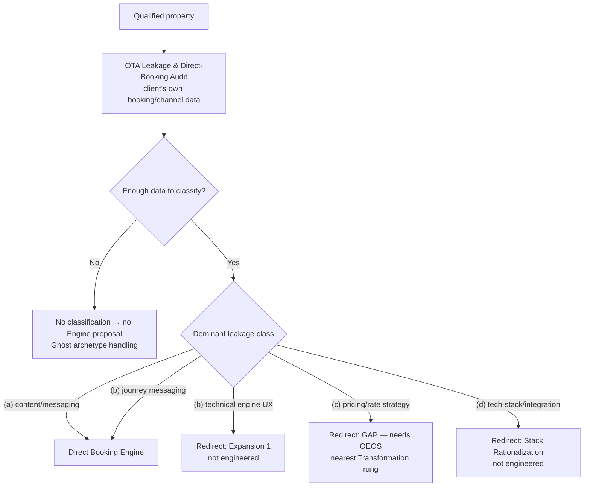

# OEOS — Hospitality Division — Hospitality Revenue Content OS (Structural, Non-Pricing) · Draft 41

> ⚠️ **INTERNAL TEST ARTIFACT — NOT CLIENT-FACING.** Status: **Working Hypothesis / Not Quotable.**
> No price, no pricing floor, no margin, no capacity figure, no client proof, no owner-approved policy exists in this file, and none may be inferred from it.

## 0. Header

| Field | Value |
|---|---|
| **Offer** | Hospitality Revenue Content OS · "Direct Booking Engine" |
| **Gateway offer** | OTA Leakage & Direct-Booking Audit |
| **Sector** | Hospitality → Accommodation (Hotels) · sub-sector `Status = Target` · Industry Type A (Marketing-driven) |
| **Owning department** | Offer (02). Routed by Sector (01) DB 8. "Hospitality Division" is a sector-named label, not one of Draft 28's seven divisions. |
| **Status** | Structural OEOS draft · **Non-pricing** · **Not quotable** · Working Hypothesis |
| **Registry** | **Not in the Offer Engineering Registry.** Remains the registry #13 candidate held out of the priced table (`OFFER_OS.md` §3). |
| **Source run** | `offer-oeos-engineer`, Arika Runtime, manual trigger, 2026-09-13T17:27:40Z — `02_Offer/_memory/runtime.jsonl` line 4 (top-level `requiresHumanApproval: true`) |
| **Upstream routing** | `offer-orchestrator` enriched re-intake, 2026-09-13T17:12:30Z — line 2, `registry_action: needs_more_seed_data`; routed to non-pricing OEOS phases only |
| **Context** | `01_Sector/sector_plugins/hospitality/HOSPITALITY_PLUGIN.md` (Sector Plugin #001, v0.1) · `02_Offer/OFFER_OS.md` §1, §3 (entry-offer seed, 2026-08-19), §10 |
| **Date** | 2026-09-13 |

### How to read this file — provenance labels

| Label | Meaning |
|---|---|
| **[RUN]** | Stated in the source agent output. |
| **[EXPANSION]** | Structural expansion by Claude Code of the run's phase summaries, using the OEOS phase definitions (`.claude/agents/offer-oeos-engineer.md`, `Draft 29`). Requested by the owner on 2026-09-13. **Not owner-original — requires owner review.** |
| **[SEED]** | From the 2026-08-19 entry-offer seed in `OFFER_OS.md` §3. |
| **[SECTOR]** | Sector (01) intelligence. `Confidence = Medium`. **Never client proof.** |
| **[TEST_FIXTURE]** | A test assumption supplied for the structural run. Not real, not validated, not quotable. |
| **BLOCKED** | Cannot be completed until a named input exists. |
| **OPEN** | An owner or commercial decision not yet taken (all listed in §9). |

"**Owner**" in this file means Arika's Offer owner (`OFFER_OS.md` header: Mary Thuo) unless written "**property owner**", which means the client's Owner/MD.

---

## 1. Executive summary

**What this offer is.** An outsourced **revenue-content department** for independent hotels and resorts that grows **direct-booking share** and reduces **OTA dependency** [SEED][RUN]. It is entered only through a paid **OTA Leakage & Direct-Booking Audit** that converts Arika's Medium-confidence market view into a client-specific diagnosis using the client's own booking and channel data [SEED]. It delivers offer/narrative strategy, a direct-booking content plan, landing-page and booking-journey messaging, email/WhatsApp nurture, and monthly reporting [RUN].

**What it is not.**
- Not a marketing, lead-generation or content agency service — Arika is a **Revenue Infrastructure Partner** running the **360° Growth Revenue Framework** (`OFFER_OS.md` §1).
- Not a booking-engine build, PMS/RMS/channel-manager integration, or rate/revenue-management service. The seed's core promise is explicitly "**without touching the PMS/RMS stack**" [SEED].
- Not a fix for leakage caused by **pricing/rate strategy** or **tech-stack/integration** — those findings redirect (§3).
- Not a performance guarantee.
- Not quotable, not priced, not registered.

**Why it exists.** Sector (01)'s Accommodation pilot found the "**OTA tax**": commission leakage and platform dependency that reduce a property's control of its own revenue [SECTOR]. Sector's Industry Offer Matrix found the **Entry rung is a systemic gap for every non-SaaS industry** — the existing gateway and entry offers (#4, #5, #10) are B2B-SaaS-tuned (`OFFER_OS.md` §3). This offer is the first named productized-entry gap engineered, and it is the governance spine for Accommodation scraping, outreach and content [SEED].

**Why it is blocked from quotation.**
1. **Phase 11 is BLOCKED** on five missing inputs: cost-to-deliver, delivery capacity, owner-approved price band, owner-approved audit-fee credit policy, proof-generation method (§5).
2. **No proof exists.** `Proof Status = Proof required — named`; no Arika case study exists [SEED].
3. **No pricing segmentation exists for hotels.** The department's provisional floors (`OFFER_OS.md` §10) are ARR-band segmented for B2B SaaS; the seed says hospitality pricing segments by "property-size / ARR band" but no hospitality band has been defined (§9).
4. **Every sizing and outcome number in the test brief is a TEST_FIXTURE**, and they conflict with the seed and the plugin (§2.3).
5. **`requiresHumanApproval` is true** on both the orchestrator and OEOS runs — anything quoted, sold or published needs human sign-off.

---

## 2. Source intelligence

### 2.1 Market findings

| Finding | Value | Basis | Confidence | Allowed use | Never |
|---|---|---|---|---|---|
| OTA dependency — "the OTA tax" | Commissions and platform dependency reduce direct revenue control | DB 3 finding (Plugin P3 #1) [SECTOR] | Medium | The enemy framing in positioning and content | Presented as a diagnosed fact about a specific property |
| OTA commission leakage | **15–30% effective rate** | DB 3 finding [SECTOR] | Medium | **Sector benchmark only.** Internal framing; audit hypothesis to test | Client-specific claim, promised saving, or outcome |
| Direct-channel cost comparison | **~9% direct** (as recorded alongside the OTA rate) | `OFFER_OS.md` §3 seed [SECTOR] | Medium | **Sector benchmark only.** Audit comparison baseline | Client-specific claim |
| Direct-booking share benchmark | **35–45%** | DB 3 finding (Plugin P3 #2) [SECTOR] | Medium | **Sector benchmark only.** Audit comparison point | A target promised to a client |
| Tool-stack chaos | **Extreme**, `Fragmentation Type = Integration`; stack: PMS · CRS · channel manager · RMS · CRM · POS · booking engine | DB 2 / Plugin P1 [SECTOR] | Medium | Explains why class (d) findings are likely and why reporting data pulls may fail | Assumed present at a property without audit |
| Buyer dyad | Time-poor **GM + Revenue Manager** | DB 3 finding (Plugin P3 #4) [SECTOR] | Medium | Discovery and communication design | — |
| Commercial rhythm | **Low season is Arika's buying window** — occupancy pain is visible and the GM/RM has capacity to engage | Plugin P13 [SECTOR] | Owner-curated | Discovery timing | — |
| Geography scope | **Kenya-inbound**; origin markets Germany and UK | Plugin P4, owner decision 2026-08-19 | Owner decision | Content calendar and consent-jurisdiction questions | A world atlas |
| Forecast layer | Pickup, occupancy, ADR, RevPAR, comp-set | Plugin P13/P14 ⚫ template | — | Populated **only** from a client's connected RMS/PMS | **Estimated or fabricated** |

All Sector findings above are `Confidence = Medium`. **None is client proof.** The audit exists precisely to replace them with the client's own numbers.

### 2.2 Buyer context

Decision-maker titles live in DB 10 (Plugin P9): **General Manager · Owner/MD · Director of Revenue · DOSM**. Named people, emails and dials are gated (paid, PII, Legal-reviewed) — none appear here.

| Role | Position in this offer | Source |
|---|---|---|
| **General Manager** | Economic buyer; time-poor; primary Discovery contact | [SECTOR] DB 10 · [TEST_FIXTURE] buyer |
| **Owner/MD** (property owner) | Economic buyer; final spend authority | [SECTOR] DB 10 · [TEST_FIXTURE] buyer |
| **Revenue Manager / Director of Revenue** | Operational user; holds booking/channel data; audit counterpart | [SECTOR] DB 3 dyad + DB 10 · [TEST_FIXTURE] operational user |
| **DOSM** | In the DB 10 registry; **role in this offer's buying and approval process is not defined** | [SECTOR] DB 10 · OPEN |

**Buyer language** (Plugin P10, DB 6): **use** *net RevPAR* · *the OTA tax* · *direct-booking share*. **Avoid** *more bookings* · *awareness*. **Talk to GM / Revenue Manager, not IT** [SEED].

### 2.3 Unreconciled parameters — three sources disagree

| Parameter | `OFFER_OS.md` §3 seed (2026-08-19) | Hospitality Plugin | Structural test run | Status |
|---|---|---|---|---|
| Property size | Independent / boutique, **30–150 rooms** | Pilot archetype **30–100 room** independent property (P1) | **50–150 rooms** [TEST_FIXTURE] | **OPEN** — not reconciled |
| Current direct share | **<30%** (OTA-dependent) | — | **15–25%** [TEST_FIXTURE] | **OPEN** |
| Transformation | Measurable direct-share lift + recovered commission; **30-day quick win** in the journey | — | **+10 percentage points in 6 months** [TEST_FIXTURE], no baseline | **OPEN** — both agent runs recommend a per-client, audit-derived target |
| Buyer | GM / Revenue Manager | GM · Owner/MD · Director of Revenue · DOSM | GM or Owner/MD; Revenue Manager operational | Compatible; DOSM role OPEN |
| Anti-ICP | Chains with a central brand.com team; properties with no website/booking engine | — | — | Carried forward |
| Commercial shape | One-time audit fee + **monthly content-OS retainer** | P11 ladder | Gateway audit → **Entry build** → Governance retainer | **OPEN** — build + retainer vs retainer-only |

This file uses the TEST_FIXTURE values where the structural run did, **labelled**, and does not treat any column as settled.

---

## 3. The diagnostic gate

**The rule [RUN][SEED]:** the audit must classify the property's leakage **before** any Direct Booking Engine proposal exists. The Engine proceeds **only** where the leakage is content/messaging and booking-journey driven. Where the root cause is pricing/rate strategy or tech-stack/integration, the engagement **redirects** — the Engine must not be sold as the fix.

### 3.1 Classification

| Class | What it means | What the audit examines (structural — no thresholds set) | Disposition | Route |
|---|---|---|---|---|
| **(a) Content / messaging** | Direct channels work, but demand is not captured or converted: weak positioning, no need-date campaigns, no book-direct rationale, no nurture | Direct-channel content, offers, campaign coverage against the commercial rhythm, nurture existence and quality, buyer-language fit | **PROCEED** | Direct Booking Engine |
| **(b) Booking journey / UX — messaging side** | The journey loses guests through copy, trust, offer presentation or book-direct rationale on landing pages and the booking flow | Landing and booking-flow messaging, trust signals, rate/benefit presentation copy, drop-off points visible in client analytics | **PROCEED** | Direct Booking Engine (landing / booking-journey messaging) |
| **(b) Booking journey / UX — technical side** | The engine itself loses guests: configuration, speed, mobile flow, payment steps, engine replacement | Engine configuration and technical flow | **REDIRECT** — outside the "without touching the stack" promise | Plugin P11 **Expansion 1** — guest acquisition + booking-engine optimization (`SAL`/`ACQ`). **Not engineered, not in registry.** |
| **(c) Pricing / rate strategy** | Leakage driven by rate structure: parity, OTA vs direct rate position, discounting, restrictions, RMS strategy | Rate position by channel, parity, discounting pattern — from client systems only | **REDIRECT** | **GAP — no engineered offer or department owns hotel rate strategy.** Nearest: Plugin P11 **Transformation** rung (Hospitality Revenue Intelligence + RMS-connected operating layer). Not engineered. Raise to Offer (02) intake. |
| **(d) Tech-stack / integration** | Leakage driven by the stack: PMS/CRS/channel-manager/RMS/CRM/booking-engine integration failures, inventory sync, broken tracking | Integration map, sync failures, data fragmentation, attribution breakage | **REDIRECT** | Plugin P11 **Transformation** rung (Stack Rationalization) · the flagged, **unengineered** "AI & Business Stack Rationalization" proposal (`OFFER_OS.md` §3: Offer 02 + Automation 16 + Audits 14, reusing Tech Stack 13's verify-don't-assume pattern). Nearest registered offers #6 / #7 are B2B-SaaS-tuned. |

### 3.2 Gate rules

| # | Rule | Source |
|---|---|---|
| G1 | **Audit first.** No Engine proposal, strategy or scope exists before a completed audit verdict. | [RUN] immutable component |
| G2 | **Client data only.** The verdict must be traceable to the property's own booking/channel data. Sector benchmarks cannot substitute for missing data. | [RUN] Phase 10 |
| G3 | **No data, no verdict.** If the data is insufficient to classify, the audit reports that — it does not default to (a). | [EXPANSION] |
| G4 | **Senior-expert-only verdict.** Classification and any redirect decision stay with senior judgment. | [RUN] Phase 12 |
| G5 | **A redirect is a valid audit outcome**, not a failed sale. The audit's diagnosis stands on its own. Whether any audit fee credit applies on redirect is part of the unapproved credit policy — **OPEN**. | [EXPANSION] |
| G6 | **"Dominant" is undefined.** No threshold and no rule for mixed findings (e.g. (a) dominant with material (c)) exists. Until the owner defines it, a mixed finding goes to senior review and the redirect route is disclosed to the property. | **OPEN** (§9) |

---

## 4. OEOS phases 1–10 and 12

Each phase is **structurally complete at design level only** — not validated against a real engagement. Phase 4 is expanded in §6, Phase 5 in §7, Phase 10 in §8.

### Phase 1 — Offer Identification

- **Purpose.** Fix the offer's identity, the problem it solves, the transformation, who it is for, and what must be true before it can work.
- **Decisions made.**
  - Identity: outsourced revenue-content department for independent hotels/resorts [RUN].
  - Problem: the OTA tax — commission leakage (15–30%, sector benchmark only) and loss of direct revenue control [SECTOR].
  - Transformation: from OTA-dependent to direct-first, **owning the guest relationship** [SEED].
  - Target: independent hotel or resort, 50–150 rooms [TEST_FIXTURE], current direct share 15–25% [TEST_FIXTURE] — see §2.3 conflict.
  - Business stage: established property with booking/channel history, a working website and a booking engine [RUN][SEED anti-ICP].
  - Impact: revenue (recaptured commission margin) · operational (an owned demand channel) · strategic (reduced platform dependency) [RUN].
  - Time-to-result: 6-month horizon [TEST_FIXTURE]; to become a per-client, audit-derived target [RUN].
  - Unrealistic-expectations warning: addresses only (a) and the messaging side of (b); no performance guarantee [RUN].
- **Required inputs.** Property profile (rooms, archetype per Plugin P2, geography per P4) · booking/channel data by channel and period · baseline direct share · website and booking-engine access.
- **Deliverables.** Offer identity statement (§1) · qualification criteria (§6 stage 2) · internal unrealistic-expectations disclosure.
- **Gates / exit criteria.** Property matches the ICP and not the anti-ICP · data access agreed in principle · archetype is one the calendar can serve (Plugin P2 rules exist for City/Conference Hotel, Safari Lodge, Beach Resort; others are Tier 3 or unruled).
- **Risks.** Unreconciled ICP band · target metric with no baseline · archetypes move on different signals (P2), so one content calendar cannot fit all.

### Phase 2 — Offer Positioning Architecture

- **Purpose.** Define market, strategic and value position, differentiators, value drivers, and the messaging layer.
- **Decisions made.**
  - Market position: Revenue Infrastructure Partner for accommodation businesses — never marketing, content or lead-gen agency [RUN].
  - Strategic position: owner of the direct-booking demand layer [RUN].
  - Differentiators: audit-gated engagement · refuses to sell the wrong fix · department-as-a-service, not one-off deliverables · measured from the client's own data [RUN].
  - Value drivers: margin recapture · risk reduction (diagnosis before build) · time compression (pre-built content/nurture backbone) · revenue leverage (shifting commissioned to owned bookings) [RUN].
  - Core narrative: *stop paying the OTA tax on demand you already earned* [RUN].
  - Objections: "we can't leave OTAs" → this shifts share, it does not abandon channels · "will it work for us?" → the audit decides eligibility [RUN].
  - **Pricing justification: BLOCKED** — omitted.
  - **Risk reversal:** audit-fee credit toward the build [TEST_FIXTURE] — **not owner-approved**, flagged **weak** for a GM/Owner buyer, explicitly **not** a performance guarantee [RUN]. Redesign OPEN.
  - **Proof: none.** No client results exist; none are implied [RUN].
- **Required inputs.** Owner-approved risk reversal · a proof asset (blocked on the proof-generation method) · Legal (10) review of any external claim wording.
- **Deliverables.** Internal positioning brief · objection map · messaging use/avoid list (§2.2).
- **Gates / exit criteria.** No benchmark used as a client-specific claim (§8 QG3) · no implied results (QG2) · no "agency" positioning language (QG7) · public content passes Content (04)'s publishing gate.
- **Risks.** "OTAs drive our occupancy" buyer belief · a benchmark heard as a promise · a weak risk reversal undermining certainty.

### Phase 3 — Offer Backbone Architecture

- **Purpose.** Define core systems, workflows, required assets, approvals, tech, automations, SOPs and dashboards; split immutable from customizable components.
- **Decisions made — core systems [RUN].**
  1. Leakage Diagnosis Engine (the audit + (a)–(d) classification)
  2. Offer / narrative strategy layer
  3. Direct-booking content plan — a **revenue-year content calendar** (peak / shoulder / low) built on Sector (01)'s commercial rhythm [SEED]
  4. Landing-page / booking-journey messaging
  5. Email / WhatsApp nurture system
  6. Monthly reporting and measurement loop
- **Workflow.** Audit → classification gate → strategy → content production → journey messaging → nurture activation → reporting → iteration [RUN].
- **Required inputs.** Client tool stack inventory (PMS, CRS, channel manager, RMS, CRM, booking engine, email platform, WhatsApp Business) · platform access · brand assets · **consent status of every contact list** · content inventory.
- **Deliverables.** System map · SOP set: audit protocol, classification decision rules, content production SOP, nurture build SOP, reporting template [RUN] · dashboard spec: direct share and channel mix [RUN].
- **Gates / exit criteria.** Every automation (nurture sends, reporting data pulls) needs an `AUTOMATION_APPROVAL_MATRIX.md` row and sign-off before going live (`OFFER_OS.md` §12) · all access verified live, not assumed.
- **Risks.** Extreme integration-type stack chaos may break reporting data pulls — the offer's measurement can depend on a class (d) problem it does not fix · pressure to cross the "without touching the PMS/RMS stack" boundary.

**Immutable components [RUN].**
- The audit as a mandatory gateway before any build
- The (a)/(b)/(c)/(d) leakage classification
- The hard rule: do not sell the Engine when (c) or (d) dominates
- Direct-booking share measured from the client's own booking/channel data
- No performance guarantee; risk reversal is not a results promise
- Revenue Infrastructure Partner positioning
- Sector benchmarks labelled benchmark-only

**Customization components [RUN].**
- Offer / narrative strategy per property brand and market
- Content calendar themes (per archetype and destination — Plugin P2, P5)
- Landing-page / booking-journey messaging
- Nurture sequences and cadence
- Per-client, audit-derived direct-share target (replacing the +10pp TEST_FIXTURE)
- Reporting emphasis by channel mix and buyer (GM vs Owner/MD)

### Phase 4 — Client Journey Engineering

- **Purpose.** Engineer the full 17-stage lifecycle so every stage has a goal, actions, exit criteria and a risk.
- **Decisions made.** Audit is a **gating** stage [RUN] · Proposal and Agreement are **BLOCKED** while Phase 11 is blocked · Expansion is re-audit gated [RUN] · the seed's "30-day quick win" is carried as a candidate milestone, not a commitment [SEED].
- **Required inputs.** Qualification criteria · audit protocol · approved proposal and contract templates (not existing).
- **Deliverables.** The stage map in §6.
- **Gates / exit criteria.** Per stage, §6.
- **Risks.** Stages 5–6 cannot run; the journey is testable only through stage 4 today.

### Phase 5 — Internal Execution Journey

- **Purpose.** Define the agency-side fulfilment sequence by task, owner role, input, output, quality check and approval.
- **Decisions made.** Role-based only; no headcount; delivery owner and capacity **not provided** [RUN].
- **Required inputs.** Named delivery owner · capacity model · tool access pattern.
- **Deliverables.** Role map and execution sequence in §7.
- **Gates / exit criteria.** Each task has an owner role and a quality check; build tasks cannot start before the diagnostic gate passes.
- **Risks.** The roles are AI-assisted functional labels and the owner currently orchestrates solo with AI (`OFFER_OS.md` §3) — capacity is the binding constraint, and it is unquantified.

### Phase 6 — Deliverable Engineering

- **Purpose.** Specify each deliverable so it can be produced, reviewed and measured consistently.
- **Decisions made.** Seven deliverables [RUN][SEED]; success metrics tie to direct-booking share from client data [RUN].
- **Required inputs.** Audit verdict · brand assets · platform access · consent status · client KPI data.
- **Deliverables.**

| # | Deliverable | Purpose | Format | Owner role | Depends on | Approval | Success metric | Quality standard |
|---|---|---|---|---|---|---|---|---|
| D1 | **OTA Leakage & Direct-Booking Audit** — report, (a)–(d) verdict, one-page roadmap [SEED] | Client-specific diagnosis and eligibility | Report + verdict + roadmap | Audit Analyst; verdict by Senior Diagnostic Reviewer | Client booking/channel data | Senior review; client readout | Confident, data-traceable classification | QG1, QG6 |
| D2 | Offer / narrative strategy | Direct-first positioning for this property | Strategy document | Revenue-Content Strategist | D1 (a)/(b) verdict | Client sign-off | Signed-off per-client target and narrative | QG7 |
| D3 | Revenue-year content calendar [SEED] | Time content to peak / shoulder / low and need-dates | Calendar | Revenue-Content Strategist | D2 · Sector commercial rhythm · Plugin P7 offsets | Client sign-off | Campaigns scheduled ahead of need-dates | Uses destination seasonality (Plugin P8: Kenya's peak is Dec–Jan, not a northern-hemisphere summer) |
| D4 | Direct-booking content production [SEED] | Need-date campaigns, offers, guest-story and authority pieces in buyer language | Content assets | Content Producer | D3 | Client approval per piece | Direct-channel engagement and conversion from client analytics | QG2, QG3, Content (04) publishing gate |
| D5 | Landing-page / booking-journey messaging | Fix messaging-side journey friction | Copy package | Conversion Copywriter | D1 (b-messaging) · D2 | Client approval | Journey conversion from client analytics | No technical engine changes (§3) |
| D6 | Email / WhatsApp nurture sequences | Convert and retain owned demand | Sequences + automation | Lifecycle Engineer | Consent-verified lists · D2 | Client approval + automation approval row | Direct bookings attributed to nurture | QG4, QG8 |
| D7 | Monthly reporting pack | Measure direct share, commission recovered / room-night, need-date occupancy, net RevPAR [SEED] | Report + dashboard | Reporting Analyst | Client system data | Account Lead review | Report accepted; baseline comparison valid | QG6 — client-system-sourced only |

- **Still OPEN for every deliverable:** revision policy (number of rounds) · storage location for client data and deliverables · delivery method. None were supplied; none are invented here.
- **Gates / exit criteria.** Each deliverable passes its §8 gate before client release.
- **Risks.** Attribution of direct bookings to content is confounded by seasonality and rate changes — see Phase 7.

### Phase 7 — Timeline Architecture

- **Purpose.** Set minimum / ideal / aggressive timelines and name the delay risks.
- **Decisions made.**
  - The only sanctioned horizon is **6 months** [TEST_FIXTURE] [RUN].
  - Sequence: audit and classification first → build → measurement window [RUN].
  - The seed's **30-day quick win** (one need-date filled or one campaign live) is a candidate milestone [SEED], not a commitment.
  - **Minimum / ideal / aggressive durations: OPEN.** No input supports them; they are not invented.
  - **Content lead times** follow Plugin P7's derived planning offsets (not external facts) — e.g. the Marketing column: T-120 for Event/Compression, T-180 for Seasonality, T-240 for Sales/MICE, T-150 for origin-side Holiday/School-Holiday. The calendar must launch campaigns ahead of these, not at need-date.
- **Required inputs.** Audit duration (the seed says "days" — no figure) · client approval turnaround · access lead times.
- **Deliverables.** Per-client timeline built on D3.
- **Gates / exit criteria.** Measurement window agreed with a **seasonally comparable baseline** before build starts.
- **Delay-risk categories [RUN].** Approval (owner credit policy; client messaging sign-off) · Asset (booking/channel data access) · Technical (booking-engine / integration access) · Revision (messaging cycles) · Client (Revenue Manager availability, worst in peak season) · Resource (delivery capacity — unquantified).
- **Risks.** A 6-month window that spans low and peak season will show direct-share movement caused by seasonal channel mix, not the offer. The baseline design is OPEN.

### Phase 8 — Communication Architecture

- **Purpose.** Define channels, cadence, approval windows, feedback and escalation.
- **Decisions made [RUN].**
  - Account Lead is the single point of contact.
  - Email primary; WhatsApp for operational coordination; scheduled video for reviews.
  - Cadence: kickoff · audit readout · strategy sign-off · messaging approval · monthly reporting review · QBR [SEED].
  - Approval windows required at the audit gate and messaging sign-off.
  - Escalation: Account Lead → agency lead / Offer owner for stalled approvals, data access, scope, credit policy and redirect decisions.
  - **Response SLA durations and approval-window lengths: OPEN** — none supplied.
- **Required inputs.** Client stakeholder map (GM, Owner/MD, Revenue Manager, DOSM) · named client approver · named data-access owner.
- **Deliverables.** Per-client communication charter.
- **Gates / exit criteria.** A named client approver and data-access owner exist before implementation.
- **Risks.** A time-poor GM becomes the approval bottleneck · WhatsApp threads leave decisions unrecorded — approvals must be confirmed in the system of record.

### Phase 9 — Client Constraint System

- **Purpose.** Anticipate the named client risk archetypes and pre-engineer prevention, escalation and recovery.
- **Decisions made.** The seven OEOS archetypes plus one offer-specific constraint [RUN].

| Archetype | Warning signal | Operational risk | Prevention | Escalation | Recovery |
|---|---|---|---|---|---|
| **Ghost** | Booking/channel data not delivered | Audit cannot classify; reporting collapses | Data access is a Qualification and Onboarding exit criterion | Account Lead → property owner | Pause; audit reports "insufficient data"; no Engine proposal |
| **Unrealistic** | Expects the +10pp figure guaranteed | Undeliverable promise | Per-client audit-derived target; no guarantee language anywhere | Senior Diagnostic Reviewer re-presents baseline | Reset the target in writing |
| **Micromanager** | Rewrites messaging line by line | Timeline slip; brand drift | Consolidated review rounds and approval windows | Account Lead → property owner | Re-baseline scope and revision policy (OPEN) |
| **Doubter** | Believes only OTAs drive occupancy | Stalls at Strategy | Audit evidence from the property's own data | Readout with the Revenue Manager present | Narrow to a single need-date test |
| **Know-It-All** (often the Revenue Manager) | Overrides strategy; resists a content-led approach | Strategy diluted | Classification evidence; role clarity in the charter | GM / property owner arbitration | Re-confirm decision rights |
| **Quitter** | Disengages before the measurement window | Offer judged before it can work | Expectation set on the 6-month horizon [TEST_FIXTURE]; milestone reporting | Account Lead review | Offboarding with a documented state |
| **Result Ghoster** | Will not share outcome data after launch | No measurement; no proof possible | Reporting access and a data-sharing clause agreed up front (Legal 10) | Account Lead → property owner | Record as unmeasured; never estimate |
| **Leakage-cause mismatch** | Audit shows (c) or (d) dominant | Selling the wrong fix | The diagnostic gate (§3) | Senior Diagnostic Reviewer | Redirect; do not propose the Engine |

- **Required inputs.** Qualification notes · stakeholder map.
- **Deliverables.** This table as an account-review checklist.
- **Gates / exit criteria.** Archetype signals reviewed at every monthly reporting review.
- **Risks.** The Result Ghoster archetype directly kills the proof-generation path.

### Phase 10 — Quality Control System

- **Purpose.** Define review stages, validation rules, approval gates, testing and benchmarks.
- **Decisions made.** Eight gates (§8) · review stages: audit-classification validation → strategy QA → content/messaging QA → nurture QA (consent) → reporting QA [RUN] · testing: booking-journey messaging and nurture deliverability [RUN] · performance benchmarks are per-client and audit-derived, **not** the +10pp TEST_FIXTURE [RUN].
- **Required inputs.** Proof-generation method · consent position (Legal 10) · approved automation rows.
- **Deliverables.** Gate table and checklists in §8.
- **Gates / exit criteria.** No deliverable released without passing its gate.
- **Risks.** Gates that depend on BLOCKED inputs (QG2 proof, QG4 consent, QG5 pricing) cannot pass today.

### Phase 12 — Scalability Engineering

- **Purpose.** Decide what is standardized, customized, automated, delegated, productized, licensed, or kept senior-expert-only.

| Mode | Components | Constraint |
|---|---|---|
| **Standardize** | Audit protocol · classification decision rules · content production SOP · nurture templates · reporting template [RUN] | Rules for "dominant" must exist first (G6) |
| **Customize** | Narrative · messaging · calendar themes · target [RUN] | Per archetype (P2) and destination (P5) |
| **Automate** | Nurture sequences · reporting data pulls · deliverability checks · content calendar [RUN] | Each needs an approval-matrix row; stack chaos may block pulls |
| **Delegate** | Content production · lifecycle deployment · reporting [RUN] | Depends on capacity; hiring is deferred to HR (11) |
| **Productize** | The audit as a repeatable gateway diagnostic [RUN] · the calendar and content system across independents [SEED] | Commercial rhythm reusable per property geography [SEED] |
| **License / white-label** | Possible OS templates for hospitality groups [RUN] | Future; **not approved**; out of scope |
| **Senior-expert-only** | Audit interpretation · classification verdict · (c)/(d) redirect decisions [RUN] | Currently the owner |
| **Future AI** | Channel-data parsing for the audit · draft messaging generation · booking-mix anomaly detection [RUN] | All human-validated against §8 gates |

- **Required inputs.** Capacity model · delivery owner · a completed first engagement to standardize from.
- **Deliverables.** This scalability map.
- **Gates / exit criteria.** Nothing is productized before one engagement has passed every gate.
- **Risks.** Standardizing before the first real audit would freeze untested classification rules.

---

## 5. Phase 11 — Revenue & Monetization Architecture — **BLOCKED**

> **BLOCKED.** No price, price band, pricing floor, margin, discount, credit value or capacity figure exists or may be created. `offer-pricing-floor-analyst` has **not** been run and must not be run until the inputs below exist.

### 5.1 Required missing inputs

| # | Input | Why it is required | Decides / supplies | Status |
|---|---|---|---|---|
| 1 | **Cost-to-deliver** | A floor cannot protect margin that has not been measured | Owner, with Finance (09) | **Missing** |
| 2 | **Delivery capacity** | Pricing and SLAs depend on how many concurrent properties can be served, and by whom | Owner; Operations (08) capacity planner; HR (11) if delegation is needed | **Missing** — no capacity model exists |
| 3 | **Owner-approved price band** | For the audit, the entry offer and the retainer | Owner | **Missing** |
| 4 | **Owner-approved audit-fee credit policy** | The only proposed risk reversal; unapproved and flagged weak | Owner | **Missing** |
| 5 | **Proof-generation method** | How audit findings and outcomes become approved, consented case evidence | Owner; Client Success (07) advocacy; Legal (10) for claims | **Missing** |

**Additional pricing blockers surfaced in this file:**
- **Hospitality pricing segmentation variable** — `OFFER_OS.md` §10's provisional floors are ARR-band (B2B SaaS) segmented; no property-size or revenue band exists for hotels. Applying the existing floors to this offer would be a category error.
- **Commercial shape** — seed "audit fee + monthly retainer" vs run "entry build + governance retainer" (§2.3).

### 5.2 Ladder structure — no figures

Gateway audit (one-time) → Entry (Direct Booking Engine) → Governance / optimization retainer → Scaling / Embedded Partnership → Enterprise Transformation — mapped onto the agency ascension path Audit → Infrastructure → Optimization → Embedded Partnership → Enterprise Transformation [RUN]. Plugin P11's Expansion 1, Expansion 2 (guest CRM + retention, WhatsApp/email, `AUTO`) and Transformation rungs map onto existing offers #6 / #7 / #11 [SEED] — none is engineered for hospitality.

| Tier | Investment | Best for | Timeline |
|---|---|---|---|
| Gateway — OTA Leakage & Direct-Booking Audit | **BLOCKED** — pending the five inputs above | Independent property (50–150 rooms [TEST_FIXTURE]) needing a client-data diagnosis before any build | Precedes the build horizon; duration OPEN |
| Entry — Direct Booking Engine | **BLOCKED** — pending the five inputs above | Properties where the audit confirms (a) and/or the messaging side of (b) | 6-month horizon [TEST_FIXTURE] |
| Governance / Optimization retainer | **BLOCKED** — pending the five inputs above | Ongoing operation of the revenue-content department | Beyond the initial horizon [TEST_FIXTURE] |
| Scaling / Embedded Partnership | **BLOCKED** — pending the five inputs above | Groups or properties expanding into other leakage causes, **via re-audit only** | Multi-cycle, re-audit gated [TEST_FIXTURE] |

---

## 6. Client journey — 17 stages

| # | Stage | Goal | Client action | Agency action | Exit criteria | Risk |
|---|---|---|---|---|---|---|
| 1 | **Discovery** | Surface the OTA-tax problem with an economic buyer | Engages with OTA-tax content or a conversation; shares how dependent the property feels on OTAs | Leads with the OTA-tax framing, benchmarks labelled sector-only; talks to GM / Revenue Manager, not IT; prioritises the low-season buying window | Buyer acknowledges OTA dependency as worth diagnosing | Benchmark heard as a promise; wrong contact |
| 2 | **Qualification** | Confirm fit and data accessibility | Confirms rooms, archetype, website + booking engine, willingness to share data | Checks ICP (50–150 rooms / 15–25% direct [TEST_FIXTURE], seed band OPEN) and anti-ICP; checks archetype scope | Fit and data access confirmed — or disqualified with reason | Unreconciled ICP band; chain with a central brand team |
| 3 | **Audit** | Client-specific diagnosis and (a)–(d) classification | Provides booking/channel data and platform access | Analyses effective OTA cost vs direct, direct share vs benchmark, journey messaging, stack signals; classifies | Verdict documented, data-traceable, senior-reviewed | Insufficient data (Ghost); pressure to find (a) |
| 4 | **Strategy** | Set the per-client target and narrative — **only if (a)/(b-messaging) dominant** | Attends the readout; agrees baseline and target — or accepts the redirect | Sets an audit-derived, seasonally comparable target and strategy; or documents the redirect route (§3) | Signed-off target + strategy, **or** documented redirect | Unrealistic expectations of the +10pp fixture |
| 5 | **Proposal** | Scope the engagement | Reviews the proposal | **BLOCKED** — no price exists; cannot be issued until Phase 11 is unblocked and human approval is given | Not reachable today | Premature quote |
| 6 | **Agreement** | Contract the engagement | Signs | **BLOCKED** — needs a Legal (10)-reviewed contract with data-processing and outcome-data-sharing terms; credit policy unapproved | Not reachable today | Unreviewed terms; data rights unclear |
| 7 | **Onboarding** | Stand up the engagement | Names the approver and data-access owner; attends kickoff | Runs kickoff; issues the communication charter; hands scoped delivery to Operations (08) | Approver and data owner named; access requests issued | Time-poor GM delegates without authority |
| 8 | **Asset Collection** | Gather everything implementation needs | Provides brand assets, booking-engine / email / WhatsApp Business access, contact lists with consent status | Verifies every access live (verify, don't assume); records consent basis per list | All access verified; consent status known for every list | Unknown consent blocks nurture |
| 9 | **Implementation** | Build the content system | Responds to questions; supplies property details | Builds the calendar, content, journey messaging and nurture; candidate 30-day quick win [SEED] | Deliverables pass §8 gates; automations approved | Micromanager; integration access blocks |
| 10 | **Review** | Client approval of what ships | Approves or requests revisions within the window | Consolidates feedback; applies revisions | Approved within the window | Revision loops; approval bottleneck |
| 11 | **Optimization** | Improve on early signals | Shares observations from the front desk and revenue team | Iterates messaging and campaigns on client-data signals | Changes logged with reason | Attributing seasonal or rate effects to content |
| 12 | **Delivery** | The system is live and operating | Confirms live assets | Final QA; confirms every in-scope deliverable is live | All deliverables live and QA-passed | A live asset untracked in reporting |
| 13 | **Reporting** | Measure against the baseline | Maintains data access; attends the review | Monthly pack: direct share, commission recovered / room-night, need-date occupancy, net RevPAR — client-system-sourced | Report accepted | Data access lapses (Result Ghoster); no estimates ever |
| 14 | **Offboarding** | Close or transition cleanly | Receives handover | Hands over assets; revokes access; returns or deletes data per the agreement | Documented handover; access revoked | Residual access; data retained without basis |
| 15 | **Retention** | Continue into governance | Takes part in QBRs [SEED] and health reviews | Runs health reviews; value recap from measured data only | Renewal decision recorded | Quitter; value unproven |
| 16 | **Referral** | Capture advocacy with consent | Approves or declines a testimonial / case evidence | Requests advocacy only with client-approved, data-backed evidence (proof method BLOCKED) | Approved evidence — or none | Using results without consent |
| 17 | **Expansion** | Grow into adjacent leakage causes | Agrees to a re-audit | Routes to Expansion 1 / 2 / Transformation **via re-audit only**; hands a qualified opportunity to Sales (05) | Re-audit scoped — or no path recorded | Selling expansion without diagnosis |

---

## 7. Delivery model

> **Role-based only.** No human is named for delivery — none is confirmed in the repo. **Delivery owner: BLOCKED / unassigned.** Per `OFFER_OS.md` §3, these are AI-assisted functional roles, not headcount; the owner currently orchestrates solo with AI, and hiring decisions are deferred to HR (11). **Capacity: unquantified.**

### 7.1 Roles

| Role | Responsibilities | Key inputs | Key outputs | Assigned |
|---|---|---|---|---|
| **Delivery Owner** | Accountable for the engagement end to end | — | — | **BLOCKED — unassigned** |
| Account Lead | Single client contact; approvals; escalation | Communication charter | Approvals, escalations | Unassigned |
| Audit Analyst | Data ingestion; leakage analysis | Client booking/channel data | Draft audit and classification | Unassigned |
| Senior Diagnostic Reviewer | Final (a)–(d) verdict; redirect decisions (senior-expert-only) | Draft audit | Signed verdict | Unassigned |
| Revenue-Content Strategist | Narrative strategy; revenue-year calendar | Verdict; Sector commercial rhythm | D2, D3 | Unassigned |
| Content Producer | Direct-booking content | D3 | D4 | Unassigned |
| Conversion Copywriter | Landing and booking-journey messaging | Verdict; D2 | D5 | Unassigned |
| Lifecycle Engineer | Email / WhatsApp nurture build | Consent-verified lists; D2 | D6 | Unassigned |
| Reporting Analyst | Monthly measurement | Client system data | D7 | Unassigned |

### 7.2 Execution sequence

| # | Task | Owner role | Input | Output | Quality check | Approval |
|---|---|---|---|---|---|---|
| 1 | Qualification check | Account Lead | Property profile | Fit decision | ICP / anti-ICP | — |
| 2 | Data and access request | Account Lead | Fit decision | Access granted | Access verified live | Client data owner |
| 3 | Data ingestion | Audit Analyst | Booking/channel data | Clean dataset | Completeness check (G3) | — |
| 4 | Leakage analysis + draft classification | Audit Analyst | Dataset | Draft verdict | Traceable to data (G2) | — |
| 5 | Verdict | Senior Diagnostic Reviewer | Draft verdict | Signed verdict or redirect | QG1 | Senior review |
| 6 | Audit readout | Account Lead + Reviewer | Signed verdict | Client decision | — | Client |
| 7 | Strategy + calendar | Revenue-Content Strategist | Verdict (a/b-messaging) | D2, D3 | QG7 | Client |
| 8 | Content + journey messaging | Content Producer, Conversion Copywriter | D2, D3 | D4, D5 | QG2, QG3 | Client |
| 9 | Nurture build | Lifecycle Engineer | Consent-verified lists | D6 | QG4 | Client + automation approval row (QG8) |
| 10 | Launch | Account Lead | Approved D4–D6 | Live system | Delivery QA | Client |
| 11 | Monthly reporting | Reporting Analyst | Client system data | D7 | QG6 | Account Lead |
| 12 | Optimization | Strategist | D7 | Logged changes | QG6 | Client |

### 7.3 Department handoffs (existing agents, advisory)

| Department | Role for this offer |
|---|---|
| Sector (01) | Market intelligence, commercial rhythm, linguistics, buyer titles |
| Offer (02) | Engineering, this file, intake of redirect gaps (`offer-orchestrator`) |
| Content (04) | Content operations; `content-publishing-gate` for anything public |
| Sales (05) | Proposal and close (BLOCKED); expansion opportunities |
| Client Success (07) | Onboarding, health/retention, advocacy, expansion |
| Operations (08) | Delivery scheduling, delivery QA, capacity planning (`operations-capacity-planner` flags that no capacity model exists) |
| Finance (09) | Cost-to-deliver; billing (BLOCKED) |
| Legal (10) | Contracts, data terms, consent position, claim substantiation (`legal-counsel-router`) |
| HR (11) | Capacity and delegation, if solo + AI stops being enough |
| Tech Stack (13) | Verify-don't-assume access pattern for client tools |
| Audits & Diagnostics (14) | Gateway pattern (offer #10), hospitality-tuned here |
| Automation (16) | `automation-approval-gate` for nurture and reporting automations |

---

## 8. Quality control

| Gate | Rule | When | Checked by | On failure |
|---|---|---|---|---|
| **QG1 — Diagnostic gate** | No Engine strategy, scope or proposal without a signed, data-traceable (a)–(d) verdict; (c)/(d)/technical (b) dominant → redirect (§3) | End of Audit | Senior Diagnostic Reviewer | Redirect or "insufficient data"; no Engine proposal |
| **QG2 — Proof gate** | No result, case study, testimonial or outcome claim without client-data evidence, client consent, and an approved proof-generation method | Any external or client-facing use | Account Lead; Legal (10) for claims | Remove the claim. **Currently always fails — method BLOCKED** |
| **QG3 — Benchmark-use gate** | 15–30%, ~9% and 35–45% are always labelled *sector benchmark, Medium confidence*; never presented as a client-specific finding, a promised saving, or a target | Every content piece, audit and proposal | Content QA; `content-publishing-gate` | Relabel or remove |
| **QG4 — Consent / compliance gate (WhatsApp / email)** | No nurture send to any contact without a recorded consent basis; opt-out handling built in; WhatsApp Business platform policy followed; the applicable data-protection position — including for guests from origin markets such as Germany and the UK — confirmed by Legal (10). **This file does not assess the law.** | Before list import and before any send | Lifecycle Engineer; Legal (10) | Block the send. **Currently cannot pass — Legal position not obtained** |
| **QG5 — Pricing gate** | No price, band, floor, discount or credit value in any artifact until Phase 11 is unblocked, `offer-pricing-floor-analyst` has run, and the owner approves | Every artifact | Account Lead; Offer owner | Remove the figure. **Currently always blocks** |
| **QG6 — Data-integrity gate** | Every KPI comes from client systems; nothing estimated, extrapolated or fabricated (Plugin P13/P14) | Reporting and audit | Reporting Analyst | Report as unmeasured |
| **QG7 — Positioning gate** | Revenue Infrastructure Partner language; never marketing / lead-gen / content agency; buyer language per §2.2 | Strategy and content | Strategist | Rewrite |
| **QG8 — Automation go-live gate** | Every automation has an `AUTOMATION_APPROVAL_MATRIX.md` row, rollback and fallback before going live | Before activation | `automation-approval-gate` | Do not activate |

**Review stages [RUN].** Audit-classification validation → strategy QA → content / messaging QA → nurture QA → reporting QA.

**Testing [RUN].** Booking-journey messaging and nurture deliverability testing before launch.

**Performance benchmarks.** Per-client and audit-derived, measured against a seasonally comparable baseline. **Not** the +10pp TEST_FIXTURE, and **not** the sector benchmarks.

---

## 9. Open decisions — every input needed before quotation

| # | Decision | Needed for | Decider | Blocks |
|---|---|---|---|---|
| 1 | **Cost-to-deliver** | Phase 11; floor | Owner + Finance (09) | Pricing |
| 2 | **Delivery capacity** and a **named delivery owner** | Phase 11; SLAs; §7 | Owner; Operations (08); HR (11) | Pricing; delivery |
| 3 | **Owner-approved price band** — audit, entry, retainer | Phase 11 | Owner | Proposal; Agreement |
| 4 | **Owner-approved audit-fee credit policy**, including whether credit applies on redirect | Risk reversal; G5 | Owner | Proposal |
| 5 | **Proof-generation method** | QG2; Referral; positioning proof | Owner; Client Success (07); Legal (10) | Any claim |
| 6 | **Hospitality pricing segmentation variable** (property size vs revenue band) | Using §10's floor method at all | Owner | Pricing floor |
| 7 | **ICP reconciliation** — 30–150 vs 50–150 vs 30–100 rooms; <30% vs 15–25% direct share | Qualification; targeting | Owner + Sector (01) | Qualification |
| 8 | **Transformation metric** — per-client target definition and seasonally comparable baseline | Strategy; reporting | Owner | Strategy; any outcome language |
| 9 | **Definition of "dominant"** and the mixed-finding rule | QG1; standardization | Owner | Audit verdicts at scale |
| 10 | **Redirect destinations** for (c), (d) and technical (b) — none is engineered | §3 routes | Owner; Offer (02) intake | Honest redirects |
| 11 | **Risk-reversal redesign** (credit flagged weak) | Positioning | Owner | Proposal |
| 12 | **Entry commercial shape** — build + governance retainer vs audit fee + monthly retainer | Phase 11 structure | Owner | Pricing |
| 13 | **Audit scope and duration** (seed: "days", no figure) | Timeline; pricing | Owner | Gateway productization |
| 14 | **Revision policy, SLA durations, approval windows, min / ideal / aggressive timelines** | Phases 6–8 | Owner | Agreement |
| 15 | **Contract template** with data-processing and outcome-data-sharing terms | Agreement | Legal (10) | Agreement |
| 16 | **Consent / compliance position** for WhatsApp and email, including origin-market guests | QG4 | Legal (10) | Nurture |
| 17 | **DOSM role** in the buying and approval process | Stakeholder map | Owner + Sector (01) | — |
| 18 | **Archetype scope at launch** (which Plugin P2 archetypes the offer serves) | Calendar design | Owner | Qualification |
| 19 | **Registry decision** — enter as #13 once priced | Registry | Owner | Registration |

---

## 10. Change log

- **2026-09-13 — Created from the structural OEOS test; remains non-pricing.** Built from the successful `offer-oeos-engineer` structural run (`02_Offer/_memory/runtime.jsonl` line 4, 2026-09-13T17:27:40Z; the first run with the corrected top-level `requiresHumanApproval: true`), routed by `offer-orchestrator`'s enriched re-intake (line 2, `needs_more_seed_data`). Expanded the run's 11 non-pricing phase summaries into purpose / decisions / inputs / deliverables / gates / risks, the full 17-stage journey, a role-based delivery model and an eight-gate QC system, using `HOSPITALITY_PLUGIN.md` and `OFFER_OS.md` §3 as context. **Phase 11 is BLOCKED** on cost-to-deliver, delivery capacity, owner-approved price band, owner-approved audit-fee credit policy, and proof-generation method. **Surfaced, not resolved:** three-way ICP / direct-share conflict (seed vs plugin vs test fixture); no engineered redirect route for pricing/rate-strategy or tech-stack findings; §10's pricing floors are B2B-SaaS ARR-band and have no hospitality segmentation. The TEST_FIXTURE values were supplied for the test run and are not real. Status unchanged: **Working Hypothesis / Not Quotable**, not in the registry, no event published, `offer-pricing-floor-analyst` not run. — Claude Code (Opus 5)
- **2026-09-13 — Added §11 Commercial Test Model (owner review required).** Proposed hotel H-band segmentation (H1/H2/H3), a leakage severity layer (L1/L2/L3), price-free commercial rules for audit / entry build / governance retainer, and the pricing-floor agent test contract (B2B SaaS ARR floors barred; expected `insufficient_data`). Nothing adopted; no prices; Phase 11 still BLOCKED. — Claude Code (Opus 5)

---

## 11. Commercial Test Model — Owner Review Required

> 🧪 **TEST MODEL ONLY · NOT QUOTABLE · NOT APPROVED PRICING · FOR PRICING-FLOOR AGENT TEST ONLY**
>
> Proposed by Claude Code on 2026-09-13 for owner review. **Contains no prices and no amounts.** Every band, severity level and rule below is a proposal until the owner confirms it (§11.5). It does not change §3's diagnostic gate and does **not** unblock Phase 11 (§5).

### 11.1 Hotel segmentation — H-bands (proposed)

Proposed as this offer's segmentation variable in place of the B2B SaaS ARR bands (§9 #6), and as the basis for reconciling the ICP conflict (§2.3, §9 #7).

| Band | Size | Buying process | Defining conditions |
|---|---|---|---|
| **H1 — Small independent property** | 30–60 rooms | Owner/GM-led | Low internal marketing capacity · OTA dependency problem visible |
| **H2 — Mid-size independent property** | 61–120 rooms | GM plus Revenue Manager or Sales/Marketing lead | Active OTA dependency · underdeveloped direct-booking engine |
| **H3 — Larger independent or small group** | 121–250 rooms, or 2–5 properties | Multiple stakeholders | Direct-booking upside must be validated by audit |

**Points the owner should weigh:**
- **The bands are wider than every existing ICP.** H1–H3 span 30–250 rooms; the seed is 30–150, the plugin pilot 30–100, the test fixture 50–150. Confirming the bands also means deciding whether H3 is in the launch ICP.
- **H3 small groups vs the anti-ICP.** The seed excludes chains with a central brand.com team. Proposed: a 2–5 property group qualifies as H3 only if it has no such team.
- **H3 groups need per-property archetypes.** Plugin P2 rules a `Hospitality Group` by inheritance from its members' archetypes, and that union operator is unimplemented — so each property in an H3 group is profiled on its own.
- **Proposed tie-break.** Room count (or property count) sets the band; the profile conditions are recorded at Qualification. Where they disagree — e.g. a 50-room property with a full revenue team — the band stays room-based and the mismatch is noted.

### 11.2 Leakage severity layer (proposed)

| Level | Definition | Can be known | Proposed consequence |
|---|---|---|---|
| **L1** | Direct-booking gap visible but not yet quantified | Discovery / Qualification — before any data | Audit only; no build discussion |
| **L2** | Client data confirms meaningful OTA leakage | Qualification (if the property shares channel data) or Audit | Audit proceeds; build **not** proposed on L2 alone — disposition OPEN |
| **L3** | Leakage material enough to justify a build + governance retainer | **Audit output only** | Build + retainer **eligible** — only together with an eligible root cause (§11.3) |

- **"Meaningful" (L2) and "material" (L3) have no threshold.** Defining them is part of the same owner decision as "dominant" (§3 G6, §9 #9), and must use client-system data only (QG6).
- **Severity is not root cause.** Severity measures *how much* leaks; §3's classification says *why*. Both are required; neither substitutes for the other.

### 11.3 Commercial rules (proposed — no prices)

| Component | Proposed rule |
|---|---|
| **Audit** | Segmented by **H-band × leakage severity**. Only L1 or L2 can exist before the audit — L3 is an audit output and cannot scope the audit that produces it. How an H3 multi-property audit scales with property count is OPEN. |
| **Entry build** | Sold **only after** the audit confirms a **content/messaging (a)** or **booking-journey messaging (b)** root cause **and** L3 severity. Technical booking-engine (b), pricing/rate strategy (c) and tech-stack/integration (d) redirect per §3, at any severity. |
| **Governance retainer** | Tied to **governance and optimization obligations** — cadence, reporting, optimization, QA. **No performance guarantee and no performance fee.** Results are reported from client data, never promised. |
| **Pricing floor** | B2B SaaS ARR floors barred — see §11.4. |

**Eligibility — severity × root cause:**

| Severity | (a) content/messaging · (b) journey messaging | (b) technical · (c) rate strategy · (d) tech-stack |
|---|---|---|
| **L1** | Audit only — root cause not yet known | Audit only — root cause not yet known |
| **L2** | Audit; no build proposal — disposition OPEN | Redirect (§3) |
| **L3** | Entry build + governance retainer **eligible** | Redirect (§3) |

### 11.4 Pricing-floor agent — test contract

- **B2B SaaS ARR floors must not be used.** `OFFER_OS.md` §10's Bands A–D and their floors are derived from B2B SaaS offers. Hotels are not segmented by ARR, and **no hospitality floor exists**.
- **Required result until hospitality floors are added:**

| Field | Expected value |
|---|---|
| `arr_band` | `"unknown"` |
| `setup_floor` | `null` |
| `retainer_floor` | `null` |
| `floor_check` | `"insufficient_data"` |
| `requiresHumanApproval` | `true` |
| `variance_notes` | States that no hospitality floor exists and SaaS floors were not applied |

- **Spec gap — the agent does not enforce this on its own.** `.claude/agents/offer-pricing-floor-analyst.md` returns `insufficient_data` only when an ARR band "can't be determined"; nothing stops it mapping a hotel's revenue onto Bands A–D. **A run that returns any band A–D or a non-null floor fails this test.** The test input must state that no hospitality floor exists. A durable fix (a sector-aware floor rule in the spec) is not made here — owner decision.
- **Test input:** H-band + severity level + root-cause verdict, all labelled TEST_FIXTURE. `proposed_price` stays empty unless the owner approves test prices (§11.5 #4).

### 11.5 Owner decisions required before pricing test

1. **Confirm H1/H2/H3 segmentation — or replace it.**
2. **Choose the audit commercial shape:** paid standalone audit vs audit credited into build.
3. **Choose the entry commercial shape:** entry build + retainer vs audit + monthly retainer.
4. **Approve whether test prices may be used for internal agent testing.**
5. **Define who owns delivery capacity.**

These map onto §9 rather than adding to it: #1 answers §9 #6 and part of #7 · #2 is part of §9 #4 · #3 is §9 #12 · #5 is part of §9 #2 · **#4 is new.**
