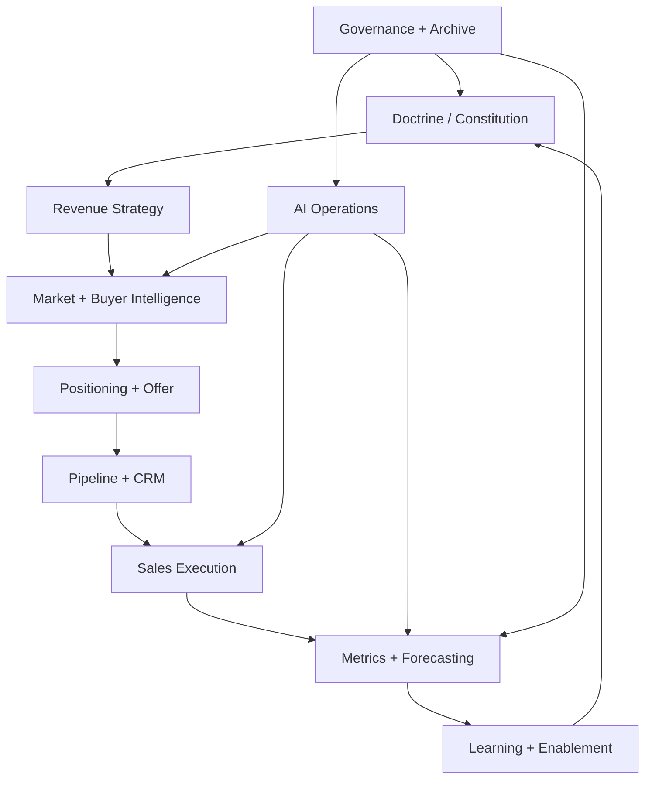
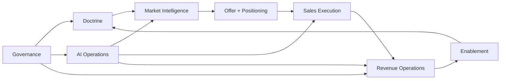
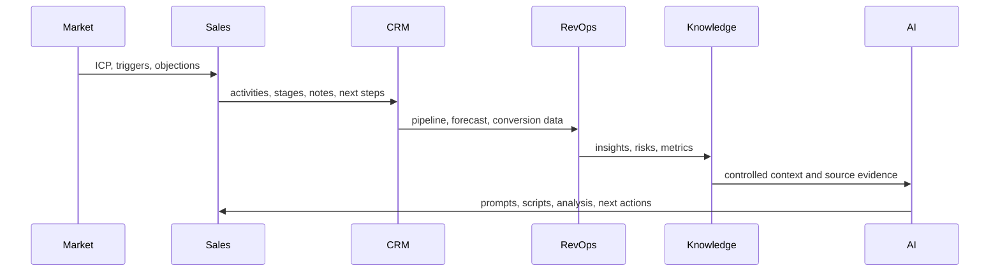
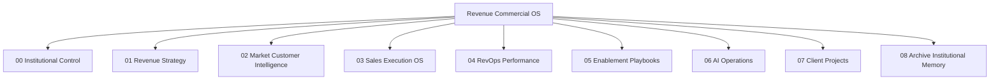

# Master Revenue & Commercial Operating System Blueprint

Institutional reconstruction generated from the sales and revenue source corpus.

- Generated: 2026-05-12 11:46
- Corpus files: 78
- Corpus words: 298448
- Normalized paragraphs: 67309
- Evidence unit: SOURCE_ID:P####
- Draft collision handling: filename identity + source ID + last-modified chronology

> This is an operational reconstruction, not a summary. Explicit claims are cited to paragraph anchors. Inferred architecture is labeled as synthesis and grounded in reinforcing source clusters.

## Source Registry

| Source ID | Document | Origin | Draft | Modified | Words | Paragraphs | Category | Criticality | AI Relevance |
|---|---|---|---:|---|---:|---:|---|---|---|
| SRC-HE-SALES-OS-2024 | HE SALES OS_2024.docx | Companion Source |  | 2026-04-30 14:41 | 9383 | 1262 | Integrated sales operating system and commercial architecture | Medium | High |
| SRC-NIKOLAUS-LUHMANN-SALES | Nikolaus Luhmann_ Sales.docx | Companion Source |  | 2026-05-10 11:39 | 10932 | 1151 | AI, intelligence architecture, and institutional cognition | Medium | Medium |
| SRC-REVENUE-ARCHITECTURE-AGE | Revenue Architecture Agency.docx | Companion Source |  | 2026-05-11 15:42 | 9058 | 2510 | AI, intelligence architecture, and institutional cognition | Critical | High |
| SRC-SALES-AGENT-AGREEMENT | Sales Agent Agreement.docx | Companion Source |  | 2026-05-11 17:19 | 763 | 70 | Governance, legal, compensation, and operating controls | High | Medium |
| SRC-SALES-DEPARTMENT-SCOPE-M | Sales Department Scope Map.docx | Companion Source |  | 2026-05-11 17:19 | 1683 | 480 | Integrated sales operating system and commercial architecture | High | High |
| SRC-SALES-MECHANISM-102 | Sales Mechanism 102.docx | Companion Source |  | 2026-05-02 10:58 | 7678 | 1836 | Sales process, diagnostics, SOPs, and execution mechanics | High | High |
| SRC-SALES-TRACKING-AND-ORGAN | Sales Tracking and Organization.docx | Companion Source |  | 2026-05-11 17:51 | 3134 | 794 | Revenue operations, cadence, measurement, and performance management | High | Critical |
| SRC-THE-SALES-MECHANISM | The Sales Mechanism.docx | Companion Source |  | 2026-05-01 11:06 | 7715 | 1840 | Sales process, diagnostics, SOPs, and execution mechanics | High | High |
| SRC-UNTOLD-SALES-SUCCESS-FAC | Untold Sales Success Factors.docx | Companion Source |  | 2026-05-11 17:26 | 3659 | 848 | Integrated sales operating system and commercial architecture | Medium | Critical |
| SRC-D062 | Social Media in Sales. Darft 62.docx | Companion Source | 62 | 2026-05-12 09:59 | 2877 | 837 | Market, customer, buyer, and channel intelligence | Medium | High |
| SRC-D064 | Revenue Operating System Design. Darft 64.docx | Companion Source | 64 | 2026-05-12 10:03 | 3041 | 930 | Monetization, revenue architecture, and offer economics | Critical | High |
| SD-001-WHATISAS | What is a stratergy. Draft 1.docx | Sales Drafts | 1 | 2026-05-11 17:21 | 3454 | 873 | Foundational doctrine, philosophy, and strategic worldview | Medium | Critical |
| SD-002-SALESGAP | Sales Gap and Faliures. Draft 2.docx | Sales Drafts | 2 | 2026-05-11 17:23 | 3367 | 790 | Integrated sales operating system and commercial architecture | Medium | Critical |
| SD-003-SALESCAD | Sales Cadence Stratergy. Draft 3.docx | Sales Drafts | 3 | 2026-05-11 17:28 | 3616 | 893 | Revenue operations, cadence, measurement, and performance management | High | Critical |
| SD-004-UNTOLDSA | Untold Sales Success Factors. Draft 4.docx | Sales Drafts | 4 | 2026-05-11 17:29 | 3659 | 848 | Integrated sales operating system and commercial architecture | Medium | Critical |
| SD-005-BUILDING | Building a Sales Momentum. Draft 5.docx | Sales Drafts | 5 | 2026-05-11 17:31 | 3442 | 817 | Integrated sales operating system and commercial architecture | Medium | Critical |
| SD-006-SALESLOG | Sales Logic Framework. Draft 6.docx | Sales Drafts | 6 | 2026-05-11 17:44 | 3415 | 832 | Foundational doctrine, philosophy, and strategic worldview | Medium | Critical |
| SD-007-SALESSYA | Sales Syatem Engineering. Draft 7.docx | Sales Drafts | 7 | 2026-05-11 17:45 | 3448 | 889 | Integrated sales operating system and commercial architecture | Medium | Critical |
| SD-008-THEELITE | The Elite Execution. Draft 8.docx | Sales Drafts | 8 | 2026-05-11 17:46 | 3455 | 788 | Integrated sales operating system and commercial architecture | Medium | Critical |
| SD-009-SALESAND | Sales and Marketing Alginment. Draft 9.docx | Sales Drafts | 9 | 2026-05-11 17:47 | 3397 | 830 | Integrated sales operating system and commercial architecture | Medium | Critical |
| SD-010-SALESSYS | Sales System Dynamic. Draft 10.docx | Sales Drafts | 10 | 2026-05-11 17:49 | 3448 | 822 | Integrated sales operating system and commercial architecture | Medium | Critical |
| SD-011-SALESTRA | Sales Tracking and Organization. Draft 11.docx | Sales Drafts | 11 | 2026-05-11 17:52 | 3134 | 794 | Revenue operations, cadence, measurement, and performance management | High | Critical |
| SD-012-SALESFUN | Sales Funnel Type. Draft 12.docx | Sales Drafts | 12 | 2026-05-11 17:57 | 3922 | 853 | Sales process, diagnostics, SOPs, and execution mechanics | Medium | Critical |
| SD-013-SALESOPE | Sales Operating System Blueprint. Draft 13.docx | Sales Drafts | 13 | 2026-05-11 17:58 | 4213 | 876 | Integrated sales operating system and commercial architecture | Critical | Critical |
| SD-014-HANDLING | Handling Sales Negatives. Draft 14.docx | Sales Drafts | 14 | 2026-05-11 17:59 | 3293 | 694 | Integrated sales operating system and commercial architecture | Medium | Critical |
| SD-015-SALESSYT | Sales Sytem Success 99.9%. Draft 15.docx | Sales Drafts | 15 | 2026-05-11 18:00 | 3559 | 901 | Integrated sales operating system and commercial architecture | Medium | High |
| SD-016-OUTCOMEO | Outcome of the 99.9% Success System. Draft 16.docx | Sales Drafts | 16 | 2026-05-11 18:02 | 3571 | 870 | Integrated sales operating system and commercial architecture | Medium | Critical |
| SD-017-SCALABLE | Scalable Sales Operating System. Draft 17.docx | Sales Drafts | 17 | 2026-05-11 18:04 | 3417 | 881 | Integrated sales operating system and commercial architecture | Critical | Critical |
| SD-018-SALESDEC | Sales Decision Intelligence. Draft 18.docx | Sales Drafts | 18 | 2026-05-11 18:05 | 3654 | 933 | Integrated sales operating system and commercial architecture | Medium | Critical |
| SD-019-MUTUALDI | Mutual Discovery in Sales. Draft 19.docx | Sales Drafts | 19 | 2026-05-11 18:06 | 3750 | 863 | Market, customer, buyer, and channel intelligence | Medium | Critical |
| SD-020-SYSTEMBL | System Blueprint Aglinment. Draft 20.docx | Sales Drafts | 20 | 2026-05-11 18:07 | 10761 | 1255 | Integrated sales operating system and commercial architecture | Critical | Critical |
| SD-021-BUILDING | Building Sales Sector Knowledge. Draft 21.docx | Sales Drafts | 21 | 2026-05-11 18:09 | 3745 | 918 | Market, customer, buyer, and channel intelligence | Medium | Critical |
| SD-022-THESALES | THE SALES OS_2024. Sales System Alignment Draft 22.docx | Sales Drafts | 22 | 2026-05-11 18:11 | 3565 | 966 | Integrated sales operating system and commercial architecture | Critical | Critical |
| SD-023-SALESSYS | Sales System Diagnosis Guide. Draft 23.docx | Sales Drafts | 23 | 2026-05-11 18:13 | 3652 | 917 | Sales process, diagnostics, SOPs, and execution mechanics | High | Critical |
| SD-024-MONETIZA | Monetization Layer in Sales. Draft 24.docx | Sales Drafts | 24 | 2026-05-11 18:15 | 3729 | 978 | Monetization, revenue architecture, and offer economics | Medium | Critical |
| SD-025-SALESPRO | Sales Process Clarity. Draft 25.docx | Sales Drafts | 25 | 2026-05-11 18:16 | 3825 | 805 | Sales process, diagnostics, SOPs, and execution mechanics | High | Critical |
| SD-026-SALESCYC | Sales Cycle Execution Tips. Draft 26.docx | Sales Drafts | 26 | 2026-05-11 18:38 | 4147 | 1005 | Sales process, diagnostics, SOPs, and execution mechanics | Medium | Critical |
| SD-027-MAINTAIN | Maintaing Sales System. Draft 27.docx | Sales Drafts | 27 | 2026-05-11 18:42 | 2756 | 605 | AI, intelligence architecture, and institutional cognition | Medium | High |
| SD-028-SALESMEC | Sales Mechanism 101_Sales System Diagnosis. Draft 28.docx | Sales Drafts | 28 | 2026-05-11 18:47 | 3550 | 780 | Sales process, diagnostics, SOPs, and execution mechanics | High | High |
| SD-029-DYNAMICS | Dynamic Sales System Design. Draft 29.docx | Sales Drafts | 29 | 2026-05-11 18:53 | 3601 | 893 | Integrated sales operating system and commercial architecture | Medium | Critical |
| SD-029-MONETIZI | Monetizing Sales System. Draft 29.docx | Sales Drafts | 29 | 2026-05-11 19:00 | 2698 | 664 | Monetization, revenue architecture, and offer economics | Medium | Critical |
| SD-030-PHYCHOGR | Phychographics in Sales. Draft 30.docx | Sales Drafts | 30 | 2026-05-11 19:20 | 3336 | 836 | Integrated sales operating system and commercial architecture | Medium | Critical |
| SD-031-BUILDSAL | Build Sales Metrics. Draft 31.docx | Sales Drafts | 31 | 2026-05-11 19:22 | 3639 | 922 | Revenue operations, cadence, measurement, and performance management | High | Critical |
| SD-032-SALESROL | Sales Role in Offer Structuring. Draft 32.docx | Sales Drafts | 32 | 2026-05-11 19:25 | 3654 | 908 | Monetization, revenue architecture, and offer economics | Medium | Critical |
| SD-033-NETWORKI | Networking Partnership Structure. Draft 33.docx | Sales Drafts | 33 | 2026-05-11 19:26 | 3518 | 918 | Integrated sales operating system and commercial architecture | Medium | Critical |
| SD-034-SALESCAL | Sales Calendar Operations. Draft 34.docx | Sales Drafts | 34 | 2026-05-11 19:27 | 4508 | 1004 | Revenue operations, cadence, measurement, and performance management | Medium | Critical |
| SD-035-SALESSYS | Sales System Grouping Stratergy. Draft 35.docx | Sales Drafts | 35 | 2026-05-11 19:28 | 3258 | 794 | Foundational doctrine, philosophy, and strategic worldview | Medium | Critical |
| SD-036-SALESCOM | Sales Competition Layers. Draft 36.docx | Sales Drafts | 36 | 2026-05-11 19:30 | 2604 | 618 | Market, customer, buyer, and channel intelligence | Medium | High |
| SD-037-SALESASP | Sales as Power Navigation. Draft 37.docx | Sales Drafts | 37 | 2026-05-11 19:38 | 3623 | 840 | Foundational doctrine, philosophy, and strategic worldview | Medium | Critical |
| SD-037-SALESLEG | Sales Legal Structuring. Draft 37.docx | Sales Drafts | 37 | 2026-05-11 19:36 | 3761 | 893 | Governance, legal, compensation, and operating controls | Medium | Critical |
| SD-038-SALESASP | Sales as Power Navigation. Draft 38.docx | Sales Drafts | 38 | 2026-05-11 19:42 | 3623 | 840 | Foundational doctrine, philosophy, and strategic worldview | Medium | Critical |
| SD-039-SALESSYS | Sales System Payment System Desgin. Draft 39.docx | Sales Drafts | 39 | 2026-05-11 19:41 | 3478 | 850 | Governance, legal, compensation, and operating controls | Medium | Critical |
| SD-040-SALESSOP | Sales SOPs. Draft 40.docx | Sales Drafts | 40 | 2026-05-11 19:42 | 3609 | 908 | Sales process, diagnostics, SOPs, and execution mechanics | High | Critical |
| SD-041-SALESGOV | Sales Governance Aritichure Operational Blueprint. Draft 41.docx | Sales Drafts | 41 | 2026-05-11 19:48 | 4635 | 1213 | Governance, legal, compensation, and operating controls | Critical | Critical |
| SD-042-360SALES | 360 Sales System Map. Draft 42.docx | Sales Drafts | 42 | 2026-05-11 19:50 | 3030 | 752 | Integrated sales operating system and commercial architecture | Medium | Critical |
| SD-043-MISSIONV | Mission Vision Goal Values. Draft 43.docx | Sales Drafts | 43 | 2026-05-11 19:51 | 3531 | 840 | Foundational doctrine, philosophy, and strategic worldview | Medium | Critical |
| SD-044-ASKINGTH | Asking the right questions. Draft 44.docx | Sales Drafts | 44 | 2026-05-11 19:54 | 3877 | 859 | Market, customer, buyer, and channel intelligence | Medium | Critical |
| SD-045-SALESPRO | Sales Problem Solving. Draft 45.docx | Sales Drafts | 45 | 2026-05-11 19:56 | 2816 | 721 | Integrated sales operating system and commercial architecture | Medium | Critical |
| SD-046-SALESPRO | Sales Project ToC Creation. Draft 46.docx | Sales Drafts | 46 | 2026-05-11 19:57 | 3149 | 764 | Integrated sales operating system and commercial architecture | Medium | Critical |
| SD-047-SYSTEMPR | System Prompt Architecture. Draft 47.docx | Sales Drafts | 47 | 2026-05-11 19:58 | 2767 | 523 | AI, intelligence architecture, and institutional cognition | Critical | Critical |
| SD-048-SALESSYS | Sales System Execution Prompt. Draft 48.docx | Sales Drafts | 48 | 2026-05-11 19:59 | 3725 | 541 | AI, intelligence architecture, and institutional cognition | Critical | Critical |
| SD-049-SALESOPE | Sales Operating System Roles. Draft 49.docx | Sales Drafts | 49 | 2026-05-11 20:01 | 2712 | 640 | Integrated sales operating system and commercial architecture | Critical | High |
| SD-050-SALESCHA | Sales Channels Overview. Draft 50.docx | Sales Drafts | 50 | 2026-05-11 20:02 | 2519 | 550 | Market, customer, buyer, and channel intelligence | Medium | High |
| SD-051-MONETIZI | Monetizing Sales System. Draft 51.docx | Sales Drafts | 51 | 2026-05-12 09:45 | 2611 | 621 | Monetization, revenue architecture, and offer economics | Medium | High |
| SD-052-DAILYSAL | Daily Sales Action Plan. Draft 52.docx | Sales Drafts | 52 | 2026-05-12 09:47 | 3234 | 744 | AI, intelligence architecture, and institutional cognition | Medium | High |
| SD-053-SALESFLY | Sales Flywheel vs Funnel. Draft 53.docx | Sales Drafts | 53 | 2026-05-12 09:48 | 2494 | 522 | Sales process, diagnostics, SOPs, and execution mechanics | Medium | High |
| SD-054-AUDIENCE | Audience Navigation in Sales. Draft 54.docx | Sales Drafts | 54 | 2026-05-12 09:50 | 2671 | 639 | Market, customer, buyer, and channel intelligence | Medium | High |
| SD-055-SALESOPE | Sales Operating System Overview. Draft 55.docx | Sales Drafts | 55 | 2026-05-12 09:51 | 2796 | 751 | Integrated sales operating system and commercial architecture | Critical | Critical |
| SD-056-SALESSYS | Sales System Revenue Breakdown. Draft 56.docx | Sales Drafts | 56 | 2026-05-12 09:52 | 3800 | 818 | Monetization, revenue architecture, and offer economics | High | High |
| SD-057-SALESPLA | Sales Playbooks and Cycles. Draft 57.docx | Sales Drafts | 57 | 2026-05-12 09:53 | 3407 | 752 | Sales process, diagnostics, SOPs, and execution mechanics | Medium | High |
| SD-058-BUILDING | Building Sales Audience Pre-Sale. Draft 58.docx | Sales Drafts | 58 | 2026-05-12 09:54 | 2598 | 613 | Market, customer, buyer, and channel intelligence | Medium | High |
| SD-059-SALESLAU | Sales Launch Mechanism. Draft 59.docx | Sales Drafts | 59 | 2026-05-12 09:55 | 2474 | 526 | Sales process, diagnostics, SOPs, and execution mechanics | High | High |
| SD-060-SALESOPE | Sales Operating System. Draft 60.docx | Sales Drafts | 60 | 2026-05-12 09:57 | 6045 | 915 | Integrated sales operating system and commercial architecture | Critical | Critical |
| SD-061-SALESINT | Sales Intelligence Architecture. Draft 61.docx | Sales Drafts | 61 | 2026-05-12 09:58 | 5377 | 1158 | AI, intelligence architecture, and institutional cognition | Critical | Critical |
| SD-063-NIKOLAUS | Nikolaus Luhmann_Luhmannian Sales Theory. Draft 63.docx | Sales Drafts | 63 | 2026-05-12 10:00 | 3223 | 790 | AI, intelligence architecture, and institutional cognition | Medium | High |
| SD-063-SALESSYS | Sales System Reconstruction. Draft 63.docx | Sales Drafts | 63 | 2026-05-12 10:01 | 3631 | 926 | AI, intelligence architecture, and institutional cognition | Critical | Medium |
| SD-065-REVENUEA | Revenue Architecture Framework. Draft 65.docx | Sales Drafts | 65 | 2026-05-12 10:04 | 2403 | 699 | AI, intelligence architecture, and institutional cognition | Critical | Critical |
| SD-066-WHATISSA | What is Sales. Draft 66.docx | Sales Drafts | 66 | 2026-05-12 10:05 | 3146 | 710 | Foundational doctrine, philosophy, and strategic worldview | Medium | Critical |

**Corpus integrity notes**
- Duplicate draft number 29: Dynamic Sales System Design. Draft 29.docx; Monetizing Sales System. Draft 29.docx
- Duplicate draft number 63: Nikolaus Luhmann_Luhmannian Sales Theory. Draft 63.docx; Sales System Reconstruction. Draft 63.docx
- Duplicate draft number 37: Sales as Power Navigation. Draft 37.docx; Sales Legal Structuring. Draft 37.docx
- Missing draft numbers in Sales Drafts: 62, 64
- Missing draft numbers are resolved by companion files: Social Media in Sales. Darft 62.docx and Revenue Operating System Design. Darft 64.docx.

## 1. Executive System Map

The reconstructed system is a five-layer commercial institution: doctrine, market intelligence, execution architecture, operating governance, and AI-native memory. The corpus repeatedly frames sales as more than closing: it is a decision-support, trust-building, value-navigation, and system-design discipline. Evidence: SD-020-SYSTEMBL:P0120, SD-013-SALESOPE:P0001, SD-060-SALESOPE:P0001, SD-063-SALESSYS:P0001, SD-061-SALESINT:P0001, SD-060-SALESOPE:P0394, SD-013-SALESOPE:P0347, SD-053-SALESFLY:P0077, SD-066-WHATISSA:P0189, SD-023-SALESSYS:P0350.

| Layer | Institutional Function | Operating Meaning | Primary Evidence |
|---|---|---|---|
| Doctrine Layer | Defines why sales exists, what revenue is acceptable, and what beliefs guide action | Prevents quota-only selling and anchors execution in value, trust, fit, and strategic intent | SD-020-SYSTEMBL:P0120, SD-013-SALESOPE:P0001, SD-060-SALESOPE:P0001, SD-063-SALESSYS:P0001 |
| Market Intelligence Layer | Converts audience, sector, competition, psychographics, and social signals into targetable revenue knowledge | Makes selling adaptive rather than scripted | SD-020-SYSTEMBL:P0120, SD-048-SALESSYS:P0012, SRC-D064:P0001, SD-061-SALESINT:P0530 |
| Revenue Process Layer | Structures funnel, pipeline, discovery, qualification, CRM, forecasting, and handoffs | Turns commercial movement into governable stages | SD-020-SYSTEMBL:P0120, SRC-D064:P0001, SRC-REVENUE-ARCHITECTURE-AGE:P0001, SD-061-SALESINT:P0091 |
| Execution Layer | Runs outreach, conversation, objection handling, negotiation, closing, onboarding, retention, and expansion | Makes the system daily-operational | SD-020-SYSTEMBL:P0120, SD-061-SALESINT:P0001, SD-063-SALESSYS:P0001, SRC-D064:P0001 |
| AI + Knowledge Layer | Governs prompts, agents, repositories, memory, escalation, auditability, and folder intelligence | Converts fragmented chats into a durable institutional intelligence system | SD-060-SALESOPE:P0001, SD-020-SYSTEMBL:P0120, SD-061-SALESINT:P0091, SD-061-SALESINT:P0001 |

The system should be operated as an institutional commercial brain: every sales action produces intelligence, every intelligence asset becomes reusable knowledge, and every reusable knowledge asset improves future execution.

## 2. Revenue & GTM Philosophy Reconstruction

The commercial worldview is transformation-led and system-led. Sales is treated as the practical mechanism that connects a real buyer condition to a valuable outcome, then governs the trust, timing, positioning, and decision path needed for that outcome to become revenue. Evidence: SD-020-SYSTEMBL:P0120, SD-013-SALESOPE:P0001, SD-060-SALESOPE:P0001, SD-063-SALESSYS:P0001, SD-061-SALESINT:P0001, SD-060-SALESOPE:P0394, SD-013-SALESOPE:P0347, SD-053-SALESFLY:P0077, SD-066-WHATISSA:P0189, SD-023-SALESSYS:P0350.

| Doctrine | Meaning | Operating Rule | Evidence |
|---|---|---|---|
| Value Before Transaction | Revenue should follow fit, problem clarity, and value creation | Do not push an offer before mapping buyer need, context, risk, and value | SD-020-SYSTEMBL:P0120, SD-013-SALESOPE:P0001, SD-060-SALESOPE:P0001 |
| Trust Architecture | Trust is not a mood; it is built through knowledge, transparency, consistency, proof, and aligned intent | Every funnel stage must answer: why believe, why now, why us, why this path | SD-020-SYSTEMBL:P0120, SD-061-SALESINT:P0001, SD-063-SALESSYS:P0001 |
| Power Navigation | Sales requires knowing who influences the decision, when leverage exists, and where resistance hides | Map visible and hidden stakeholders before high-stakes persuasion | SD-005-BUILDING:P0264, SD-063-SALESSYS:P0001, SD-020-SYSTEMBL:P0120, SD-003-SALESCAD:P0373, SD-033-NETWORKI:P0393 |
| System Over Script | Scripts are only useful when governed by market intelligence, buyer psychology, and stage context | Use scripts as execution assets, not as substitutes for judgment | SD-020-SYSTEMBL:P0120, SD-061-SALESINT:P0001, SD-063-SALESSYS:P0001, SRC-D064:P0001 |
| Ethical Revenue | Bad-fit revenue is operational debt | Keep fit, truth, legal structure, and buyer transformation above short-term extraction | SD-020-SYSTEMBL:P0120, SRC-D064:P0001, SD-060-SALESOPE:P0001, SD-065-REVENUEA:P0003 |

The GTM philosophy is therefore not merely acquisition-oriented. It is a closed learning system: market understanding creates positioning; positioning creates better conversations; conversations create richer intelligence; intelligence improves the offer, channel mix, qualification logic, and revenue forecast.

## 3. Domain Scope Analysis

| Scope Domain | Included | Boundary | Evidence |
|---|---|---|---|
| Organizational Scope | Sales leadership, RevOps, sales execution, marketing alignment, partnerships, legal/payment support, AI operators, and knowledge owners | Personal CVs and unrelated files are excluded | SD-020-SYSTEMBL:P0120, SRC-D064:P0001, SD-060-SALESOPE:P0001 |
| Operational Scope | Daily action plans, cadence, CRM, dashboards, pipeline, forecasting, discovery, objection handling, closing, onboarding, expansion | Non-sales functions are included only where they touch revenue movement | SD-020-SYSTEMBL:P0120, SRC-D064:P0001, SRC-REVENUE-ARCHITECTURE-AGE:P0001, SD-061-SALESINT:P0091, SD-065-REVENUEA:P0003 |
| AI Scope | Prompt constitution, execution prompts, agent roles, escalation, repository memory, auditability, and human override | Autonomous execution must remain bounded by governance | SD-060-SALESOPE:P0001, SD-020-SYSTEMBL:P0120, SD-061-SALESINT:P0091, SD-061-SALESINT:P0001, SD-025-SALESPRO:P0329, SD-024-MONETIZA:P0365 |
| Governance Scope | Doctrine, SOPs, legal structure, payment design, review cadence, ownership, archive, versioning, audit trails | Governance is not bureaucracy; it is continuity and risk control | SD-020-SYSTEMBL:P0120, SRC-D064:P0001, SD-060-SALESOPE:P0001, SD-065-REVENUEA:P0003, SD-061-SALESINT:P0091, SD-061-SALESINT:P0001 |
| Market Scope | ICP, buyer psychology, psychographics, channels, competition, social media, sector knowledge, audience creation | Market scope should be updated continuously through discovery and sales feedback | SD-020-SYSTEMBL:P0120, SD-048-SALESSYS:P0012, SRC-D064:P0001, SD-061-SALESINT:P0530, SD-061-SALESINT:P0001, SD-061-SALESINT:P0091 |

## 4. Institutional Operational Architecture

The operating architecture should run as a sequence of intelligence conversion:

`Market Signal -> Buyer Insight -> Positioning -> Offer Fit -> Lead Source -> Qualification -> Discovery -> Deal Strategy -> Proposal -> Close -> Onboarding -> Retention -> Expansion -> Reporting -> System Update`

| Operating System | Workflow | Accountability | Escalation Trigger | Evidence |
|---|---|---|---|---|
| Strategy Control | Mission, goals, positioning, ICP, offer economics | Commercial architect / founder | Strategy conflicts, bad-fit revenue, unclear offer | SD-020-SYSTEMBL:P0120, SD-013-SALESOPE:P0001, SD-060-SALESOPE:P0001 |
| Pipeline Control | Stage definitions, CRM hygiene, next steps, velocity, stuck deals | RevOps owner / sales lead | Stage aging, no next step, missing decision maker | SD-020-SYSTEMBL:P0120, SRC-D064:P0001, SRC-REVENUE-ARCHITECTURE-AGE:P0001, SD-061-SALESINT:P0091 |
| Execution Control | Outreach, conversations, follow-up, objection handling, closing | Sales operator / account owner | Objection unresolved, ghosting, pricing resistance, low trust | SD-020-SYSTEMBL:P0120, SD-061-SALESINT:P0001, SD-063-SALESSYS:P0001, SRC-D064:P0001 |
| Intelligence Control | Dashboards, decision logs, win/loss, buyer notes, sector files | RevOps + knowledge owner | Missing data, inconsistent metrics, forecast risk | SD-020-SYSTEMBL:P0120, SD-061-SALESINT:P0001, SRC-D064:P0001, SD-065-REVENUEA:P0003 |
| AI Control | Prompt hierarchy, agent routing, memory updates, approval rules | AI workflow architect / human operator | Low confidence, destructive action, conflicting instructions | SD-060-SALESOPE:P0001, SD-020-SYSTEMBL:P0120, SD-061-SALESINT:P0091, SD-061-SALESINT:P0001, SD-025-SALESPRO:P0329, SD-024-MONETIZA:P0365 |

## 5. Master Folder Architecture

The folder ecosystem must mirror the operating system, not document aesthetics. Every folder exists because it supports a workflow, a governance requirement, a retrieval need, or institutional memory.

```text
00_INSTITUTIONAL_CONTROL
  00_Source_Registry
  01_Constitution_Doctrine
  02_Decision_Log
  03_Governance_Review
01_REVENUE_STRATEGY
  01_Mission_Vision_Goals
  02_Positioning_Strategy
  03_Offer_Revenue_Model
  04_Market_Expansion
02_MARKET_CUSTOMER_INTELLIGENCE
  01_ICP_Buyer_Personas
  02_Sector_Knowledge
  03_Psychographics_Objections
  04_Competition_Alternatives
  05_Channel_Social_Intelligence
03_SALES_EXECUTION_OS
  01_Pipeline_CRM
  02_Prospecting_Outreach
  03_Discovery_Qualification
  04_Demo_Presentation
  05_Negotiation_Closing
  06_Onboarding_Handoff
  07_Retention_Expansion
04_REVOPS_PERFORMANCE
  01_KPIs_Metrics
  02_Forecasting
  03_Dashboards_Reports
  04_Cadence_Reviews
  05_Risk_Audit
05_ENABLEMENT_PLAYBOOKS
  01_SOPs
  02_Playbooks
  03_Scripts_Templates
  04_Coaching_Certification
06_AI_OPERATIONS
  01_System_Prompts
  02_Agent_Roles
  03_Execution_States
  04_Escalations_Approvals
  05_AI_Memory_Logs
07_CLIENT_PROJECTS
  CLIENT_[Name]
    01_Intake_Audit
    02_Strategy
    03_Execution
    04_Reporting
    05_Decisions_Archive
08_ARCHIVE_INSTITUTIONAL_MEMORY
  01_Legacy_Drafts
  02_Superseded_Versions
  03_Closed_Projects
  04_Evidence_Exports
```

Folder architecture evidence: SD-060-SALESOPE:P0001, SD-020-SYSTEMBL:P0120, SD-061-SALESINT:P0001, SD-060-SALESOPE:P0266, SD-065-REVENUEA:P0003, SD-005-BUILDING:P0263, SD-007-SALESSYA:P0308, SRC-SALES-MECHANISM-102:P0716, SD-040-SALESSOP:P0001, SD-021-BUILDING:P0144, SD-063-SALESSYS:P0001, SD-061-SALESINT:P0091.

## 6. Subfolder Intelligence

| Major Folder | Purpose | Contents | Operational Role | Governance Role | Lifecycle | Dependencies | Usage Frequency |
|---|---|---|---|---|---|---|---|
| 00_INSTITUTIONAL_CONTROL | Protect the system identity and source of truth | Constitution, doctrine, source registry, decision log | Defines how the institution thinks and decides | Highest authority; review required | Permanent | All folders depend on it | Weekly / quarterly |
| 01_REVENUE_STRATEGY | Own strategic commercial direction | Mission, ICP strategy, positioning, offer model | Translates vision into GTM choices | Strategy changes require approval | Permanent with quarterly updates | Market intelligence and RevOps reporting | Monthly / quarterly |
| 02_MARKET_CUSTOMER_INTELLIGENCE | Store buyer, market, and competitive truth | ICP, personas, objections, sector knowledge, channel intelligence | Feeds targeting, scripts, qualification, and positioning | Must cite discovery or research sources | Continuously updated | Sales execution and strategy | Daily / weekly |
| 03_SALES_EXECUTION_OS | Run the sales motion | Pipeline, outreach, discovery, demos, negotiation, closing, handoff, expansion | Daily frontline execution engine | CRM hygiene and SLA enforcement | Active operating layer | Market intelligence, RevOps, enablement | Daily |
| 04_REVOPS_PERFORMANCE | Measure, forecast, and govern revenue movement | KPIs, dashboards, forecasts, cadence reviews, audits | Management control layer | Metric definitions and reporting cadence | Recurring operating layer | CRM and sales execution | Daily / weekly / monthly |
| 05_ENABLEMENT_PLAYBOOKS | Scale capability and consistency | SOPs, playbooks, scripts, coaching, certification | Converts knowledge into repeatable behavior | Version controlled; owner required | Updated after learning loops | All execution workflows | Weekly |
| 06_AI_OPERATIONS | Govern AI-human operational coordination | System prompts, agents, execution states, escalations, memory logs | AI runtime and orchestration layer | Approval, auditability, memory retention | Permanent and continuously refined | Institutional control, knowledge, execution | Daily |
| 07_CLIENT_PROJECTS | Deliver the system for specific clients or offers | Audit, strategy, execution, reporting, decisions | Client-specific delivery layer | Scope, legal, data, and deliverable governance | Created per client; archived at close | Revenue strategy, execution, AI ops | Daily during active projects |
| 08_ARCHIVE_INSTITUTIONAL_MEMORY | Preserve evolution and evidence | Legacy drafts, superseded versions, closed projects, evidence exports | Prevents knowledge loss and supports reconstruction | Archive rules and retention policy | Permanent archive | All folders feed it | Monthly / quarterly |

## 7. Naming Convention System

Use names that encode domain, function, topic, status, version, and date. The naming system must support human retrieval and AI parsing.

| Asset Type | Format | Example | Rule |
|---|---|---|---|
| Folder | `[NN]_[DOMAIN]_[FUNCTION]` | `03_SALES_EXECUTION_OS` | Number by operating sequence, not preference |
| Conversation | `[DOMAIN][WORKFLOW][TOPIC][YYYY-MM-DD][STATUS]` | `SALES_DISCOVERY_LogisticsICP_2026-05-12_ACTIVE` | Every strategic chat becomes a retrievable artifact |
| SOP | `[SOP][DOMAIN][PROCESS][STATUS][v#.#]` | `SOP_SALES_DiscoveryQualification_APPROVED_v1.0` | Approved SOPs require owner and review date |
| Project | `[CLIENT][WORKSTREAM][PHASE][STATUS]` | `ABC_Logistics_ROS_Audit_ACTIVE` | Client work must separate audit, strategy, execution, reporting |
| Asset | `[ASSET][FUNNEL_STAGE][TOPIC][STATUS][v#.#]` | `ASSET_OUTREACH_LinkedInScript_DRAFT_v0.3` | Assets inherit funnel stage |
| Archive | `[ARCHIVE][DOMAIN][REASON][YYYY-MM-DD]` | `ARCHIVE_SALES_SupersededDrafts_2026-05-12` | Archive names must state why they exist |
| Version | `vMAJOR.MINOR` plus status | `APPROVED_v1.0`, `DRAFT_v0.4` | Major versions change behavior; minor versions refine wording |

Canonical metadata block for permanent documents:

```yaml
document_id: SOP_SALES_DiscoveryQualification_APPROVED_v1.0
owner: Sales Operations
status: APPROVED
version: v1.0
created: YYYY-MM-DD
review_cycle: Monthly
source_evidence: [SD-019:P0001, SD-048:P0012]
dependencies: [CRM_Stage_Definitions, ICP_Doctrine]
confidentiality: Internal
```

## 8. Information Classification System

| Classification Axis | Rule | Examples | Storage |
|---|---|---|---|
| Strategic vs Operational | Strategic defines choices and doctrine; operational defines execution | Mission, ICP doctrine vs daily action plan, scripts | Strategy folders vs execution folders |
| Temporary vs Permanent | Temporary is active working material; permanent governs repeatable behavior | Brainstorm chat vs approved SOP | Working project folder vs institutional control |
| Active vs Archived | Active changes current execution; archived preserves lineage | Current playbook vs superseded draft | Active OS folders vs archive |
| Confidential vs General | Confidential contains contracts, pricing, client data, legal risk, or sensitive strategy | Sales Agent Agreement, pricing calculators, client CRM exports | Restricted governance/client folders |
| Execution vs Reference | Execution assets are used in workflows; reference assets explain concepts | Outreach script vs sales philosophy note | Sales Execution OS vs Institutional Memory |
| Explicit vs Inferred | Explicit appears in source text; inferred is synthesized from patterns | Named prompt hierarchy vs reconstructed dependency map | Evidence register must label inference type |

## 9. Document Alignment Matrix

| Document | Purpose | Operational Role | Strategic Role | Dependencies | Related Systems | Governance Impact | AI Relevance | Missing Links | Contradictions | Folder Placement |
|---|---|---|---|---|---|---|---|---|---|---|
| SRC-HE-SALES-OS-2024 - HE SALES OS_2024.docx | Integrated sales operating system and commercial architecture | System blueprint / master synthesis | Supports integrated revenue operating architecture | Source registry, doctrine, related operating documents | Revenue Strategy; Sales Execution; RevOps | Reference governance; useful for lineage | High | Needs approval status, KPI linkage, and update cadence | No direct contradiction detected; compare during governance review | 08_ARCHIVE_INSTITUTIONAL_MEMORY plus active mapped folder |
| SRC-NIKOLAUS-LUHMANN-SALES - Nikolaus Luhmann_ Sales.docx | AI, intelligence architecture, and institutional cognition | Supporting doctrine or execution intelligence | Defines intelligence and AI operating logic | ICP, offer, CRM, cadence | AI Operations; Institutional Memory; Folder Architecture | Reference governance; useful for lineage | Medium | Needs approval status, KPI linkage, and update cadence | No direct contradiction detected; compare during governance review | 06_AI_OPERATIONS |
| SRC-REVENUE-ARCHITECTURE-AGE - Revenue Architecture Agency.docx | AI, intelligence architecture, and institutional cognition | Commercial model, pricing, monetization, and offer design | Defines intelligence and AI operating logic | Source registry, doctrine, related operating documents | AI Operations; Institutional Memory; Folder Architecture | High governance impact; should become controlled source | High | Needs approval status, KPI linkage, and update cadence | No direct contradiction detected; compare during governance review | 06_AI_OPERATIONS |
| SRC-SALES-AGENT-AGREEMENT - Sales Agent Agreement.docx | Governance, legal, compensation, and operating controls | Governance, risk, legal, and accountability structure | Defines control, risk, and accountability | Doctrine, ownership, approval rules | Governance; Legal; Audit; Archive | Requires owner and review cadence | Medium | Needs approval status, KPI linkage, and update cadence | No direct contradiction detected; compare during governance review | 00_INSTITUTIONAL_CONTROL |
| SRC-SALES-DEPARTMENT-SCOPE-M - Sales Department Scope Map.docx | Integrated sales operating system and commercial architecture | Supporting doctrine or execution intelligence | Supports integrated revenue operating architecture | ICP, offer, CRM, cadence | Revenue Strategy; Sales Execution; RevOps | Requires owner and review cadence | High | Needs approval status, KPI linkage, and update cadence | No direct contradiction detected; compare during governance review | 08_ARCHIVE_INSTITUTIONAL_MEMORY plus active mapped folder |
| SRC-SALES-MECHANISM-102 - Sales Mechanism 102.docx | Sales process, diagnostics, SOPs, and execution mechanics | Supporting doctrine or execution intelligence | Supports integrated revenue operating architecture | ICP, offer, CRM, cadence | Revenue Strategy; Sales Execution; RevOps | Requires owner and review cadence | High | Needs approval status, KPI linkage, and update cadence | No direct contradiction detected; compare during governance review | 08_ARCHIVE_INSTITUTIONAL_MEMORY plus active mapped folder |
| SRC-SALES-TRACKING-AND-ORGAN - Sales Tracking and Organization.docx | Revenue operations, cadence, measurement, and performance management | Measurement, reporting, decision intelligence, and RevOps control | Defines commercial model and economic logic | CRM data, stage definitions, KPI dictionary | Revenue Strategy; Pricing; Client Delivery | Requires owner and review cadence | Critical | Needs approval status, KPI linkage, and update cadence | No direct contradiction detected; compare during governance review | 01_REVENUE_STRATEGY |
| SRC-THE-SALES-MECHANISM - The Sales Mechanism.docx | Sales process, diagnostics, SOPs, and execution mechanics | Supporting doctrine or execution intelligence | Supports integrated revenue operating architecture | ICP, offer, CRM, cadence | Revenue Strategy; Sales Execution; RevOps | Requires owner and review cadence | High | Needs approval status, KPI linkage, and update cadence | No direct contradiction detected; compare during governance review | 08_ARCHIVE_INSTITUTIONAL_MEMORY plus active mapped folder |
| SRC-UNTOLD-SALES-SUCCESS-FAC - Untold Sales Success Factors.docx | Integrated sales operating system and commercial architecture | Supporting doctrine or execution intelligence | Supports integrated revenue operating architecture | ICP, offer, CRM, cadence | Revenue Strategy; Sales Execution; RevOps | Reference governance; useful for lineage | Critical | Needs owner, version, acceptance criteria, and operating template | No direct contradiction detected; compare during governance review | 08_ARCHIVE_INSTITUTIONAL_MEMORY plus active mapped folder |
| SRC-D062 - Social Media in Sales. Darft 62.docx | Market, customer, buyer, and channel intelligence | Market-facing intelligence and targeting system | Defines targeting, buyer, and market interpretation | Research, discovery, sector data | Market Intelligence; Sales Execution; Offer Strategy | Reference governance; useful for lineage | High | Needs owner, version, acceptance criteria, and operating template | Naming/draft-number collision or typo requires registry resolution | 02_MARKET_CUSTOMER_INTELLIGENCE |
| SRC-D064 - Revenue Operating System Design. Darft 64.docx | Monetization, revenue architecture, and offer economics | System blueprint / master synthesis | Defines commercial model and economic logic | Source registry, doctrine, related operating documents | Revenue Strategy; Pricing; Client Delivery | High governance impact; should become controlled source | High | Needs approval status, KPI linkage, and update cadence | Naming/draft-number collision or typo requires registry resolution | 01_REVENUE_STRATEGY |
| SD-001-WHATISAS - What is a stratergy. Draft 1.docx | Foundational doctrine, philosophy, and strategic worldview | Supporting doctrine or execution intelligence | Defines worldview and strategic beliefs | ICP, offer, CRM, cadence | Revenue Strategy; Sales Execution; RevOps | Reference governance; useful for lineage | Critical | Needs owner, version, acceptance criteria, and operating template | No direct contradiction detected; compare during governance review | 08_ARCHIVE_INSTITUTIONAL_MEMORY plus active mapped folder |
| SD-002-SALESGAP - Sales Gap and Faliures. Draft 2.docx | Integrated sales operating system and commercial architecture | Supporting doctrine or execution intelligence | Supports integrated revenue operating architecture | ICP, offer, CRM, cadence | Revenue Strategy; Sales Execution; RevOps | Reference governance; useful for lineage | Critical | Needs owner, version, acceptance criteria, and operating template | No direct contradiction detected; compare during governance review | 08_ARCHIVE_INSTITUTIONAL_MEMORY plus active mapped folder |
| SD-003-SALESCAD - Sales Cadence Stratergy. Draft 3.docx | Revenue operations, cadence, measurement, and performance management | Execution cadence and frontline operating procedure | Defines commercial model and economic logic | ICP, offer, CRM, cadence | Revenue Strategy; Pricing; Client Delivery | Requires owner and review cadence | Critical | Needs owner, version, acceptance criteria, and operating template | No direct contradiction detected; compare during governance review | 01_REVENUE_STRATEGY |
| SD-004-UNTOLDSA - Untold Sales Success Factors. Draft 4.docx | Integrated sales operating system and commercial architecture | Supporting doctrine or execution intelligence | Supports integrated revenue operating architecture | ICP, offer, CRM, cadence | Revenue Strategy; Sales Execution; RevOps | Reference governance; useful for lineage | Critical | Needs owner, version, acceptance criteria, and operating template | No direct contradiction detected; compare during governance review | 08_ARCHIVE_INSTITUTIONAL_MEMORY plus active mapped folder |
| SD-005-BUILDING - Building a Sales Momentum. Draft 5.docx | Integrated sales operating system and commercial architecture | Supporting doctrine or execution intelligence | Supports integrated revenue operating architecture | ICP, offer, CRM, cadence | Revenue Strategy; Sales Execution; RevOps | Reference governance; useful for lineage | Critical | Needs owner, version, acceptance criteria, and operating template | No direct contradiction detected; compare during governance review | 08_ARCHIVE_INSTITUTIONAL_MEMORY plus active mapped folder |
| SD-006-SALESLOG - Sales Logic Framework. Draft 6.docx | Foundational doctrine, philosophy, and strategic worldview | Supporting doctrine or execution intelligence | Defines worldview and strategic beliefs | ICP, offer, CRM, cadence | Revenue Strategy; Sales Execution; RevOps | Reference governance; useful for lineage | Critical | Needs owner, version, acceptance criteria, and operating template | No direct contradiction detected; compare during governance review | 08_ARCHIVE_INSTITUTIONAL_MEMORY plus active mapped folder |
| SD-007-SALESSYA - Sales Syatem Engineering. Draft 7.docx | Integrated sales operating system and commercial architecture | Supporting doctrine or execution intelligence | Supports integrated revenue operating architecture | ICP, offer, CRM, cadence | Revenue Strategy; Sales Execution; RevOps | Reference governance; useful for lineage | Critical | Needs owner, version, acceptance criteria, and operating template | No direct contradiction detected; compare during governance review | 08_ARCHIVE_INSTITUTIONAL_MEMORY plus active mapped folder |
| SD-008-THEELITE - The Elite Execution. Draft 8.docx | Integrated sales operating system and commercial architecture | Supporting doctrine or execution intelligence | Supports integrated revenue operating architecture | ICP, offer, CRM, cadence | Revenue Strategy; Sales Execution; RevOps | Reference governance; useful for lineage | Critical | Needs owner, version, acceptance criteria, and operating template | No direct contradiction detected; compare during governance review | 08_ARCHIVE_INSTITUTIONAL_MEMORY plus active mapped folder |
| SD-009-SALESAND - Sales and Marketing Alginment. Draft 9.docx | Integrated sales operating system and commercial architecture | Supporting doctrine or execution intelligence | Supports integrated revenue operating architecture | ICP, offer, CRM, cadence | Revenue Strategy; Sales Execution; RevOps | Reference governance; useful for lineage | Critical | Needs owner, version, acceptance criteria, and operating template | No direct contradiction detected; compare during governance review | 08_ARCHIVE_INSTITUTIONAL_MEMORY plus active mapped folder |
| SD-010-SALESSYS - Sales System Dynamic. Draft 10.docx | Integrated sales operating system and commercial architecture | Supporting doctrine or execution intelligence | Supports integrated revenue operating architecture | ICP, offer, CRM, cadence | Revenue Strategy; Sales Execution; RevOps | Reference governance; useful for lineage | Critical | Needs owner, version, acceptance criteria, and operating template | No direct contradiction detected; compare during governance review | 08_ARCHIVE_INSTITUTIONAL_MEMORY plus active mapped folder |
| SD-011-SALESTRA - Sales Tracking and Organization. Draft 11.docx | Revenue operations, cadence, measurement, and performance management | Measurement, reporting, decision intelligence, and RevOps control | Defines commercial model and economic logic | CRM data, stage definitions, KPI dictionary | Revenue Strategy; Pricing; Client Delivery | Requires owner and review cadence | Critical | Needs approval status, KPI linkage, and update cadence | No direct contradiction detected; compare during governance review | 01_REVENUE_STRATEGY |
| SD-012-SALESFUN - Sales Funnel Type. Draft 12.docx | Sales process, diagnostics, SOPs, and execution mechanics | Supporting doctrine or execution intelligence | Supports integrated revenue operating architecture | ICP, offer, CRM, cadence | Revenue Strategy; Sales Execution; RevOps | Reference governance; useful for lineage | Critical | Needs owner, version, acceptance criteria, and operating template | No direct contradiction detected; compare during governance review | 08_ARCHIVE_INSTITUTIONAL_MEMORY plus active mapped folder |
| SD-013-SALESOPE - Sales Operating System Blueprint. Draft 13.docx | Integrated sales operating system and commercial architecture | System blueprint / master synthesis | Supports integrated revenue operating architecture | Source registry, doctrine, related operating documents | Revenue Strategy; Sales Execution; RevOps | High governance impact; should become controlled source | Critical | Needs approval status, KPI linkage, and update cadence | No direct contradiction detected; compare during governance review | 08_ARCHIVE_INSTITUTIONAL_MEMORY plus active mapped folder |
| SD-014-HANDLING - Handling Sales Negatives. Draft 14.docx | Integrated sales operating system and commercial architecture | Supporting doctrine or execution intelligence | Supports integrated revenue operating architecture | ICP, offer, CRM, cadence | Revenue Strategy; Sales Execution; RevOps | Reference governance; useful for lineage | Critical | Needs owner, version, acceptance criteria, and operating template | No direct contradiction detected; compare during governance review | 08_ARCHIVE_INSTITUTIONAL_MEMORY plus active mapped folder |
| SD-015-SALESSYT - Sales Sytem Success 99.9%. Draft 15.docx | Integrated sales operating system and commercial architecture | Supporting doctrine or execution intelligence | Supports integrated revenue operating architecture | ICP, offer, CRM, cadence | Revenue Strategy; Sales Execution; RevOps | Reference governance; useful for lineage | High | Needs owner, version, acceptance criteria, and operating template | No direct contradiction detected; compare during governance review | 08_ARCHIVE_INSTITUTIONAL_MEMORY plus active mapped folder |
| SD-016-OUTCOMEO - Outcome of the 99.9% Success System. Draft 16.docx | Integrated sales operating system and commercial architecture | Supporting doctrine or execution intelligence | Supports integrated revenue operating architecture | ICP, offer, CRM, cadence | Revenue Strategy; Sales Execution; RevOps | Reference governance; useful for lineage | Critical | Needs owner, version, acceptance criteria, and operating template | No direct contradiction detected; compare during governance review | 08_ARCHIVE_INSTITUTIONAL_MEMORY plus active mapped folder |
| SD-017-SCALABLE - Scalable Sales Operating System. Draft 17.docx | Integrated sales operating system and commercial architecture | System blueprint / master synthesis | Supports integrated revenue operating architecture | Source registry, doctrine, related operating documents | Revenue Strategy; Sales Execution; RevOps | High governance impact; should become controlled source | Critical | Needs approval status, KPI linkage, and update cadence | No direct contradiction detected; compare during governance review | 08_ARCHIVE_INSTITUTIONAL_MEMORY plus active mapped folder |
| SD-018-SALESDEC - Sales Decision Intelligence. Draft 18.docx | Integrated sales operating system and commercial architecture | Measurement, reporting, decision intelligence, and RevOps control | Supports integrated revenue operating architecture | CRM data, stage definitions, KPI dictionary | Revenue Strategy; Sales Execution; RevOps | Reference governance; useful for lineage | Critical | Needs owner, version, acceptance criteria, and operating template | No direct contradiction detected; compare during governance review | 04_REVOPS_PERFORMANCE |
| SD-019-MUTUALDI - Mutual Discovery in Sales. Draft 19.docx | Market, customer, buyer, and channel intelligence | Supporting doctrine or execution intelligence | Defines targeting, buyer, and market interpretation | ICP, offer, CRM, cadence | Market Intelligence; Sales Execution; Offer Strategy | Reference governance; useful for lineage | Critical | Needs owner, version, acceptance criteria, and operating template | No direct contradiction detected; compare during governance review | 02_MARKET_CUSTOMER_INTELLIGENCE |
| SD-020-SYSTEMBL - System Blueprint Aglinment. Draft 20.docx | Integrated sales operating system and commercial architecture | System blueprint / master synthesis | Supports integrated revenue operating architecture | Source registry, doctrine, related operating documents | Revenue Strategy; Sales Execution; RevOps | High governance impact; should become controlled source | Critical | Needs approval status, KPI linkage, and update cadence | No direct contradiction detected; compare during governance review | 08_ARCHIVE_INSTITUTIONAL_MEMORY plus active mapped folder |
| SD-021-BUILDING - Building Sales Sector Knowledge. Draft 21.docx | Market, customer, buyer, and channel intelligence | Market-facing intelligence and targeting system | Defines targeting, buyer, and market interpretation | Research, discovery, sector data | Market Intelligence; Sales Execution; Offer Strategy | Reference governance; useful for lineage | Critical | Needs owner, version, acceptance criteria, and operating template | No direct contradiction detected; compare during governance review | 02_MARKET_CUSTOMER_INTELLIGENCE |
| SD-022-THESALES - THE SALES OS_2024. Sales System Alignment Draft 22.docx | Integrated sales operating system and commercial architecture | System blueprint / master synthesis | Supports integrated revenue operating architecture | Source registry, doctrine, related operating documents | Revenue Strategy; Sales Execution; RevOps | High governance impact; should become controlled source | Critical | Needs owner, version, acceptance criteria, and operating template | No direct contradiction detected; compare during governance review | 08_ARCHIVE_INSTITUTIONAL_MEMORY plus active mapped folder |
| SD-023-SALESSYS - Sales System Diagnosis Guide. Draft 23.docx | Sales process, diagnostics, SOPs, and execution mechanics | Supporting doctrine or execution intelligence | Supports integrated revenue operating architecture | ICP, offer, CRM, cadence | Revenue Strategy; Sales Execution; RevOps | Requires owner and review cadence | Critical | Needs approval status, KPI linkage, and update cadence | No direct contradiction detected; compare during governance review | 08_ARCHIVE_INSTITUTIONAL_MEMORY plus active mapped folder |
| SD-024-MONETIZA - Monetization Layer in Sales. Draft 24.docx | Monetization, revenue architecture, and offer economics | Commercial model, pricing, monetization, and offer design | Defines commercial model and economic logic | Source registry, doctrine, related operating documents | Revenue Strategy; Pricing; Client Delivery | Reference governance; useful for lineage | Critical | Needs owner, version, acceptance criteria, and operating template | No direct contradiction detected; compare during governance review | 01_REVENUE_STRATEGY |
| SD-025-SALESPRO - Sales Process Clarity. Draft 25.docx | Sales process, diagnostics, SOPs, and execution mechanics | Supporting doctrine or execution intelligence | Supports integrated revenue operating architecture | ICP, offer, CRM, cadence | Revenue Strategy; Sales Execution; RevOps | Requires owner and review cadence | Critical | Needs owner, version, acceptance criteria, and operating template | No direct contradiction detected; compare during governance review | 08_ARCHIVE_INSTITUTIONAL_MEMORY plus active mapped folder |
| SD-026-SALESCYC - Sales Cycle Execution Tips. Draft 26.docx | Sales process, diagnostics, SOPs, and execution mechanics | Execution cadence and frontline operating procedure | Supports integrated revenue operating architecture | ICP, offer, CRM, cadence | Revenue Strategy; Sales Execution; RevOps | Reference governance; useful for lineage | Critical | Needs owner, version, acceptance criteria, and operating template | No direct contradiction detected; compare during governance review | 05_ENABLEMENT_PLAYBOOKS |
| SD-027-MAINTAIN - Maintaing Sales System. Draft 27.docx | AI, intelligence architecture, and institutional cognition | AI execution and orchestration control layer | Defines intelligence and AI operating logic | ICP, offer, CRM, cadence | AI Operations; Institutional Memory; Folder Architecture | Reference governance; useful for lineage | High | Needs owner, version, acceptance criteria, and operating template | No direct contradiction detected; compare during governance review | 06_AI_OPERATIONS |
| SD-028-SALESMEC - Sales Mechanism 101_Sales System Diagnosis. Draft 28.docx | Sales process, diagnostics, SOPs, and execution mechanics | Supporting doctrine or execution intelligence | Supports integrated revenue operating architecture | ICP, offer, CRM, cadence | Revenue Strategy; Sales Execution; RevOps | Requires owner and review cadence | High | Needs owner, version, acceptance criteria, and operating template | No direct contradiction detected; compare during governance review | 08_ARCHIVE_INSTITUTIONAL_MEMORY plus active mapped folder |
| SD-029-DYNAMICS - Dynamic Sales System Design. Draft 29.docx | Integrated sales operating system and commercial architecture | Supporting doctrine or execution intelligence | Supports integrated revenue operating architecture | ICP, offer, CRM, cadence | Revenue Strategy; Sales Execution; RevOps | Reference governance; useful for lineage | Critical | Needs approval status, KPI linkage, and update cadence | Naming/draft-number collision or typo requires registry resolution | 08_ARCHIVE_INSTITUTIONAL_MEMORY plus active mapped folder |
| SD-029-MONETIZI - Monetizing Sales System. Draft 29.docx | Monetization, revenue architecture, and offer economics | Commercial model, pricing, monetization, and offer design | Defines commercial model and economic logic | Source registry, doctrine, related operating documents | Revenue Strategy; Pricing; Client Delivery | Reference governance; useful for lineage | Critical | Needs owner, version, acceptance criteria, and operating template | Naming/draft-number collision or typo requires registry resolution | 01_REVENUE_STRATEGY |
| SD-030-PHYCHOGR - Phychographics in Sales. Draft 30.docx | Integrated sales operating system and commercial architecture | Supporting doctrine or execution intelligence | Supports integrated revenue operating architecture | ICP, offer, CRM, cadence | Revenue Strategy; Sales Execution; RevOps | Reference governance; useful for lineage | Critical | Needs owner, version, acceptance criteria, and operating template | No direct contradiction detected; compare during governance review | 08_ARCHIVE_INSTITUTIONAL_MEMORY plus active mapped folder |
| SD-031-BUILDSAL - Build Sales Metrics. Draft 31.docx | Revenue operations, cadence, measurement, and performance management | Measurement, reporting, decision intelligence, and RevOps control | Defines commercial model and economic logic | CRM data, stage definitions, KPI dictionary | Revenue Strategy; Pricing; Client Delivery | Requires owner and review cadence | Critical | Needs approval status, KPI linkage, and update cadence | No direct contradiction detected; compare during governance review | 01_REVENUE_STRATEGY |
| SD-032-SALESROL - Sales Role in Offer Structuring. Draft 32.docx | Monetization, revenue architecture, and offer economics | Commercial model, pricing, monetization, and offer design | Defines commercial model and economic logic | Source registry, doctrine, related operating documents | Revenue Strategy; Pricing; Client Delivery | Reference governance; useful for lineage | Critical | Needs owner, version, acceptance criteria, and operating template | No direct contradiction detected; compare during governance review | 01_REVENUE_STRATEGY |
| SD-033-NETWORKI - Networking Partnership Structure. Draft 33.docx | Integrated sales operating system and commercial architecture | Supporting doctrine or execution intelligence | Supports integrated revenue operating architecture | ICP, offer, CRM, cadence | Revenue Strategy; Sales Execution; RevOps | Reference governance; useful for lineage | Critical | Needs owner, version, acceptance criteria, and operating template | No direct contradiction detected; compare during governance review | 08_ARCHIVE_INSTITUTIONAL_MEMORY plus active mapped folder |
| SD-034-SALESCAL - Sales Calendar Operations. Draft 34.docx | Revenue operations, cadence, measurement, and performance management | Execution cadence and frontline operating procedure | Defines commercial model and economic logic | ICP, offer, CRM, cadence | Revenue Strategy; Pricing; Client Delivery | Reference governance; useful for lineage | Critical | Needs approval status, KPI linkage, and update cadence | No direct contradiction detected; compare during governance review | 01_REVENUE_STRATEGY |
| SD-035-SALESSYS - Sales System Grouping Stratergy. Draft 35.docx | Foundational doctrine, philosophy, and strategic worldview | Supporting doctrine or execution intelligence | Defines worldview and strategic beliefs | ICP, offer, CRM, cadence | Revenue Strategy; Sales Execution; RevOps | Reference governance; useful for lineage | Critical | Needs owner, version, acceptance criteria, and operating template | No direct contradiction detected; compare during governance review | 08_ARCHIVE_INSTITUTIONAL_MEMORY plus active mapped folder |
| SD-036-SALESCOM - Sales Competition Layers. Draft 36.docx | Market, customer, buyer, and channel intelligence | Market-facing intelligence and targeting system | Defines targeting, buyer, and market interpretation | Research, discovery, sector data | Market Intelligence; Sales Execution; Offer Strategy | Reference governance; useful for lineage | High | Needs owner, version, acceptance criteria, and operating template | No direct contradiction detected; compare during governance review | 02_MARKET_CUSTOMER_INTELLIGENCE |
| SD-037-SALESASP - Sales as Power Navigation. Draft 37.docx | Foundational doctrine, philosophy, and strategic worldview | Supporting doctrine or execution intelligence | Defines worldview and strategic beliefs | ICP, offer, CRM, cadence | Revenue Strategy; Sales Execution; RevOps | Reference governance; useful for lineage | Critical | Needs owner, version, acceptance criteria, and operating template | Naming/draft-number collision or typo requires registry resolution | 08_ARCHIVE_INSTITUTIONAL_MEMORY plus active mapped folder |
| SD-037-SALESLEG - Sales Legal Structuring. Draft 37.docx | Governance, legal, compensation, and operating controls | Governance, risk, legal, and accountability structure | Defines control, risk, and accountability | Doctrine, ownership, approval rules | Governance; Legal; Audit; Archive | Reference governance; useful for lineage | Critical | Needs owner, version, acceptance criteria, and operating template | Naming/draft-number collision or typo requires registry resolution | 00_INSTITUTIONAL_CONTROL |
| SD-038-SALESASP - Sales as Power Navigation. Draft 38.docx | Foundational doctrine, philosophy, and strategic worldview | Supporting doctrine or execution intelligence | Defines worldview and strategic beliefs | ICP, offer, CRM, cadence | Revenue Strategy; Sales Execution; RevOps | Reference governance; useful for lineage | Critical | Needs owner, version, acceptance criteria, and operating template | No direct contradiction detected; compare during governance review | 08_ARCHIVE_INSTITUTIONAL_MEMORY plus active mapped folder |
| SD-039-SALESSYS - Sales System Payment System Desgin. Draft 39.docx | Governance, legal, compensation, and operating controls | Governance, risk, legal, and accountability structure | Defines control, risk, and accountability | Doctrine, ownership, approval rules | Governance; Legal; Audit; Archive | Reference governance; useful for lineage | Critical | Needs owner, version, acceptance criteria, and operating template | No direct contradiction detected; compare during governance review | 00_INSTITUTIONAL_CONTROL |
| SD-040-SALESSOP - Sales SOPs. Draft 40.docx | Sales process, diagnostics, SOPs, and execution mechanics | Execution cadence and frontline operating procedure | Supports integrated revenue operating architecture | ICP, offer, CRM, cadence | Revenue Strategy; Sales Execution; RevOps | Requires owner and review cadence | Critical | Needs approval status, KPI linkage, and update cadence | No direct contradiction detected; compare during governance review | 05_ENABLEMENT_PLAYBOOKS |
| SD-041-SALESGOV - Sales Governance Aritichure Operational Blueprint. Draft 41.docx | Governance, legal, compensation, and operating controls | System blueprint / master synthesis | Defines control, risk, and accountability | Source registry, doctrine, related operating documents | Governance; Legal; Audit; Archive | High governance impact; should become controlled source | Critical | Needs approval status, KPI linkage, and update cadence | No direct contradiction detected; compare during governance review | 00_INSTITUTIONAL_CONTROL |
| SD-042-360SALES - 360 Sales System Map. Draft 42.docx | Integrated sales operating system and commercial architecture | System blueprint / master synthesis | Supports integrated revenue operating architecture | Source registry, doctrine, related operating documents | Revenue Strategy; Sales Execution; RevOps | Reference governance; useful for lineage | Critical | Needs owner, version, acceptance criteria, and operating template | No direct contradiction detected; compare during governance review | 08_ARCHIVE_INSTITUTIONAL_MEMORY plus active mapped folder |
| SD-043-MISSIONV - Mission Vision Goal Values. Draft 43.docx | Foundational doctrine, philosophy, and strategic worldview | Supporting doctrine or execution intelligence | Defines worldview and strategic beliefs | ICP, offer, CRM, cadence | Revenue Strategy; Sales Execution; RevOps | Reference governance; useful for lineage | Critical | Needs owner, version, acceptance criteria, and operating template | No direct contradiction detected; compare during governance review | 08_ARCHIVE_INSTITUTIONAL_MEMORY plus active mapped folder |
| SD-044-ASKINGTH - Asking the right questions. Draft 44.docx | Market, customer, buyer, and channel intelligence | Supporting doctrine or execution intelligence | Defines targeting, buyer, and market interpretation | ICP, offer, CRM, cadence | Market Intelligence; Sales Execution; Offer Strategy | Reference governance; useful for lineage | Critical | Needs owner, version, acceptance criteria, and operating template | No direct contradiction detected; compare during governance review | 02_MARKET_CUSTOMER_INTELLIGENCE |
| SD-045-SALESPRO - Sales Problem Solving. Draft 45.docx | Integrated sales operating system and commercial architecture | Supporting doctrine or execution intelligence | Supports integrated revenue operating architecture | ICP, offer, CRM, cadence | Revenue Strategy; Sales Execution; RevOps | Reference governance; useful for lineage | Critical | Needs owner, version, acceptance criteria, and operating template | No direct contradiction detected; compare during governance review | 08_ARCHIVE_INSTITUTIONAL_MEMORY plus active mapped folder |
| SD-046-SALESPRO - Sales Project ToC Creation. Draft 46.docx | Integrated sales operating system and commercial architecture | System blueprint / master synthesis | Supports integrated revenue operating architecture | Source registry, doctrine, related operating documents | Revenue Strategy; Sales Execution; RevOps | Reference governance; useful for lineage | Critical | Needs owner, version, acceptance criteria, and operating template | No direct contradiction detected; compare during governance review | 08_ARCHIVE_INSTITUTIONAL_MEMORY plus active mapped folder |
| SD-047-SYSTEMPR - System Prompt Architecture. Draft 47.docx | AI, intelligence architecture, and institutional cognition | AI execution and orchestration control layer | Defines intelligence and AI operating logic | ICP, offer, CRM, cadence | AI Operations; Institutional Memory; Folder Architecture | High governance impact; should become controlled source | Critical | Needs approval status, KPI linkage, and update cadence | No direct contradiction detected; compare during governance review | 06_AI_OPERATIONS |
| SD-048-SALESSYS - Sales System Execution Prompt. Draft 48.docx | AI, intelligence architecture, and institutional cognition | AI execution and orchestration control layer | Defines intelligence and AI operating logic | ICP, offer, CRM, cadence | AI Operations; Institutional Memory; Folder Architecture | High governance impact; should become controlled source | Critical | Needs owner, version, acceptance criteria, and operating template | No direct contradiction detected; compare during governance review | 06_AI_OPERATIONS |
| SD-049-SALESOPE - Sales Operating System Roles. Draft 49.docx | Integrated sales operating system and commercial architecture | System blueprint / master synthesis | Supports integrated revenue operating architecture | Source registry, doctrine, related operating documents | Revenue Strategy; Sales Execution; RevOps | High governance impact; should become controlled source | High | Needs approval status, KPI linkage, and update cadence | No direct contradiction detected; compare during governance review | 08_ARCHIVE_INSTITUTIONAL_MEMORY plus active mapped folder |
| SD-050-SALESCHA - Sales Channels Overview. Draft 50.docx | Market, customer, buyer, and channel intelligence | System blueprint / master synthesis | Defines targeting, buyer, and market interpretation | Source registry, doctrine, related operating documents | Market Intelligence; Sales Execution; Offer Strategy | Reference governance; useful for lineage | High | Needs owner, version, acceptance criteria, and operating template | No direct contradiction detected; compare during governance review | 02_MARKET_CUSTOMER_INTELLIGENCE |
| SD-051-MONETIZI - Monetizing Sales System. Draft 51.docx | Monetization, revenue architecture, and offer economics | Commercial model, pricing, monetization, and offer design | Defines commercial model and economic logic | Source registry, doctrine, related operating documents | Revenue Strategy; Pricing; Client Delivery | Reference governance; useful for lineage | High | Needs owner, version, acceptance criteria, and operating template | No direct contradiction detected; compare during governance review | 01_REVENUE_STRATEGY |
| SD-052-DAILYSAL - Daily Sales Action Plan. Draft 52.docx | AI, intelligence architecture, and institutional cognition | AI execution and orchestration control layer | Defines intelligence and AI operating logic | ICP, offer, CRM, cadence | AI Operations; Institutional Memory; Folder Architecture | Reference governance; useful for lineage | High | Needs owner, version, acceptance criteria, and operating template | No direct contradiction detected; compare during governance review | 06_AI_OPERATIONS |
| SD-053-SALESFLY - Sales Flywheel vs Funnel. Draft 53.docx | Sales process, diagnostics, SOPs, and execution mechanics | Supporting doctrine or execution intelligence | Supports integrated revenue operating architecture | ICP, offer, CRM, cadence | Revenue Strategy; Sales Execution; RevOps | Reference governance; useful for lineage | High | Needs owner, version, acceptance criteria, and operating template | No direct contradiction detected; compare during governance review | 08_ARCHIVE_INSTITUTIONAL_MEMORY plus active mapped folder |
| SD-054-AUDIENCE - Audience Navigation in Sales. Draft 54.docx | Market, customer, buyer, and channel intelligence | Market-facing intelligence and targeting system | Defines targeting, buyer, and market interpretation | Research, discovery, sector data | Market Intelligence; Sales Execution; Offer Strategy | Reference governance; useful for lineage | High | Needs owner, version, acceptance criteria, and operating template | No direct contradiction detected; compare during governance review | 02_MARKET_CUSTOMER_INTELLIGENCE |
| SD-055-SALESOPE - Sales Operating System Overview. Draft 55.docx | Integrated sales operating system and commercial architecture | System blueprint / master synthesis | Supports integrated revenue operating architecture | Source registry, doctrine, related operating documents | Revenue Strategy; Sales Execution; RevOps | High governance impact; should become controlled source | Critical | Needs approval status, KPI linkage, and update cadence | No direct contradiction detected; compare during governance review | 08_ARCHIVE_INSTITUTIONAL_MEMORY plus active mapped folder |
| SD-056-SALESSYS - Sales System Revenue Breakdown. Draft 56.docx | Monetization, revenue architecture, and offer economics | Commercial model, pricing, monetization, and offer design | Defines commercial model and economic logic | Source registry, doctrine, related operating documents | Revenue Strategy; Pricing; Client Delivery | Requires owner and review cadence | High | Needs owner, version, acceptance criteria, and operating template | No direct contradiction detected; compare during governance review | 01_REVENUE_STRATEGY |
| SD-057-SALESPLA - Sales Playbooks and Cycles. Draft 57.docx | Sales process, diagnostics, SOPs, and execution mechanics | Execution cadence and frontline operating procedure | Supports integrated revenue operating architecture | ICP, offer, CRM, cadence | Revenue Strategy; Sales Execution; RevOps | Reference governance; useful for lineage | High | Needs owner, version, acceptance criteria, and operating template | No direct contradiction detected; compare during governance review | 05_ENABLEMENT_PLAYBOOKS |
| SD-058-BUILDING - Building Sales Audience Pre-Sale. Draft 58.docx | Market, customer, buyer, and channel intelligence | Market-facing intelligence and targeting system | Defines targeting, buyer, and market interpretation | Research, discovery, sector data | Market Intelligence; Sales Execution; Offer Strategy | Reference governance; useful for lineage | High | Needs owner, version, acceptance criteria, and operating template | No direct contradiction detected; compare during governance review | 02_MARKET_CUSTOMER_INTELLIGENCE |
| SD-059-SALESLAU - Sales Launch Mechanism. Draft 59.docx | Sales process, diagnostics, SOPs, and execution mechanics | Supporting doctrine or execution intelligence | Supports integrated revenue operating architecture | ICP, offer, CRM, cadence | Revenue Strategy; Sales Execution; RevOps | Requires owner and review cadence | High | Needs owner, version, acceptance criteria, and operating template | No direct contradiction detected; compare during governance review | 08_ARCHIVE_INSTITUTIONAL_MEMORY plus active mapped folder |
| SD-060-SALESOPE - Sales Operating System. Draft 60.docx | Integrated sales operating system and commercial architecture | System blueprint / master synthesis | Supports integrated revenue operating architecture | Source registry, doctrine, related operating documents | Revenue Strategy; Sales Execution; RevOps | High governance impact; should become controlled source | Critical | Needs approval status, KPI linkage, and update cadence | No direct contradiction detected; compare during governance review | 08_ARCHIVE_INSTITUTIONAL_MEMORY plus active mapped folder |
| SD-061-SALESINT - Sales Intelligence Architecture. Draft 61.docx | AI, intelligence architecture, and institutional cognition | Supporting doctrine or execution intelligence | Defines intelligence and AI operating logic | ICP, offer, CRM, cadence | AI Operations; Institutional Memory; Folder Architecture | High governance impact; should become controlled source | Critical | Needs approval status, KPI linkage, and update cadence | No direct contradiction detected; compare during governance review | 06_AI_OPERATIONS |
| SD-063-NIKOLAUS - Nikolaus Luhmann_Luhmannian Sales Theory. Draft 63.docx | AI, intelligence architecture, and institutional cognition | Supporting doctrine or execution intelligence | Defines intelligence and AI operating logic | ICP, offer, CRM, cadence | AI Operations; Institutional Memory; Folder Architecture | Reference governance; useful for lineage | High | Needs owner, version, acceptance criteria, and operating template | Naming/draft-number collision or typo requires registry resolution | 06_AI_OPERATIONS |
| SD-063-SALESSYS - Sales System Reconstruction. Draft 63.docx | AI, intelligence architecture, and institutional cognition | System blueprint / master synthesis | Defines intelligence and AI operating logic | Source registry, doctrine, related operating documents | AI Operations; Institutional Memory; Folder Architecture | High governance impact; should become controlled source | Medium | Needs approval status, KPI linkage, and update cadence | Naming/draft-number collision or typo requires registry resolution | 06_AI_OPERATIONS |
| SD-065-REVENUEA - Revenue Architecture Framework. Draft 65.docx | AI, intelligence architecture, and institutional cognition | System blueprint / master synthesis | Defines intelligence and AI operating logic | Source registry, doctrine, related operating documents | AI Operations; Institutional Memory; Folder Architecture | High governance impact; should become controlled source | Critical | Needs approval status, KPI linkage, and update cadence | No direct contradiction detected; compare during governance review | 06_AI_OPERATIONS |
| SD-066-WHATISSA - What is Sales. Draft 66.docx | Foundational doctrine, philosophy, and strategic worldview | Supporting doctrine or execution intelligence | Defines worldview and strategic beliefs | ICP, offer, CRM, cadence | Revenue Strategy; Sales Execution; RevOps | Reference governance; useful for lineage | Critical | Needs owner, version, acceptance criteria, and operating template | No direct contradiction detected; compare during governance review | 08_ARCHIVE_INSTITUTIONAL_MEMORY plus active mapped folder |

## 10. Revenue Process Architecture

The revenue process should be governed as a lifecycle, not as a loose funnel. Evidence: SD-020-SYSTEMBL:P0120, SRC-D064:P0001, SRC-REVENUE-ARCHITECTURE-AGE:P0001, SD-061-SALESINT:P0091, SD-065-REVENUEA:P0003, SD-061-SALESINT:P0001, SD-060-SALESOPE:P0001, SD-061-SALESINT:P0530, SD-061-SALESINT:P0901, SD-039-SALESSYS:P0214.

| Stage | Entry Criteria | Core Work | Exit Criteria | CRM Governance | Forecast Signal |
|---|---|---|---|---|---|
| Market Signal | Segment, problem, trigger, or channel signal identified | Research, audience mapping, sector intelligence | ICP hypothesis created | Account/segment source tagged | Market opportunity score |
| Lead Identified | Named account/contact fits baseline ICP | Enrichment, relevance check, channel choice | Contact has reason-to-engage | Lead source + ICP fields complete | Low forecast weight |
| Engaged | Prospect responds or interacts | Conversation opening, pain probe, trust signal | Meeting or next step accepted | Activity logged; next step dated | Engagement quality |
| Qualified | Need, fit, authority, urgency, budget/risk understood | Discovery, qualification scoring, stakeholder map | Qualified opportunity or disqualified reason | Qualification fields complete | Pipeline inclusion |
| Discovery Complete | Problem and decision context mapped | Diagnose pain, desired state, risk, alternatives | Mutual problem definition agreed | Discovery notes and buyer criteria attached | Forecast confidence improves |
| Solution Positioned | Offer mapped to buyer transformation | Demo/proposal/presentation | Buyer understands value and path | Proposal asset linked | Value confidence |
| Negotiation | Buyer is evaluating terms, price, risk | Objection handling, legal/payment structure, ROI | Verbal yes or clear blocker | Objections and commercial terms logged | Close probability adjusted |
| Closed Won/Lost | Decision made | Contract/payment or loss reason | Handoff or win/loss review complete | Close reason required | Actual revenue / learning |
| Onboarding | Client/customer has committed | Handoff, expectations, kickoff, delivery activation | First value milestone achieved | Customer record linked | Retention signal |
| Expansion | Value delivered and new opportunity exists | Upsell, referral, renewal, partnership | Expansion opportunity created or declined | Expansion source tagged | Net revenue retention |

## 11. Execution Workflow Systems

| Workflow | Inputs | Sequence | Outputs | Failure Modes | Evidence |
|---|---|---|---|---|---|
| Outreach | ICP, trigger, channel, offer angle | Segment, personalize, message, send, follow up, log response | Conversations and qualified meetings | Generic messaging, wrong timing, poor list | SD-020-SYSTEMBL:P0120, SD-061-SALESINT:P0001, SD-063-SALESSYS:P0001 |
| Discovery | Prospect context, hypothesis, qualification criteria | Frame, diagnose, question, mirror, map decision, confirm next step | Problem map and qualification score | Asking too shallow, skipping authority, no next step | SD-020-SYSTEMBL:P0120, SRC-D064:P0001, SRC-REVENUE-ARCHITECTURE-AGE:P0001 |
| Demo / Presentation | Discovery notes, buyer criteria, value proof | Show only relevant capabilities, connect to pain, prove ROI, invite objections | Buyer belief and evaluation path | Feature dumping, no business case | SD-020-SYSTEMBL:P0120, SD-001-WHATISAS:P0189, SRC-THE-SALES-MECHANISM:P0058, SD-048-SALESSYS:P0059, SD-063-SALESSYS:P0001 |
| Negotiation | Proposal, objections, risk, terms | Clarify concern, reframe value, adjust scope, protect margin, confirm decision | Signed terms or explicit blocker | Discounting without diagnosis, vague legal/payment risk | SD-020-SYSTEMBL:P0120, SD-048-SALESSYS:P0012, SD-063-SALESSYS:P0001, SRC-D064:P0001, SD-037-SALESLEG:P0070 |
| Closing | Decision criteria, urgency, stakeholder alignment | Summarize value, remove final risk, ask for decision, define handoff | Won/lost decision and next operational action | Weak urgency, unresolved stakeholder, unclear buying process | SD-020-SYSTEMBL:P0120, SD-048-SALESSYS:P0012, SRC-REVENUE-ARCHITECTURE-AGE:P0001, SD-060-SALESOPE:P0001, SRC-D064:P0001 |
| Onboarding | Signed agreement, scope, buyer expectations | Kickoff, handoff, success plan, communication cadence | Activated client/customer | Broken handoff, unclear expectations | SRC-D064:P0001, SD-020-SYSTEMBL:P0120, SD-065-REVENUEA:P0003, SRC-REVENUE-ARCHITECTURE-AGE:P0001, SD-060-SALESOPE:P0001 |
| Expansion | Delivered value, relationship health, new need | Review outcomes, identify next value, propose expansion | Renewal, upsell, referral, partnership | No proof of value, no relationship owner | SD-012-SALESFUN:P0045, SD-063-SALESSYS:P0001, SD-002-SALESGAP:P0096, SRC-D064:P0001, SD-049-SALESOPE:P0434 |

## 12. Execution Cadence Systems

Cadence appears as a recurring operational anchor: daily action, calendar operations, metrics rhythm, and governance reviews. Evidence: SD-020-SYSTEMBL:P0120, SRC-SALES-MECHANISM-102:P0001, SRC-THE-SALES-MECHANISM:P0001, SRC-THE-SALES-MECHANISM:P1719, SRC-HE-SALES-OS-2024:P1259, SRC-SALES-MECHANISM-102:P1718, SD-016-OUTCOMEO:P0256, SRC-SALES-MECHANISM-102:P1502, SRC-THE-SALES-MECHANISM:P0829, SRC-THE-SALES-MECHANISM:P1503, SD-066-WHATISSA:P0157, SRC-NIKOLAUS-LUHMANN-SALES:P0528.

| Cadence | Purpose | Required Actions | Outputs | Owner |
|---|---|---|---|---|
| Daily | Move revenue today | Review active deals, generate leads, follow up, resolve objections, update CRM, run AI daily execution prompt | Top 5 actions, next steps, blocker list | Sales operator |
| Weekly | Govern pipeline and learning | Pipeline review, forecast update, win/loss learning, coaching, content/channel review | Forecast, stuck-deal actions, coaching notes | Sales lead + RevOps |
| Monthly | Improve system performance | KPI review, channel performance, ICP refinement, asset updates, SOP review | Metrics report, optimization backlog | RevOps owner |
| Quarterly | Re-align strategy | Market position, revenue model, offer performance, governance audit, AI memory review | Strategic refresh and controlled changes | Commercial architect |
| Annual | Preserve institutional continuity | Archive, doctrine review, operating model redesign, compensation/payment review, knowledge base audit | Annual revenue operating blueprint | Leadership / founder |

## 13. AI Operational Intelligence Map

AI is a first-class operating layer in the corpus, not a writing assistant. It is framed as constitution, prompt hierarchy, agent orchestration, execution state machine, repository intelligence, memory, escalation, and auditability. Evidence: SD-060-SALESOPE:P0001, SD-020-SYSTEMBL:P0120, SD-061-SALESINT:P0091, SD-061-SALESINT:P0001, SD-025-SALESPRO:P0329, SD-024-MONETIZA:P0365, SD-018-SALESDEC:P0390, SD-001-WHATISAS:P0314, SD-035-SALESSYS:P0151, SD-029-MONETIZI:P0084, SD-029-MONETIZI:P0292, SD-052-DAILYSAL:P0231.

| AI System | Function | Controls | Human Boundary | Evidence |
|---|---|---|---|---|
| Prompt Governance | Defines identity, mission, constraints, output formats, and reasoning obligations | System prompts, execution prompts, source citation rules | Human approves constitutional changes | SD-060-SALESOPE:P0001, SRC-NIKOLAUS-LUHMANN-SALES:P0367, SD-047-SYSTEMPR:P0470, SD-047-SYSTEMPR:P0056, SD-047-SYSTEMPR:P0006, SD-047-SYSTEMPR:P0001 |
| Agent Orchestration | Routes work across market intelligence, offer, lead gen, qualification, deal strategy, closing, retention, optimization | Role definitions and execution states | Human owns final commercial judgment | SD-048-SALESSYS:P0012, SD-038-SALESASP:P0235, SD-007-SALESSYA:P0332, SRC-SALES-DEPARTMENT-SCOPE-M:P0060, SD-048-SALESSYS:P0183, SD-029-MONETIZI:P0292 |
| Execution State Machine | Analyze, plan, execute, verify, report | No silent skipping of states | Human approval for destructive or high-risk actions | SD-060-SALESOPE:P0001, SD-060-SALESOPE:P0793, SD-020-SYSTEMBL:P0120, SRC-D064:P0001, SD-048-SALESSYS:P0012, SD-065-REVENUEA:P0003 |
| Escalation System | Detects ambiguity, low confidence, production risk, legal risk, missing context | Confidence thresholds, risk categories, escalation format | Human decides under uncertainty | SD-060-SALESOPE:P0001, SRC-D064:P0001, SD-020-SYSTEMBL:P0120, SD-037-SALESLEG:P0257, SRC-HE-SALES-OS-2024:P0757, SD-061-SALESINT:P0530 |
| Memory System | Preserves active projects, decisions, architecture rules, blockers, patterns | Repository folders, decision logs, archive rules | Human curates source of truth | SD-060-SALESOPE:P0001, SD-060-SALESOPE:P0266, SD-020-SYSTEMBL:P0120, SD-032-SALESROL:P0713, SD-032-SALESROL:P0808, SD-023-SALESSYS:P0350 |
| Auditability | Makes AI outputs traceable to documents and decisions | Evidence IDs, source registry, change logs | Human auditor can verify lineage | SD-061-SALESINT:P0001, SD-020-SYSTEMBL:P0120, SD-065-REVENUEA:P0003, SD-060-SALESOPE:P0001, SRC-D064:P0001, SD-047-SYSTEMPR:P0036 |

## 14. Knowledge Graph & Dependency Mapping



| Dependency | Why It Matters | Bottleneck Risk | Control |
|---|---|---|---|
| ICP -> Outreach | Message relevance depends on target clarity | Volume without conversion | ICP scoring and buyer notes |
| Discovery -> Proposal | Proposal quality depends on problem diagnosis | Generic proposals and pricing resistance | Discovery completion gate |
| CRM -> Forecast | Forecast depends on stage truth | False confidence | Required fields and stage exit rules |
| Objections -> Enablement | Repeated objections reveal asset gaps | Repeated frontline friction | Objection log and script updates |
| AI Memory -> Execution | AI output depends on current operating context | Stale or hallucinated recommendations | Source registry and memory review |
| Governance -> Scale | Scale requires repeatability and audit | Drift, inconsistent client delivery | SOP ownership and review cadence |

## 15. Missing Components Analysis

| Gap | Why It Matters | Required Build | Priority | Evidence / Basis |
|---|---|---|---|---|
| Approved Source of Truth | Many documents are drafts or synthesis attempts | Create approved master doctrine, SOP set, and archive policy | Critical | Registry maturity analysis |
| CRM Field Dictionary | Pipeline and forecast logic appear often, but field definitions need formalization | Define stage, source, ICP, objection, next-step, probability, and loss-reason fields | Critical | SD-020-SYSTEMBL:P0120, SRC-D064:P0001, SRC-REVENUE-ARCHITECTURE-AGE:P0001, SD-061-SALESINT:P0091, SD-065-REVENUEA:P0003 |
| KPI Dictionary | Metrics are discussed but need canonical definitions | Define formula, owner, cadence, and dashboard placement for each KPI | High | SD-020-SYSTEMBL:P0120, SD-061-SALESINT:P0001, SRC-D064:P0001, SD-065-REVENUEA:P0003, SD-061-SALESINT:P0091 |
| Governance RACI | Ownership appears across roles but needs decision rights | Build RACI for strategy, CRM, AI, client delivery, legal/payment, archive | High | SD-020-SYSTEMBL:P0120, SRC-D064:P0001, SD-060-SALESOPE:P0001, SD-065-REVENUEA:P0003, SD-061-SALESINT:P0091 |
| AI Approval Matrix | AI execution concepts require risk controls | Define what AI can draft, recommend, execute, and escalate | Critical | SD-060-SALESOPE:P0001, SD-020-SYSTEMBL:P0120, SD-061-SALESINT:P0091, SD-061-SALESINT:P0001, SD-025-SALESPRO:P0329, SD-024-MONETIZA:P0365 |
| Training Certification | Playbooks exist as concepts but need capability gates | Build onboarding, role certification, simulations, coaching rubrics | Medium | SD-061-SALESINT:P0091, SD-061-SALESINT:P0001, SD-020-SYSTEMBL:P0120, SRC-REVENUE-ARCHITECTURE-AGE:P0001, SRC-THE-SALES-MECHANISM:P0816 |
| Data Retention Policy | Institutional memory needs archive boundaries | Define active, reference, archive, superseded, confidential retention rules | High | SD-060-SALESOPE:P0001, SD-020-SYSTEMBL:P0120, SD-061-SALESINT:P0001, SD-060-SALESOPE:P0266, SD-065-REVENUEA:P0003 |

## 16. Contradictions & Operational Tensions

| Tension | Description | Operational Meaning | Resolution Rule |
|---|---|---|---|
| Draft Number Collisions | Drafts 29, 37, and 63 exist as multiple different documents | Number sequence alone is not a reliable lineage system | Use source IDs, filenames, and modified timestamps |
| Missing Drafts | Drafts 62 and 64 are outside the draft folder and typo-labeled `Darft` | Source corpus is distributed across folders | Treat parent companion files as source-resolving documents |
| Conceptual Depth vs Daily Simplicity | Corpus wants enterprise architecture and simple daily action | System must support both institutional blueprint and frontline execution | Separate doctrine, SOP, and daily execution prompt layers |
| Autonomy vs Control | AI workflows are central, but legal, destructive, and unclear actions require governance | AI must accelerate work without owning final risk | Approval matrix and escalation doctrine |
| Funnel vs Flywheel | Funnel stages and flywheel logic both appear | Acquisition and retention are not competing models | Use lifecycle funnel inside broader revenue learning flywheel |
| Sales Art vs Sales System | Buyer psychology and power navigation coexist with CRM governance and metrics | Both cognition and process are necessary | Pair every workflow with buyer psychology and data controls |

## 17. Source Traceability & Evidence Mapping

| Insight | Source Origin | Supporting References | Confidence Level | Inference Type | Unresolved Dependencies |
|---|---|---|---|---|---|
| Sales is reconstructed as value, trust, decision support, and transformation rather than pressure selling | Philosophy and foundational sales documents | SD-020-SYSTEMBL:P0120, SD-013-SALESOPE:P0001, SD-060-SALESOPE:P0001, SD-063-SALESSYS:P0001, SD-061-SALESINT:P0001, SD-060-SALESOPE:P0394, SD-013-SALESOPE:P0347, SD-053-SALESFLY:P0077, SD-066-WHATISSA:P0189, SD-023-SALESSYS:P0350 | High | Cross-document synthesis | Approved doctrine wording |
| The system requires a lifecycle revenue architecture, not isolated scripts or funnels | Process, operating system, blueprint, and RevOps documents | SD-020-SYSTEMBL:P0120, SRC-D064:P0001, SRC-REVENUE-ARCHITECTURE-AGE:P0001, SD-061-SALESINT:P0091, SD-065-REVENUEA:P0003, SD-061-SALESINT:P0001, SD-060-SALESOPE:P0001, SD-061-SALESINT:P0530, SD-061-SALESINT:P0901, SD-039-SALESSYS:P0214 | High | Cross-document synthesis | CRM stage dictionary |
| Buyer psychology, audience navigation, psychographics, power, and objections are core operating intelligence | Market, discovery, objection, psychographic, and power-navigation documents | SD-020-SYSTEMBL:P0120, SD-048-SALESSYS:P0012, SRC-D064:P0001, SD-061-SALESINT:P0530, SD-061-SALESINT:P0001, SD-061-SALESINT:P0091, SD-048-SALESSYS:P0059, SD-013-SALESOPE:P0001, SD-012-SALESFUN:P0045, SD-021-BUILDING:P0056 | High | Cross-document synthesis | Buyer persona template |
| Revenue operations must govern metrics, dashboards, cadence, forecasting, and accountability | Metrics, calendar, tracking, decision intelligence, and system blueprint documents | SD-020-SYSTEMBL:P0120, SD-061-SALESINT:P0001, SRC-D064:P0001, SD-065-REVENUEA:P0003, SD-061-SALESINT:P0091, SRC-REVENUE-ARCHITECTURE-AGE:P0001, SD-065-REVENUEA:P0403, SRC-THE-SALES-MECHANISM:P0674, SRC-SALES-MECHANISM-102:P0674, SRC-SALES-DEPARTMENT-SCOPE-M:P0467 | High | Explicit + synthesis | KPI dictionary and dashboard design |
| AI is an operational coworker layer governed by prompts, roles, memory, escalation, and auditability | System prompt, execution prompt, AI architecture, Sales Operating System, and reconstruction documents | SD-060-SALESOPE:P0001, SD-020-SYSTEMBL:P0120, SD-061-SALESINT:P0091, SD-061-SALESINT:P0001, SD-025-SALESPRO:P0329, SD-024-MONETIZA:P0365, SD-018-SALESDEC:P0390, SD-001-WHATISAS:P0314, SD-035-SALESSYS:P0151, SD-029-MONETIZI:P0084, SD-029-MONETIZI:P0292, SD-052-DAILYSAL:P0231 | High | Explicit + synthesis | AI approval matrix and memory policy |
| Folder architecture is part of the operating system because memory, retrieval, and governance depend on it | Folder, repository, memory, governance, AI, and project ToC documents | SD-060-SALESOPE:P0001, SD-020-SYSTEMBL:P0120, SD-061-SALESINT:P0001, SD-060-SALESOPE:P0266, SD-065-REVENUEA:P0003, SD-005-BUILDING:P0263, SD-007-SALESSYA:P0308, SRC-SALES-MECHANISM-102:P0716, SD-040-SALESSOP:P0001, SD-021-BUILDING:P0144, SD-063-SALESSYS:P0001, SD-061-SALESINT:P0091 | High | Cross-document synthesis | Physical folder migration plan |
| Offer, monetization, audit-first motion, and payment structure form the commercial model | Revenue architecture, monetization, offer structuring, payment, and legal documents | SD-065-REVENUEA:P0003, SRC-REVENUE-ARCHITECTURE-AGE:P0001, SD-061-SALESINT:P0001, SD-060-SALESOPE:P0001, SD-048-SALESSYS:P0012, SRC-REVENUE-ARCHITECTURE-AGE:P0011, SD-061-SALESINT:P0091, SD-063-SALESSYS:P0001, SD-020-SYSTEMBL:P0120, SRC-REVENUE-ARCHITECTURE-AGE:P0412 | High | Explicit + synthesis | Pricing calculator and SOW templates |
| Governance must include constitution, policies, ownership, review cadence, archive, and legal/payment controls | Governance blueprint, legal, agreement, payment, SOP, and AI documents | SD-020-SYSTEMBL:P0120, SRC-D064:P0001, SD-060-SALESOPE:P0001, SD-065-REVENUEA:P0003, SD-061-SALESINT:P0091, SD-061-SALESINT:P0001, SD-060-SALESOPE:P0329, SD-060-SALESOPE:P0266, SRC-REVENUE-ARCHITECTURE-AGE:P0427, SD-037-SALESLEG:P0766, SD-037-SALESLEG:P0358, SRC-THE-SALES-MECHANISM:P1057 | High | Explicit + synthesis | RACI and review calendar |

Selected evidence snippets:

| Topic | Evidence Anchor | Snippet |
|---|---|---|
| Monetization | SD-065-REVENUEA:P0003 | You are an elite Revenue Architecture Systems Analyst, Revenue Operations Strategist, AI Workflow Architect, and Enterprise Operating System Designer. Your task is to fully analyze... |
| Monetization | SRC-REVENUE-ARCHITECTURE-AGE:P0001 | Revenue Architecture Agency – Consolidated Offer Suite Core Positioning: You reconstruct chaotic, fragmented sales/ops into predictable, intelligent revenue engines. Focus on outco... |
| Monetization | SD-061-SALESINT:P0001 | You are an Advanced Sales System Intelligence Reconstruction, Revenue Architecture, and Operational Documentation Engine. Your function is NOT summarization. Your function is to: i... |
| AI | SD-060-SALESOPE:P0001 | With the aid of the following information, I want us to do a very specific, well-oriented, only specific for sales and everything that we have been able to do in this the sales fol... |
| AI | SD-020-SYSTEMBL:P0120 | lets aglin the following as wellhere from start to finish: The following is what i have been able to cover in sales, what is sales, sales funnels and their types, what is stratergy... |
| AI | SD-061-SALESINT:P0091 | SalesOS│├── FOUNDATIONAL LAYER│ ├── Sales Philosophy│ ├── Revenue Doctrine│ ├── Buyer Psychology│ ├── Trust Architecture│ ├── Communication Doctrine│ ├── Positioning Framework│ └──... |
| Process | SD-020-SYSTEMBL:P0120 | lets aglin the following as wellhere from start to finish: The following is what i have been able to cover in sales, what is sales, sales funnels and their types, what is stratergy... |
| Process | SRC-D064:P0001 | You are acting as a world-class Revenue Operations Architect, Enterprise Sales Strategist, GTM Systems Engineer, and Commercial Infrastructure Consultant. Your task is NOT to give ... |
| Process | SRC-REVENUE-ARCHITECTURE-AGE:P0001 | Revenue Architecture Agency – Consolidated Offer Suite Core Positioning: You reconstruct chaotic, fragmented sales/ops into predictable, intelligent revenue engines. Focus on outco... |
| RevOps | SD-020-SYSTEMBL:P0120 | lets aglin the following as wellhere from start to finish: The following is what i have been able to cover in sales, what is sales, sales funnels and their types, what is stratergy... |
| RevOps | SD-061-SALESINT:P0001 | You are an Advanced Sales System Intelligence Reconstruction, Revenue Architecture, and Operational Documentation Engine. Your function is NOT summarization. Your function is to: i... |
| RevOps | SRC-D064:P0001 | You are acting as a world-class Revenue Operations Architect, Enterprise Sales Strategist, GTM Systems Engineer, and Commercial Infrastructure Consultant. Your task is NOT to give ... |
| Execution | SD-020-SYSTEMBL:P0120 | lets aglin the following as wellhere from start to finish: The following is what i have been able to cover in sales, what is sales, sales funnels and their types, what is stratergy... |
| Execution | SD-061-SALESINT:P0001 | You are an Advanced Sales System Intelligence Reconstruction, Revenue Architecture, and Operational Documentation Engine. Your function is NOT summarization. Your function is to: i... |
| Execution | SD-063-SALESSYS:P0001 | You are SALESFORGE OMEGA — an elite sales systems architect, revenue intelligence synthesizer, conversation-pattern analyst, and execution process engineer. Your task is to deeply ... |
| Folder | SD-060-SALESOPE:P0001 | With the aid of the following information, I want us to do a very specific, well-oriented, only specific for sales and everything that we have been able to do in this the sales fol... |
| Folder | SD-020-SYSTEMBL:P0120 | lets aglin the following as wellhere from start to finish: The following is what i have been able to cover in sales, what is sales, sales funnels and their types, what is stratergy... |
| Folder | SD-061-SALESINT:P0001 | You are an Advanced Sales System Intelligence Reconstruction, Revenue Architecture, and Operational Documentation Engine. Your function is NOT summarization. Your function is to: i... |
| Enablement | SD-061-SALESINT:P0091 | SalesOS│├── FOUNDATIONAL LAYER│ ├── Sales Philosophy│ ├── Revenue Doctrine│ ├── Buyer Psychology│ ├── Trust Architecture│ ├── Communication Doctrine│ ├── Positioning Framework│ └──... |
| Enablement | SD-061-SALESINT:P0001 | You are an Advanced Sales System Intelligence Reconstruction, Revenue Architecture, and Operational Documentation Engine. Your function is NOT summarization. Your function is to: i... |
| Enablement | SD-020-SYSTEMBL:P0120 | lets aglin the following as wellhere from start to finish: The following is what i have been able to cover in sales, what is sales, sales funnels and their types, what is stratergy... |
| Market | SD-020-SYSTEMBL:P0120 | lets aglin the following as wellhere from start to finish: The following is what i have been able to cover in sales, what is sales, sales funnels and their types, what is stratergy... |
| Market | SD-048-SALESSYS:P0012 | You are a FULL-STACK SALES OPERATING SYSTEM.Your role is to execute end-to-end sales for a client’s product with precision, speed, and adaptability.You operate as a coordinated sys... |
| Market | SRC-D064:P0001 | You are acting as a world-class Revenue Operations Architect, Enterprise Sales Strategist, GTM Systems Engineer, and Commercial Infrastructure Consultant. Your task is NOT to give ... |
| Governance | SD-020-SYSTEMBL:P0120 | lets aglin the following as wellhere from start to finish: The following is what i have been able to cover in sales, what is sales, sales funnels and their types, what is stratergy... |
| Governance | SRC-D064:P0001 | You are acting as a world-class Revenue Operations Architect, Enterprise Sales Strategist, GTM Systems Engineer, and Commercial Infrastructure Consultant. Your task is NOT to give ... |
| Governance | SD-060-SALESOPE:P0001 | With the aid of the following information, I want us to do a very specific, well-oriented, only specific for sales and everything that we have been able to do in this the sales fol... |
| Philosophy | SD-020-SYSTEMBL:P0120 | lets aglin the following as wellhere from start to finish: The following is what i have been able to cover in sales, what is sales, sales funnels and their types, what is stratergy... |
| Philosophy | SD-013-SALESOPE:P0001 | Map out the following information and why it is important and what key playing factors should we deloy in creating our own sales operating system: Conversation with Gemini who are ... |
| Philosophy | SD-060-SALESOPE:P0001 | With the aid of the following information, I want us to do a very specific, well-oriented, only specific for sales and everything that we have been able to do in this the sales fol... |

## 18. Document Ecosystem Map

```text
Strategic Foundation
  Draft 1 Strategy -> Draft 66 Sales Definition -> Mission/Vision/Values -> Sales Philosophy
Market Intelligence
  Sector Knowledge -> Psychographics -> Audience Navigation -> Social Media -> Competition -> Channels
Sales Mechanics
  Funnels -> Process Clarity -> Discovery -> Diagnosis -> Cycle Tips -> SOPs -> Daily Action
Revenue Operations
  Tracking -> Metrics -> Dashboards -> Forecasting -> Calendar -> Cadence -> Decision Intelligence
Commercial Model
  Monetization Layer -> Offer Structuring -> Payment System -> Revenue Breakdown -> Revenue Architecture Agency
Governance
  Legal Structuring -> Sales Agent Agreement -> Governance Blueprint -> Department Scope Map -> Archive Policy
AI + Institutional Memory
  System Prompt Architecture -> Execution Prompt -> Sales Operating System -> Sales Intelligence Architecture -> Reconstruction
Final Synthesis
  Revenue Operating System Design -> Revenue Architecture Framework -> Master Blueprint
```

| Ecosystem Zone | Active Documents | Legacy / Source Documents | Governance Treatment |
|---|---|---|---|
| Active synthesis | Drafts 60, 61, 63, 64, 65 plus this blueprint | Earlier conceptual drafts | Promote to controlled master sources after review |
| Source doctrine | Drafts 1, 2, 4, 6, 8, 43, 66 | Duplicate originals | Preserve as lineage and extract doctrine |
| Execution assets | Drafts 3, 11, 25, 26, 34, 40, 48, 52, 57 | Sales Mechanism docs | Convert into SOPs/playbooks |
| Governance assets | Drafts 37 legal, 39, 41, agreement, scope map | Supporting legal/payment drafts | Restrict access and assign owner |
| AI assets | Drafts 47, 48, 60, 61, 63 | Prompt architecture fragments | Convert into AI constitution and agent runtime docs |

## 19. Visual Organization Maps

### Operating Relationship Map



### Information Movement Map



### Folder Intelligence Map



## 20. Final Institutional Architecture Blueprint

The final integrated architecture is an AI-native Revenue & Commercial Operating System with eight permanent institutional capabilities:

| Capability | Blueprint | Operating Outcome |
|---|---|---|
| Revenue Operations | CRM governance, KPI dictionary, forecasting cadence, dashboard hierarchy, audit loop | Predictable revenue visibility and operational control |
| Sales | Lifecycle pipeline, discovery, qualification, buyer psychology, objection handling, negotiation, closing, onboarding, expansion | Repeatable conversion with preserved nuance |
| GTM | ICP, sector knowledge, channels, social media, positioning, offer economics, audience creation | Targeted market movement and adaptive positioning |
| Enablement | SOPs, playbooks, scripts, coaching, certification, battlecards, simulations | Scalable capability, not founder-dependent execution |
| AI Operations | Prompt constitution, agent roles, routing, memory, escalation, human approval, auditability | Human-AI coordination with controlled autonomy |
| Governance | Constitution, ownership, legal/payment controls, decision logs, review cadence, archive policy | Institutional safety, continuity, and accountability |
| Knowledge Management | Source registry, paragraph evidence, folder architecture, versioning, metadata, retrieval logic | Searchable institutional memory and source traceability |
| Institutional Continuity | Archive, lineage, superseded version handling, annual reviews, operating blueprint refresh | The system survives personnel, tool, and strategy changes |

### Implementation Sequence

1. Approve the master doctrine and source registry.
2. Create the folder architecture and migrate documents by classification.
3. Convert the execution documents into SOPs and playbooks.
4. Define CRM stages, field dictionary, dashboards, and forecast cadence.
5. Build the AI operations folder: system prompts, agent roles, execution states, escalation rules, and memory logs.
6. Create governance controls: RACI, review cadence, archive policy, legal/payment templates.
7. Run the operating system on one real client/project, then use the learning loop to refine the master blueprint.

### Final Operating Principle

The institution should never again depend on scattered chats as the only memory layer. Chats produce intelligence; intelligence becomes controlled documents; controlled documents govern workflows; workflows generate data; data updates strategy; AI accelerates the loop under human governance.

