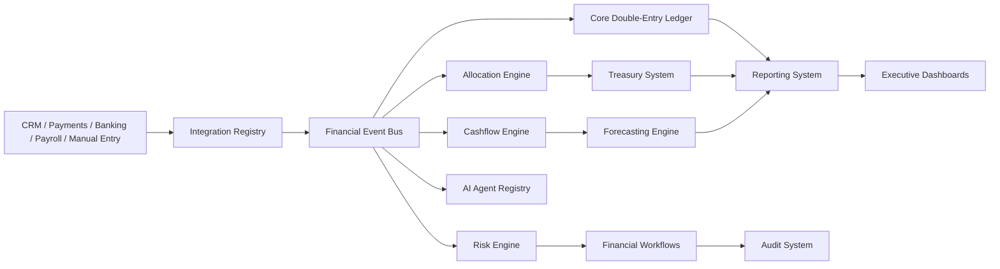

# FinOS Architecture

FinOS is a modular financial command center for a 360-degree agency ecosystem. Its architecture is event-driven, ledger-centered, treasury-aware, and AI-assisted.

## System Layers

1. **Data Ingestion Layer**: receives invoices, payments, expenses, payroll, subscriptions, ad spend, contractor costs, banking transactions, client revenue, recurring revenue, and receivables.
2. **Event Bus**: converts every financial movement into a durable event stream.
3. **Core Ledger**: reconciles every financial action through double-entry journal entries.
4. **Treasury and Allocation Layer**: segments cash, reserves taxes/payroll/emergency funds, and controls capital deployment.
5. **Cashflow and Forecasting Layer**: maintains rolling 13-week forecasts plus upside/downside/crisis scenarios.
6. **Risk Layer**: detects runway deterioration, margin compression, concentration risk, debt pressure, delayed receivables, and financial leakage.
7. **AI Agent Layer**: CFO, cashflow, risk, profitability, treasury, compliance, and leakage agents monitor events and recommend workflows.
8. **Governance and Compliance Layer**: enforces RBAC, approval hierarchy, budget discipline, segregation of duties, audit readiness, and traceability.
9. **Reporting and Dashboard Layer**: creates real-time CEO, CFO, treasury, profitability, cashflow, risk, and operations visibility.
10. **MCP/API Layer**: exposes secure, observable, event-aware functions for AI workflows and external systems.

## Event Flow

## Module Ownership

| Module | Responsibility | Institutional control |
|---|---|---|
| `event-bus` | Durable financial event stream | No silent financial state. |
| `core-ledger` | Double-entry truth engine | Every economic action balances. |
| `allocation-engine` | Capital allocation rules | Every inflow receives a purpose. |
| `cashflow-engine` | 13-week liquidity model | Runway and burn are always visible. |
| `forecasting-engine` | Scenario planning | Downside-first planning. |
| `treasury-system` | Cash segmentation | Restricted cash protected from leakage. |
| `risk-engine` | Risk signals | Instability detected before collapse. |
| `profitability-engine` | Client/service economics | Growth quality measured mathematically. |
| `financial-governance` | Approvals and duties | Authority, accountability, and control. |
| `compliance-engine` | Tax, documentation, audit readiness | Defensible financial operations. |
| `ai-agents` | Context-aware monitoring and recommendations | AI assists; humans retain strategic authority. |
| `reporting-system` | Executive reports | Data converted into decisions. |
| `dashboard-system` | KPI view models | Signal compression for operators. |
| `api-layer` | MCP and HTTP tools | Modular execution surface. |
| `audit-system` | Hash-chain audit log | Traceability and tamper evidence. |

## Deployment Shape

Production deployment should run:

- Node.js FinOS service
- PostgreSQL event store, ledger, forecasts, approvals, risk, and audit records
- NATS or Kafka event streaming for multi-service scale
- Redis for queue/cache workloads
- Object storage for evidence documents
- OpenTelemetry collector, Prometheus, Grafana, and log aggregation
- Secret manager and KMS-backed encryption
