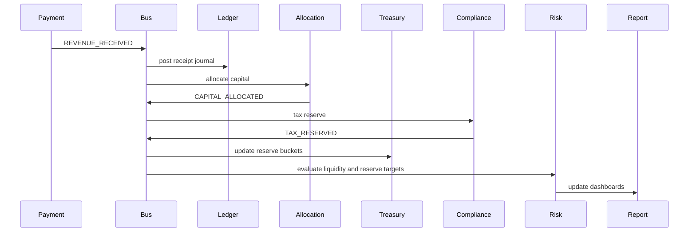

# Workflow Orchestration

## Revenue Received Workflow

## Expense Approval Workflow

1. Expense is submitted with amount, category, requester, department, source document, and strategic justification.
2. Governance service routes the request by amount:
   - Up to $500: department owner or auto-approval if policy allows.
   - $500 to $5,000: manager.
   - $5,000 to $25,000: CFO.
   - Above $25,000: executive committee or board.
3. Budget enforcement checks remaining budget and threshold.
4. If approved, the event bus emits `EXPENSE_APPROVED`.
5. Ledger, cashflow, treasury, risk, and audit systems update.

## Liquidity Alert Workflow

Trigger conditions:

- Runway below 60 days.
- Net liquidity below zero.
- Forecasted 13-week closing cash below zero.
- Reserve target breach.

Actions:

- Create `LOW_RUNWAY_ALERT` or `CASHFLOW_WARNING`.
- Notify CFO Agent, Cashflow Agent, Treasury Agent, and Risk Agent.
- Freeze discretionary spend recommendation.
- Accelerate receivables.
- Reforecast base, downside, and crisis cases.
- Escalate human approval for emergency operating mode.

## Daily Owner Intelligence

Daily review compresses the system into five survival metrics:

- Current liquidity.
- Net cash generation.
- Gross margin trend.
- Revenue predictability.
- Capital efficiency.

## Weekly Finance Operating Rhythm

- Review gross margin, CAC, LTV:CAC, payroll ratio, collections velocity, campaign ROI, and forecast drift.
- Run leakage detection against subscriptions, duplicate expenses, and vendor variance.
- Update 13-week cashflow.
- Reallocate discretionary capital only after liquidity and reserves are protected.

## Monthly Control Rhythm

- Close ledger.
- Reconcile bank, receivables, payables, payroll liabilities, tax obligations, and intercompany balances.
- Generate CEO and CFO reports.
- Review budget variance, EBITDA, working capital, DSCR, and margin quality.
- Update institutional readiness artifacts.

## Quarterly Strategic Rhythm

- Review capital allocation performance.
- Recalculate growth capacity.
- Stress test downside, crisis, and client-loss scenarios.
- Review pricing, department economics, client concentration, and expansion readiness.

## Half-Yearly and Yearly Rhythm

- Review enterprise value drivers, holding company structure, IP/entity separation, tax architecture, acquisition capacity, banking relationships, and investor readiness.
